# Events Package - Technical Architecture Documentation

## Table of Contents

- [Overview](#overview)
- [Architecture](#architecture)
- [Package Structure](#package-structure)
- [Component Details](#component-details)
  - [Core Types](#core-types)
  - [Configuration](#configuration)
  - [Authentication](#authentication)
  - [Tenant Management](#tenant-management)
  - [Middleware](#middleware)
  - [Encoding](#encoding)
  - [Transport](#transport)
  - [Endpoint Management](#endpoint-management)
  - [Microservice Management](#microservice-management)
- [Data Flow](#data-flow)
- [Usage Examples](#usage-examples)
- [Configuration Reference](#configuration-reference)
- [Error Handling](#error-handling)
- [Best Practices](#best-practices)

---

## Overview

The `events` package provides a transport-agnostic event-driven messaging SDK for Go applications, offering:

- **Multi-Transport Support**: Pluggable transport layer (NATS, Kafka, etc.)
- **Multi-Tenant Architecture**: Isolated connections per tenant with credential management
- **JWT Authentication**: Secure per-tenant authentication with automatic credential refresh
- **Middleware Pipeline**: Extensible middleware for tracing, retry, metrics, and logging
- **Service Discovery**: Endpoint and microservice registration with health checking
- **Multiple Encodings**: JSON, Protobuf, and raw bytes serialization

The package follows a modular architecture enabling clean separation of concerns and easy extensibility.

---

## Architecture

### High-Level Architecture

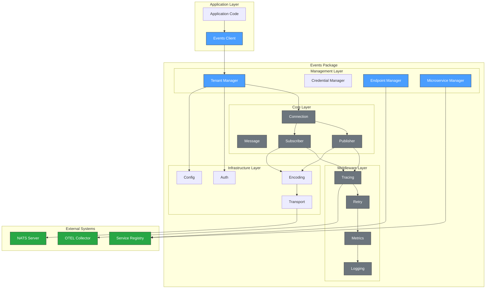

### Component Interaction

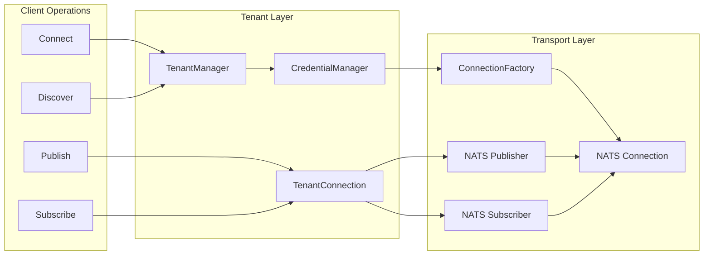

---

## Package Structure

```
events/
├── events.go            # Main entry point with re-exports
├── README.md            # This documentation
│
├── core/                # Core interfaces and types
│   ├── interfaces.go    # Connection, Publisher, Subscriber interfaces
│   ├── message.go       # Message and Headers types
│   ├── context.go       # Context helpers for tracing
│   └── errors.go        # Error definitions
│
├── config/              # Configuration management
│   ├── config.go        # Config structs and defaults
│   ├── loader.go        # Environment/file loading
│   └── options.go       # Functional options pattern
│
├── auth/                # Authentication
│   ├── auth.go          # Credentials and auth types
│   ├── jwt.go           # JWT credential handling
│   ├── credentials.go   # Credential manager
│   └── provider.go      # Auth provider interface
│
├── tenant/              # Multi-tenant connection management
│   ├── manager.go       # Tenant manager
│   └── registry.go      # Tenant registry
│
├── middleware/          # Middleware pipeline
│   ├── middleware.go    # Middleware interfaces and stack
│   ├── tracing.go       # Distributed tracing
│   ├── retry.go         # Retry with backoff
│   ├── metrics.go       # Metrics collection
│   └── logging.go       # Request logging
│
├── encoding/            # Message serialization
│   ├── encoder.go       # Encoder interface
│   ├── json.go          # JSON encoding
│   ├── protobuf.go      # Protobuf encoding
│   └── bytes.go         # Raw bytes encoding
│
├── transport/           # Transport implementations
│   └── nats/            # NATS transport
│       ├── transport.go # Factory implementation
│       ├── connection.go# NATS connection
│       ├── publisher.go # NATS publisher
│       └── subscriber.go# NATS subscriber
│
├── endpoint/            # Endpoint management
│   ├── types.go         # Endpoint info and status
│   ├── registry.go      # Endpoint registry
│   ├── manager.go       # Endpoint lifecycle manager
│   ├── handlers.go      # NATS message handlers
│   └── doc.go           # Package documentation
│
└── microservice/        # Microservice management
    ├── types.go         # Service and instance types
    ├── registry.go      # Service registry
    ├── manager.go       # Service lifecycle manager
    ├── handlers.go      # NATS message handlers
    └── doc.go           # Package documentation
```

---

## Component Details

### Core Types

#### Message

The `Message` type represents a message for publishing or receiving.

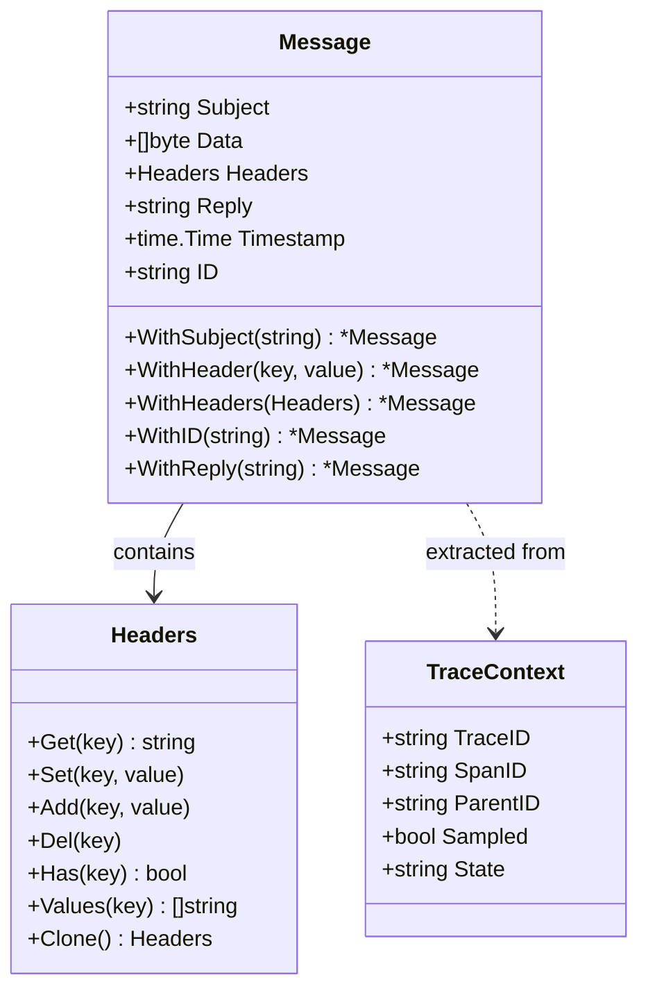

**Standard Headers:**

| Header | Constant | Description |
|--------|----------|-------------|
| `Content-Type` | `HeaderContentType` | Message content type |
| `Nats-Msg-Id` | `HeaderMessageID` | Message ID for deduplication |
| `Correlation-ID` | `HeaderCorrelationID` | Request correlation ID |
| `X-Tenant-ID` | `HeaderTenantID` | Multi-tenant identifier |
| `X-Trace-ID` | `HeaderTraceID` | Distributed trace ID |
| `X-Span-ID` | `HeaderSpanID` | Span identifier |
| `traceparent` | `HeaderTraceParent` | W3C trace context |

#### Connection Interfaces

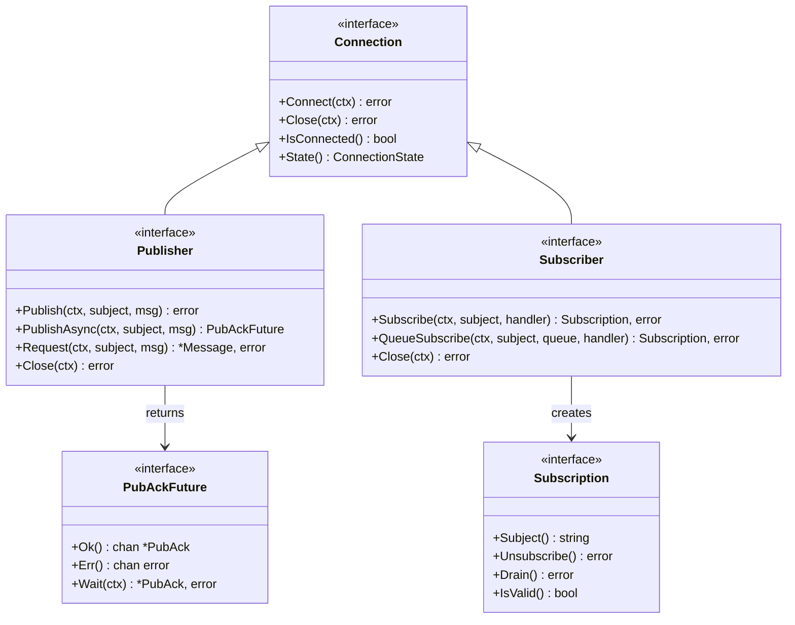

**Connection States:**

| State | Description |
|-------|-------------|
| `StateDisconnected` | Not connected to server |
| `StateConnecting` | Connection in progress |
| `StateConnected` | Successfully connected |
| `StateReconnecting` | Attempting to reconnect |
| `StateDraining` | Draining pending messages |
| `StateClosed` | Connection closed |

---

### Configuration

#### Config Structure

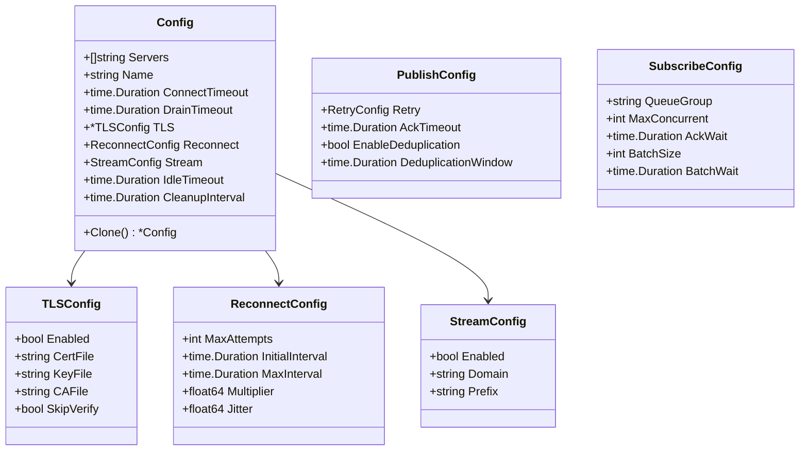

**Default Values:**

| Setting | Default | Description |
|---------|---------|-------------|
| Servers | `nats://localhost:4222` | Server URLs |
| ConnectTimeout | `10s` | Connection timeout |
| DrainTimeout | `30s` | Graceful shutdown timeout |
| IdleTimeout | `30m` | Idle connection cleanup |
| CleanupInterval | `1m` | Cleanup check frequency |
| MaxAttempts (Reconnect) | `-1` (infinite) | Reconnection attempts |
| InitialInterval | `100ms` | Initial backoff |
| MaxInterval | `30s` | Maximum backoff |

---

### Authentication

#### Auth Types

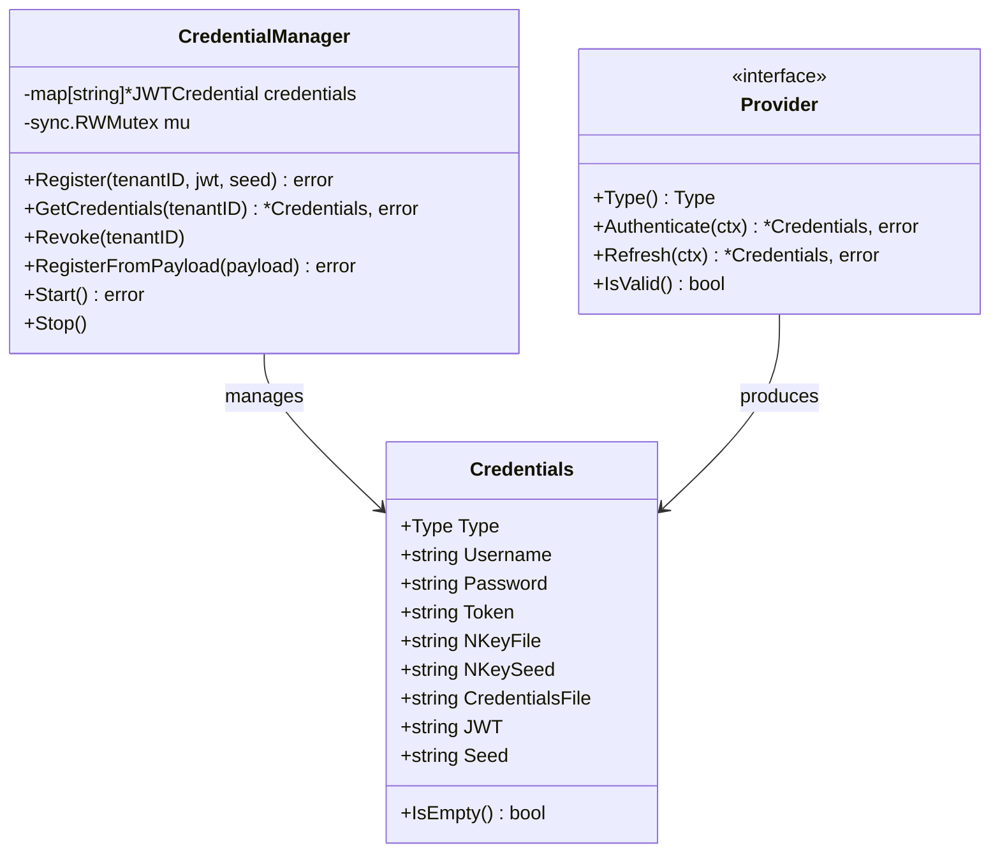

**Authentication Types:**

| Type | Constant | Usage |
|------|----------|-------|
| None | `TypeNone` | No authentication |
| UserPass | `TypeUserPass` | Username/password |
| Token | `TypeToken` | Static token |
| NKey | `TypeNKey` | NATS NKey |
| Credentials File | `TypeCredentialsFile` | From file |
| JWT | `TypeJWT` | JWT + Seed (recommended) |

---

### Tenant Management

#### Multi-Tenant Architecture

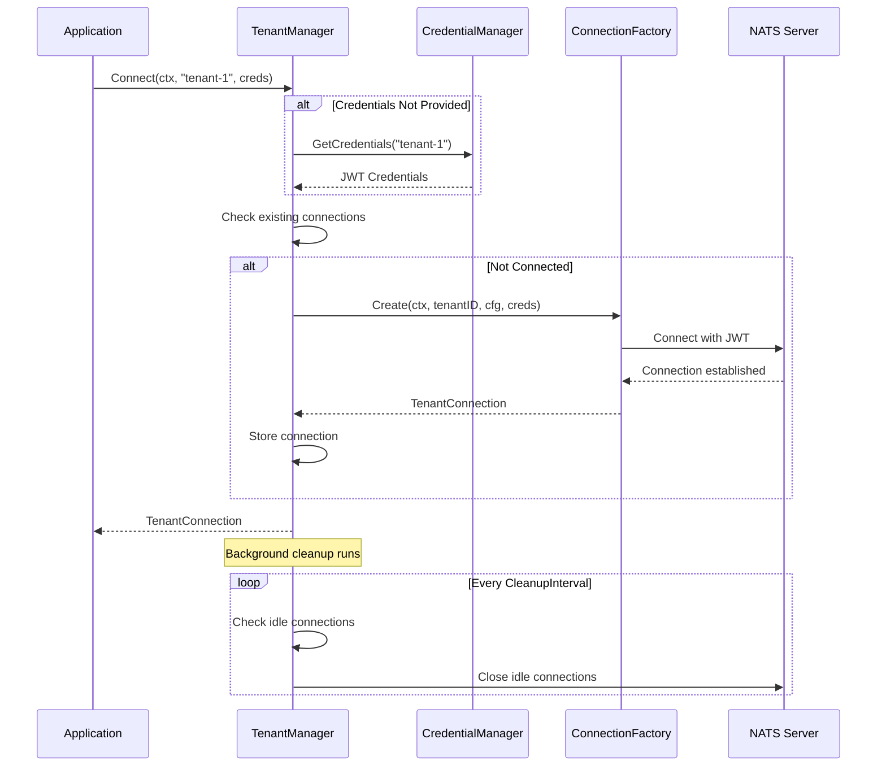

#### Tenant Manager Class

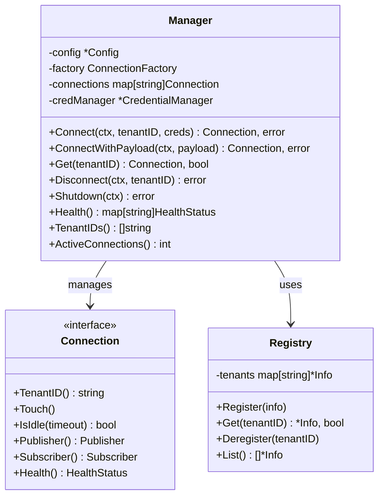

---

### Middleware

#### Middleware Pipeline

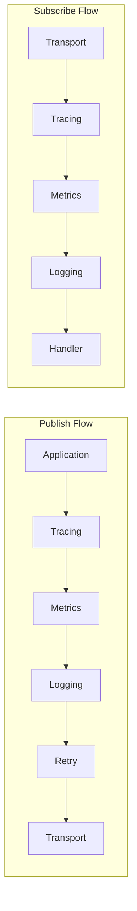

#### Middleware Types

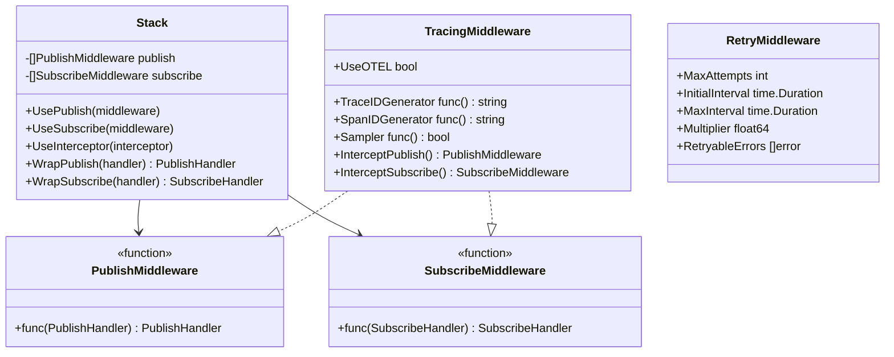

**Available Middleware:**

| Middleware | Purpose | Features |
|------------|---------|----------|
| **Tracing** | Distributed tracing | OpenTelemetry integration, W3C trace context |
| **Retry** | Automatic retry | Exponential backoff, jitter, max attempts |
| **Metrics** | Performance metrics | Request count, latency, error rates |
| **Logging** | Request logging | Structured logging, configurable levels |

---

### Encoding

#### Encoder Interface

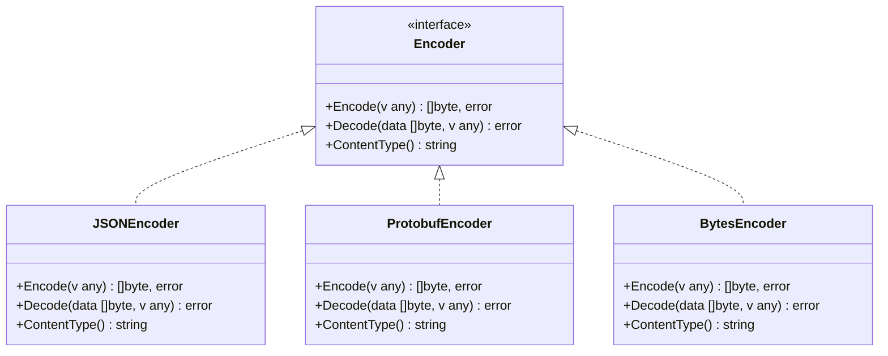

**Encoding Formats:**

| Encoder | Content-Type | Use Case |
|---------|--------------|----------|
| JSON | `application/json` | General purpose, human-readable |
| Protobuf | `application/protobuf` | High performance, schema-based |
| Bytes | `application/octet-stream` | Raw binary data |

---

### Transport

#### NATS Transport Architecture

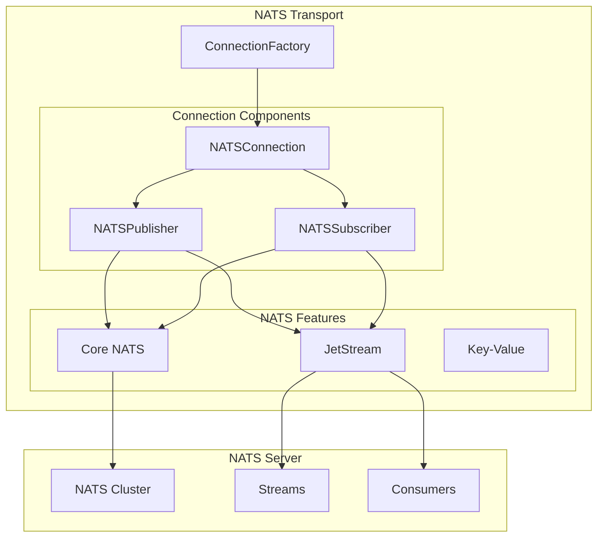

**NATS Features Supported:**

| Feature | Description |
|---------|-------------|
| Core NATS | Basic pub/sub messaging |
| JetStream | Persistent streaming with acknowledgments |
| Request-Reply | Synchronous request/response pattern |
| Queue Groups | Load balancing across subscribers |
| Wildcard Subscriptions | `*` and `>` subject patterns |

---

### Endpoint Management

#### Endpoint Lifecycle

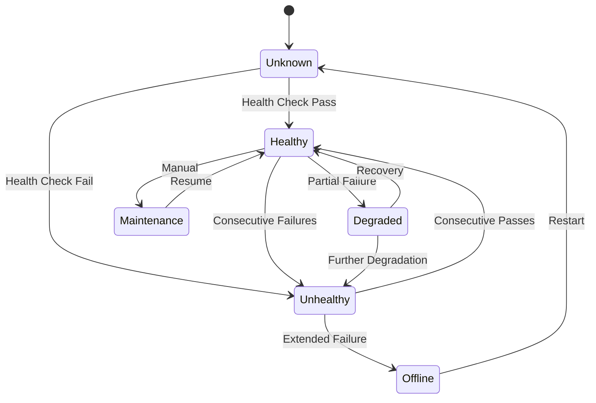

#### Endpoint Components

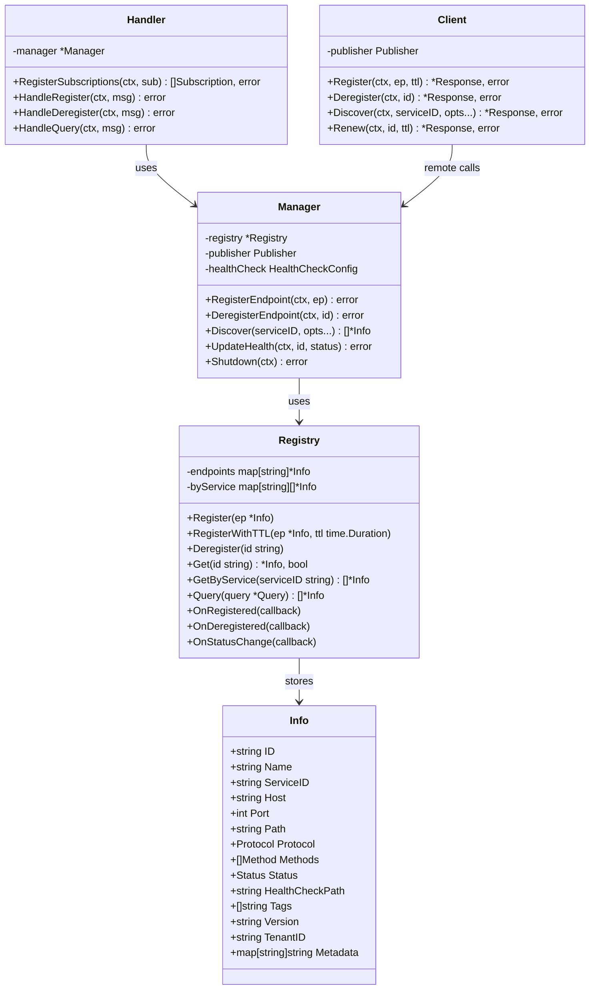

**Endpoint Event Subjects:**

| Subject | Description |
|---------|-------------|
| `endpoints.register` | Register endpoint request |
| `endpoints.deregister` | Deregister endpoint request |
| `endpoints.query` | Query endpoints request |
| `endpoints.renew` | Renew endpoint TTL |
| `endpoints.health` | Update health status |
| `endpoints.registered` | Endpoint registered event |
| `endpoints.deregistered` | Endpoint deregistered event |
| `endpoints.updated` | Endpoint updated event |

---

### Microservice Management

#### Service and Instance Model

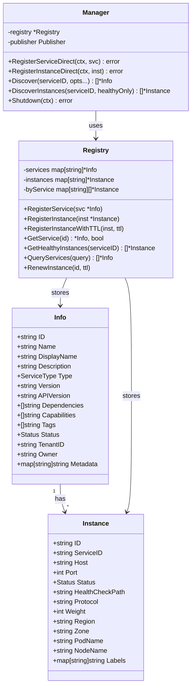

**Service Types:**

| Type | Constant | Description |
|------|----------|-------------|
| API | `ServiceTypeAPI` | REST/gRPC API services |
| Worker | `ServiceTypeWorker` | Background workers |
| Gateway | `ServiceTypeGateway` | API gateways |
| Broker | `ServiceTypeBroker` | Message brokers |
| Database | `ServiceTypeDatabase` | Database services |
| Cache | `ServiceTypeCache` | Cache services |
| Queue | `ServiceTypeQueue` | Queue services |
| Scheduler | `ServiceTypeScheduler` | Job schedulers |
| Monitor | `ServiceTypeMonitor` | Monitoring services |
| Custom | `ServiceTypeCustom` | Custom service types |

---

## Data Flow

### Complete Message Flow

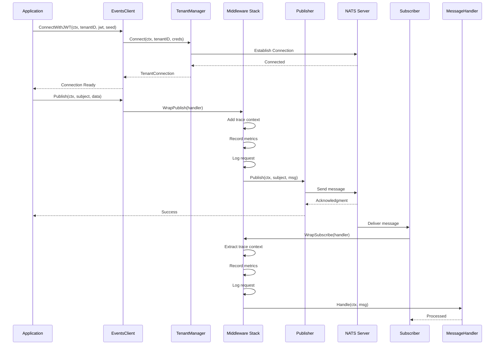

### Service Discovery Flow

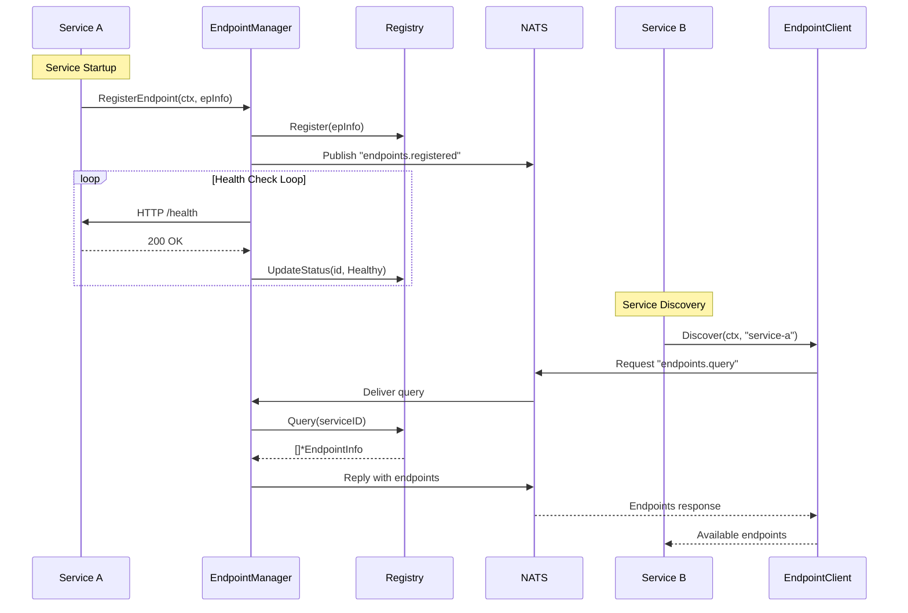

---

## Usage Examples

### Basic Setup

```go
import "dev.azure.com/Motadata/NextGen/motadata-go-sdk/events"

func main() {
    // Create client with options
    client, err := events.NewClient(
        events.WithServers("nats://localhost:4222"),
        events.WithName("my-service"),
        events.WithConnectTimeout(10 * time.Second),
    )
    if err != nil {
        log.Fatal(err)
    }
    defer client.Shutdown(context.Background())

    // Connect tenant with JWT
    conn, err := client.ConnectWithJWT(ctx, "tenant-1", jwtToken, seed)
    if err != nil {
        log.Fatal(err)
    }

    // Get publisher and subscriber
    pub := conn.Publisher()
    sub := conn.Subscriber()

    // Publish message
    msg := events.NewMessage([]byte(`{"hello": "world"}`))
    err = pub.Publish(ctx, "my.subject", msg)

    // Subscribe to messages
    subscription, err := sub.Subscribe(ctx, "my.subject", func(ctx context.Context, msg *events.Message) error {
        fmt.Printf("Received: %s\n", string(msg.Data))
        return nil
    })
    defer subscription.Unsubscribe()
}
```

### Multi-Tenant Setup

```go
// Create credential manager
credManager := events.NewCredentialManager(auth.DefaultCredentialManagerConfig())

// Register tenant credentials
credManager.Register("tenant-1", jwt1, seed1)
credManager.Register("tenant-2", jwt2, seed2)

// Create client with credential manager
client, _ := events.NewClient(
    events.WithServers("nats://localhost:4222"),
)

// Connect tenants
conn1, _ := client.Connect(ctx, "tenant-1", nil) // Uses credManager
conn2, _ := client.Connect(ctx, "tenant-2", nil)

// Each tenant has isolated connection
pub1 := conn1.Publisher()
pub2 := conn2.Publisher()
```

### Middleware Usage

```go
// Create middleware stack
stack := events.NewMiddlewareStack()

// Add middleware in order
stack.UseInterceptor(events.TracingMiddleware())
stack.UsePublish(events.RetryMiddleware(events.RetryConfig{
    MaxAttempts:     3,
    InitialInterval: 100 * time.Millisecond,
}))
stack.UseInterceptor(events.MetricsMiddleware("my-service"))
stack.UseInterceptor(events.LoggingMiddleware())

// Wrap handlers
wrappedPublish := stack.WrapPublish(func(ctx context.Context, subject string, msg *core.Message) error {
    return publisher.Publish(ctx, subject, msg)
})

wrappedSubscribe := stack.WrapSubscribe(func(ctx context.Context, msg *core.Message) error {
    // Handle message
    return nil
})
```

### Endpoint Registration

```go
// Create endpoint manager
epManager, _ := events.NewEndpointManager(endpoint.ManagerConfig{
    HealthCheck: endpoint.HealthCheckConfig{
        Enabled:            true,
        Interval:           30 * time.Second,
        Timeout:            5 * time.Second,
        HealthyThreshold:   2,
        UnhealthyThreshold: 3,
    },
})

// Register endpoint
ep := &events.EndpointInfo{
    ID:              "user-api-v1",
    ServiceID:       "user-service",
    Host:            "localhost",
    Port:            8080,
    Path:            "/api/v1/users",
    Protocol:        events.EndpointProtocolHTTP,
    HealthCheckPath: "/health",
    Tags:            []string{"api", "users"},
}
epManager.RegisterEndpoint(ctx, ep)

// Discover endpoints
endpoints := epManager.Discover("user-service",
    endpoint.OnlyHealthy(),
    endpoint.WithTags("api"),
)
```

### Microservice Registration

```go
// Create microservice manager
svcManager, _ := events.NewMicroserviceManager(microservice.ManagerConfig{
    HealthCheck: microservice.HealthCheckConfig{
        Enabled:  true,
        Interval: 30 * time.Second,
    },
})

// Register service
svc := &events.MicroserviceInfo{
    ID:           "order-service",
    Name:         "order-service",
    Type:         events.ServiceTypeAPI,
    Version:      "2.0.0",
    Capabilities: []string{"orders", "checkout"},
    Dependencies: []string{"user-service", "inventory-service"},
}
svcManager.RegisterServiceDirect(ctx, svc)

// Register instance
inst := &microservice.Instance{
    ID:              "order-service-1",
    ServiceID:       "order-service",
    Host:            "10.0.1.50",
    Port:            8080,
    HealthCheckPath: "/health",
    Weight:          100,
}
svcManager.RegisterInstanceDirect(ctx, inst)

// Discover services
services := svcManager.Discover("order-service",
    microservice.WithCapabilities("checkout"),
    microservice.OnlyHealthy(),
)
```

### Request-Reply Pattern

```go
// Publisher side (requester)
request := events.NewMessage([]byte(`{"user_id": "123"}`))
response, err := publisher.Request(ctx, "users.get", request)
if err != nil {
    log.Fatal(err)
}
fmt.Printf("Response: %s\n", string(response.Data))

// Subscriber side (responder)
sub.Subscribe(ctx, "users.get", func(ctx context.Context, msg *events.Message) error {
    // Process request
    user := getUserByID(msg.Data)

    // Send reply
    reply := events.NewMessage(user)
    return publisher.Publish(ctx, msg.Reply, reply)
})
```

---

## Configuration Reference

### Environment Variables

| Variable | Default | Description |
|----------|---------|-------------|
| `EVENTS_SERVERS` | `nats://localhost:4222` | Comma-separated server URLs |
| `EVENTS_NAME` | `app` | Client name |
| `EVENTS_CONNECT_TIMEOUT` | `10s` | Connection timeout |
| `EVENTS_DRAIN_TIMEOUT` | `30s` | Drain timeout |
| `EVENTS_IDLE_TIMEOUT` | `30m` | Idle connection timeout |
| `EVENTS_TLS_ENABLED` | `false` | Enable TLS |
| `EVENTS_TLS_CERT` | | TLS certificate file |
| `EVENTS_TLS_KEY` | | TLS key file |
| `EVENTS_TLS_CA` | | TLS CA file |
| `EVENTS_STREAM_ENABLED` | `true` | Enable JetStream |
| `EVENTS_STREAM_DOMAIN` | | JetStream domain |

### Functional Options

```go
// Server configuration
events.WithServers("nats://server1:4222", "nats://server2:4222")
events.WithName("my-service")
events.WithConnectTimeout(10 * time.Second)
events.WithDrainTimeout(30 * time.Second)

// TLS configuration
events.WithTLS(&config.TLSConfig{
    Enabled:  true,
    CertFile: "/path/to/cert.pem",
    KeyFile:  "/path/to/key.pem",
    CAFile:   "/path/to/ca.pem",
})

// Reconnection settings
events.WithReconnect(config.ReconnectConfig{
    MaxAttempts:     -1,
    InitialInterval: 100 * time.Millisecond,
    MaxInterval:     30 * time.Second,
    Multiplier:      2.0,
    Jitter:          0.1,
})

// JetStream settings
events.WithStream(config.StreamConfig{
    Enabled: true,
    Domain:  "hub",
})
```

---

## Error Handling

### Common Errors

| Error | Constant | Description |
|-------|----------|-------------|
| Not Connected | `ErrNotConnected` | Operation on disconnected client |
| Already Connected | `ErrAlreadyConnected` | Duplicate connection attempt |
| Connection Closed | `ErrConnectionClosed` | Connection was closed |
| Connection Timeout | `ErrConnectionTimeout` | Connection timed out |
| Publish Failed | `ErrPublishFailed` | Message publish failed |
| Publish Timeout | `ErrPublishTimeout` | Publish acknowledgment timeout |
| Invalid Subject | `ErrInvalidSubject` | Invalid subject format |
| Invalid Message | `ErrInvalidMessage` | Invalid message format |
| Tenant Not Found | `ErrTenantNotFound` | Tenant not registered |
| Shutdown In Progress | `ErrShutdownInProgress` | System shutting down |

### Error Handling Pattern

```go
conn, err := client.Connect(ctx, tenantID, creds)
if err != nil {
    switch {
    case errors.Is(err, events.ErrConnectionTimeout):
        // Handle timeout - maybe retry
    case errors.Is(err, events.ErrInvalidCredential):
        // Handle auth failure
    default:
        // Handle other errors
    }
}

// Publish with retry
err = publisher.Publish(ctx, subject, msg)
if err != nil {
    if errors.Is(err, events.ErrPublishTimeout) {
        // Retry with exponential backoff
    }
}
```

---

## Best Practices

### 1. Connection Management

```go
// Initialize once at startup
client, _ := events.NewClient(opts...)
defer client.Shutdown(context.Background())

// Reuse connections
conn, _ := client.Connect(ctx, tenantID, creds)
// Use conn throughout request lifecycle

// Let idle cleanup handle unused connections
// Don't manually disconnect active tenants
```

### 2. Context Propagation

```go
// Always pass context for tracing
func processOrder(ctx context.Context, order *Order) error {
    // Context propagates trace IDs
    msg := events.NewMessage(orderData)
    return publisher.Publish(ctx, "orders.created", msg)
}

// Add tenant context
ctx = events.WithTenantID(ctx, tenantID)
ctx = events.WithCorrelationID(ctx, correlationID)
```

### 3. Graceful Shutdown

```go
// Handle shutdown signals
sigChan := make(chan os.Signal, 1)
signal.Notify(sigChan, syscall.SIGINT, syscall.SIGTERM)

go func() {
    <-sigChan

    // Create shutdown context with timeout
    ctx, cancel := context.WithTimeout(context.Background(), 30*time.Second)
    defer cancel()

    // Shutdown in order
    epManager.Shutdown(ctx)
    svcManager.Shutdown(ctx)
    client.Shutdown(ctx)
}()
```

### 4. Health Monitoring

```go
// Periodic health checks
go func() {
    ticker := time.NewTicker(30 * time.Second)
    for range ticker.C {
        health := client.Manager().Health()
        for tenantID, status := range health {
            if !status.IsHealthy() {
                log.Printf("Tenant %s unhealthy: %s", tenantID, status.Message)
                // Alert or take corrective action
            }
        }
    }
}()
```

### 5. Error Channel Monitoring

```go
// Monitor tenant errors
go func() {
    for err := range client.Manager().Errors() {
        log.Printf("Tenant error [%s]: %v", err.TenantID, err.Err)

        // Optionally reconnect on disconnect
        if errors.Is(err.Err, events.ErrConnectionClosed) {
            client.Connect(ctx, err.TenantID, nil)
        }
    }
}()

// Or use callback
client.Manager().OnError(func(err core.TenantError) {
    metrics.IncrementCounter("tenant_errors", err.TenantID)
})
```

---

## Thread Safety

All components in the events package are safe for concurrent use:

| Component | Thread Safety |
|-----------|---------------|
| Client | Safe - internal mutex |
| TenantManager | Safe - sync.RWMutex |
| TenantConnection | Safe - atomic operations |
| Publisher | Safe - connection-level sync |
| Subscriber | Safe - per-subscription sync |
| EndpointRegistry | Safe - sync.RWMutex |
| EndpointManager | Safe - internal mutex |
| MicroserviceRegistry | Safe - sync.RWMutex |
| MicroserviceManager | Safe - internal mutex |
| MiddlewareStack | Safe after initialization |

---

## Dependencies

| Dependency | Version | Purpose |
|------------|---------|---------|
| `github.com/nats-io/nats.go` | v1.30+ | NATS client |
| `github.com/cenkalti/backoff/v5` | v5.0+ | Exponential backoff |
| `go.opentelemetry.io/otel` | v1.28+ | Distributed tracing |
| `dev.azure.com/.../otel` | internal | OTEL integration |
