# OTEL Package - Technical Architecture Documentation

## Table of Contents

- [Overview](#overview)
- [Architecture](#architecture)
- [Package Structure](#package-structure)
- [Component Details](#component-details)
  - [Unified OTEL Initializer](#unified-otel-initializer)
  - [Logger](#logger)
  - [Metrics](#metrics)
  - [Tracer](#tracer)
- [Data Flow](#data-flow)
- [Configuration](#configuration)
- [Initialization Lifecycle](#initialization-lifecycle)
- [Shutdown Lifecycle](#shutdown-lifecycle)
- [Cross-Module Usage](#cross-module-usage)
- [Context Propagation](#context-propagation)
- [Error Handling](#error-handling)

---

## Overview

The `otel` package provides a unified OpenTelemetry (OTEL) integration layer for Go applications, offering:

- **Structured Logging** with multi-output support (Console, File, OTEL)
- **Metrics Collection** with Counter, Gauge, Histogram, and Timer primitives
- **Distributed Tracing** with automatic context propagation

All three pillars of observability are integrated through a single initialization point, sharing common configuration for service identification and OTEL endpoints.

---

## Architecture

### High-Level Architecture

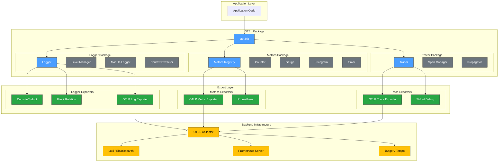
```mermaid
graph TB
    subgraph "Application Layer"
        APP[Application Code]
    end

    subgraph "OTEL Package"
        OTEL[otel.Init]

        subgraph "Logger Package"
            LOG[Logger]
            LOGLEVEL[Level Manager]
            LOGMOD[Module Logger]
            LOGCTX[Context Extractor]
        end

        subgraph "Metrics Package"
            MET[Metrics Registry]
            COUNTER[Counter]
            GAUGE[Gauge]
            HIST[Histogram]
            TIMER[Timer]
        end

        subgraph "Tracer Package"
            TRACE[Tracer]
            SPAN[Span Manager]
            PROP[Propagator]
        end
    end

    subgraph "Export Layer"
        subgraph "Logger Exporters"
            CONSOLE[Console/Stdout]
            FILE[File + Rotation]
            OTLP_LOG[OTLP Log Exporter]
        end

        subgraph "Metrics Exporters"
            OTLP_MET[OTLP Metric Exporter]
            PROM[Prometheus]
        end

        subgraph "Trace Exporters"
            OTLP_TRACE[OTLP Trace Exporter]
            STDOUT_TRACE[Stdout Debug]
        end
    end

    subgraph "Backend Infrastructure"
        COLLECTOR[OTEL Collector]
        LOKI[Loki / Elasticsearch]
        PROM_SRV[Prometheus Server]
        JAEGER[Jaeger / Tempo]
    end

    APP --> OTEL
    OTEL --> LOG
    OTEL --> MET
    OTEL --> TRACE

    LOG --> CONSOLE
    LOG --> FILE
    LOG --> OTLP_LOG

    MET --> OTLP_MET
    MET --> PROM

    TRACE --> OTLP_TRACE
    TRACE --> STDOUT_TRACE

    OTLP_LOG --> COLLECTOR
    OTLP_MET --> COLLECTOR
    OTLP_TRACE --> COLLECTOR

    COLLECTOR --> LOKI
    COLLECTOR --> PROM_SRV
    COLLECTOR --> JAEGER

    classDef primary fill:#4a9eff,stroke:#333,color:#fff
    classDef secondary fill:#6c757d,stroke:#333,color:#fff
    classDef exporter fill:#28a745,stroke:#333,color:#fff
    classDef backend fill:#ffc107,stroke:#333,color:#000

    class OTEL,LOG,MET,TRACE primary
    class LOGLEVEL,LOGMOD,LOGCTX,COUNTER,GAUGE,HIST,TIMER,SPAN,PROP secondary
    class CONSOLE,FILE,OTLP_LOG,OTLP_MET,PROM,OTLP_TRACE,STDOUT_TRACE exporter
    class COLLECTOR,LOKI,PROM_SRV,JAEGER backend
```

### Component Interaction

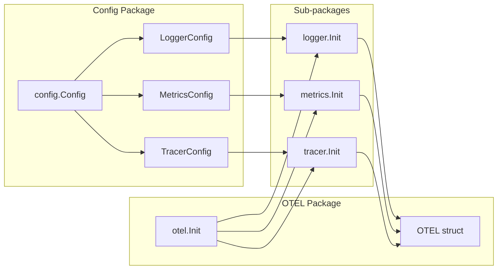
```mermaid
graph LR
    subgraph "Config Package"
        CFG[config.Config]
        LCFG[LoggerConfig]
        MCFG[MetricsConfig]
        TCFG[TracerConfig]
    end

    subgraph "OTEL Package"
        INIT[otel.Init]
        OTELSTRUCT[OTEL struct]
    end

    subgraph "Sub-packages"
        LINIT[logger.Init]
        MINIT[metrics.Init]
        TINIT[tracer.Init]
    end

    CFG --> LCFG
    CFG --> MCFG
    CFG --> TCFG

    INIT --> LINIT
    INIT --> MINIT
    INIT --> TINIT

    LCFG --> LINIT
    MCFG --> MINIT
    TCFG --> TINIT

    LINIT --> OTELSTRUCT
    MINIT --> OTELSTRUCT
    TINIT --> OTELSTRUCT
```

---

## Package Structure

```
otel/
├── otel.go              # Unified initialization entry point
├── README.md            # This documentation
│
├── logger/              # Structured logging package
│   ├── log.go           # Core logger implementation
│   ├── level.go         # Log level definitions
│   ├── context.go       # Context field extraction
│   ├── module.go        # Per-module log level control
│   ├── provider.go      # OTEL log provider setup
│   └── README.md        # Logger documentation
│
├── metrics/             # Metrics collection package
│   ├── metrics.go       # Core metrics API
│   ├── types.go         # Metric type definitions
│   ├── registry.go      # Metric registry management
│   ├── provider.go      # OTEL metrics provider setup
│   └── README.md        # Metrics documentation
│
└── tracer/              # Distributed tracing package
    ├── tracer.go        # Core tracer implementation
    ├── types.go         # Span and attribute types
    └── provider.go      # OTEL tracer provider setup
```

---

## Component Details

### Unified OTEL Initializer

The `otel.go` file provides a single entry point for initializing all observability components.

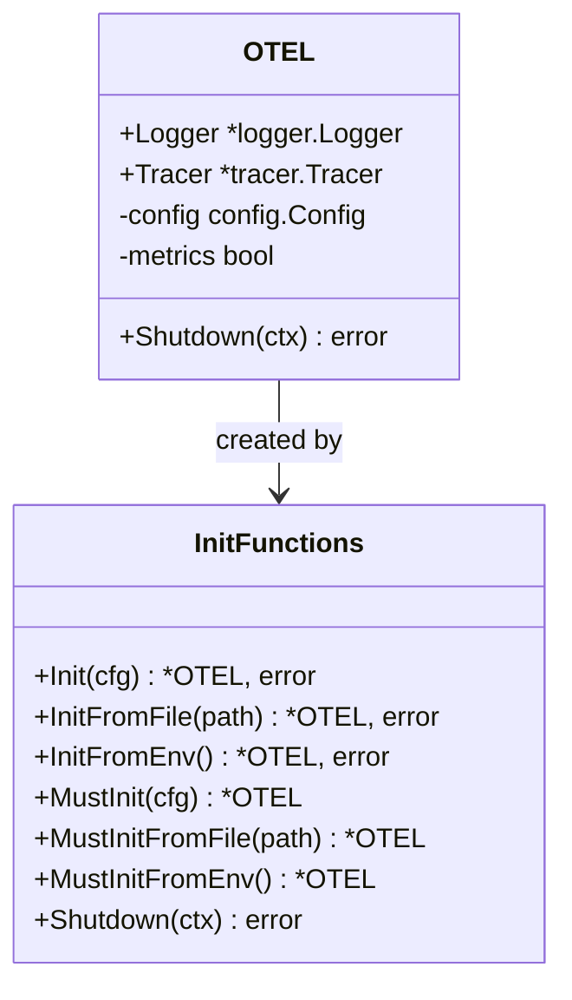
```mermaid
classDiagram
    class OTEL {
        +Logger *logger.Logger
        +Tracer *tracer.Tracer
        -config config.Config
        -metrics bool
        +Shutdown(ctx) error
    }

    class InitFunctions {
        +Init(cfg) *OTEL, error
        +InitFromFile(path) *OTEL, error
        +InitFromEnv() *OTEL, error
        +MustInit(cfg) *OTEL
        +MustInitFromFile(path) *OTEL
        +MustInitFromEnv() *OTEL
        +Shutdown(ctx) error
    }

    OTEL --> InitFunctions : created by
```

**Key Behaviors:**

| Function | Description | Panics on Error |
|----------|-------------|-----------------|
| `Init(cfg)` | Initialize from Config struct | No |
| `InitFromFile(path)` | Load YAML and initialize | No |
| `InitFromEnv()` | Load from environment variables | No |
| `MustInit(cfg)` | Initialize, panic on failure | Yes |
| `Shutdown(ctx)` | Graceful shutdown all components | No |

---

### Logger

#### Logger Architecture

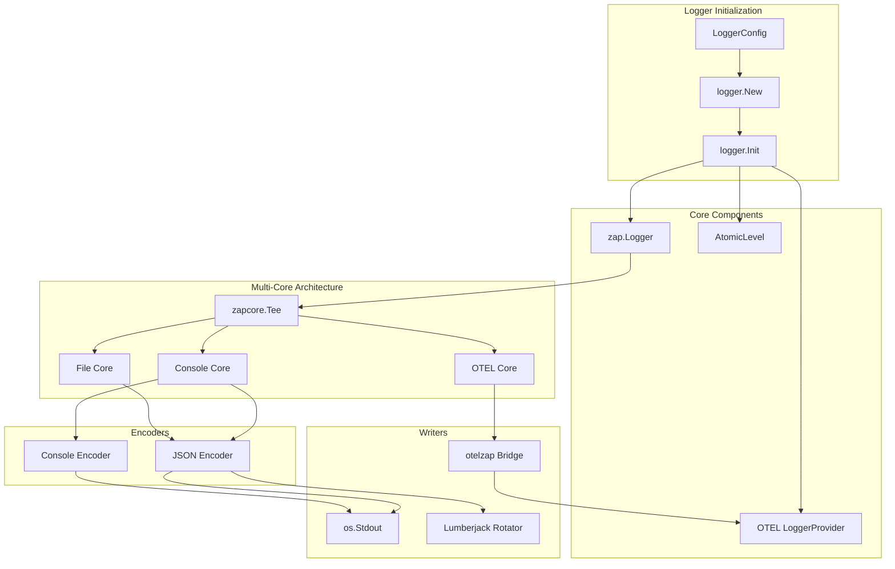
```mermaid
graph TB
    subgraph "Logger Initialization"
        NEW[logger.New]
        INIT[logger.Init]
        CFG[LoggerConfig]
    end

    subgraph "Core Components"
        ZAP[zap.Logger]
        ATOM[AtomicLevel]
        PROVIDER[OTEL LoggerProvider]
    end

    subgraph "Multi-Core Architecture"
        TEE[zapcore.Tee]
        CORE_CON[Console Core]
        CORE_FILE[File Core]
        CORE_OTEL[OTEL Core]
    end

    subgraph "Encoders"
        JSON[JSON Encoder]
        CONSOLE_ENC[Console Encoder]
    end

    subgraph "Writers"
        STDOUT[os.Stdout]
        LUMBER[Lumberjack Rotator]
        OTELBRIDGE[otelzap Bridge]
    end

    CFG --> NEW
    NEW --> INIT
    INIT --> ZAP
    INIT --> ATOM
    INIT --> PROVIDER

    ZAP --> TEE
    TEE --> CORE_CON
    TEE --> CORE_FILE
    TEE --> CORE_OTEL

    CORE_CON --> JSON
    CORE_CON --> CONSOLE_ENC
    CORE_FILE --> JSON
    CORE_OTEL --> OTELBRIDGE

    JSON --> STDOUT
    CONSOLE_ENC --> STDOUT
    JSON --> LUMBER
    OTELBRIDGE --> PROVIDER
```

#### Logger Class Diagram

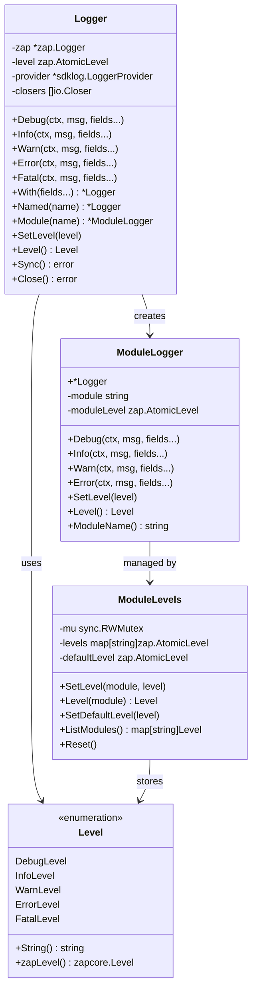
```mermaid
classDiagram
    class Logger {
        -zap *zap.Logger
        -level zap.AtomicLevel
        -provider *sdklog.LoggerProvider
        -closers []io.Closer
        +Debug(ctx, msg, fields...)
        +Info(ctx, msg, fields...)
        +Warn(ctx, msg, fields...)
        +Error(ctx, msg, fields...)
        +Fatal(ctx, msg, fields...)
        +With(fields...) *Logger
        +Named(name) *Logger
        +Module(name) *ModuleLogger
        +SetLevel(level)
        +Level() Level
        +Sync() error
        +Close() error
    }

    class ModuleLogger {
        +*Logger
        -module string
        -moduleLevel zap.AtomicLevel
        +Debug(ctx, msg, fields...)
        +Info(ctx, msg, fields...)
        +Warn(ctx, msg, fields...)
        +Error(ctx, msg, fields...)
        +SetLevel(level)
        +Level() Level
        +ModuleName() string
    }

    class ModuleLevels {
        -mu sync.RWMutex
        -levels map[string]zap.AtomicLevel
        -defaultLevel zap.AtomicLevel
        +SetLevel(module, level)
        +Level(module) Level
        +SetDefaultLevel(level)
        +ListModules() map[string]Level
        +Reset()
    }

    class Level {
        <<enumeration>>
        DebugLevel
        InfoLevel
        WarnLevel
        ErrorLevel
        FatalLevel
        +String() string
        +zapLevel() zapcore.Level
    }

    Logger --> ModuleLogger : creates
    Logger --> Level : uses
    ModuleLogger --> ModuleLevels : managed by
    ModuleLevels --> Level : stores
```

#### Context Field Extraction

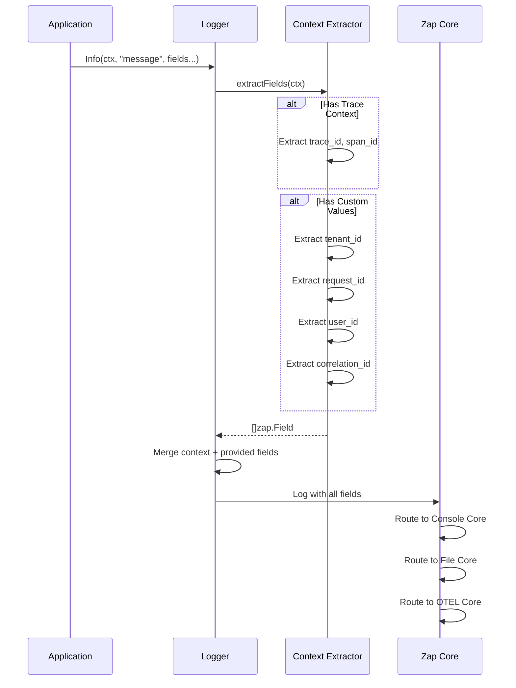
```mermaid
sequenceDiagram
    participant App as Application
    participant Log as Logger
    participant Ctx as Context Extractor
    participant Zap as Zap Core

    App->>Log: Info(ctx, "message", fields...)
    Log->>Ctx: extractFields(ctx)

    alt Has Trace Context
        Ctx->>Ctx: Extract trace_id, span_id
    end

    alt Has Custom Values
        Ctx->>Ctx: Extract tenant_id
        Ctx->>Ctx: Extract request_id
        Ctx->>Ctx: Extract user_id
        Ctx->>Ctx: Extract correlation_id
    end

    Ctx-->>Log: []zap.Field
    Log->>Log: Merge context + provided fields
    Log->>Zap: Log with all fields

    Zap->>Zap: Route to Console Core
    Zap->>Zap: Route to File Core
    Zap->>Zap: Route to OTEL Core
```

---

### Metrics

#### Metrics Architecture

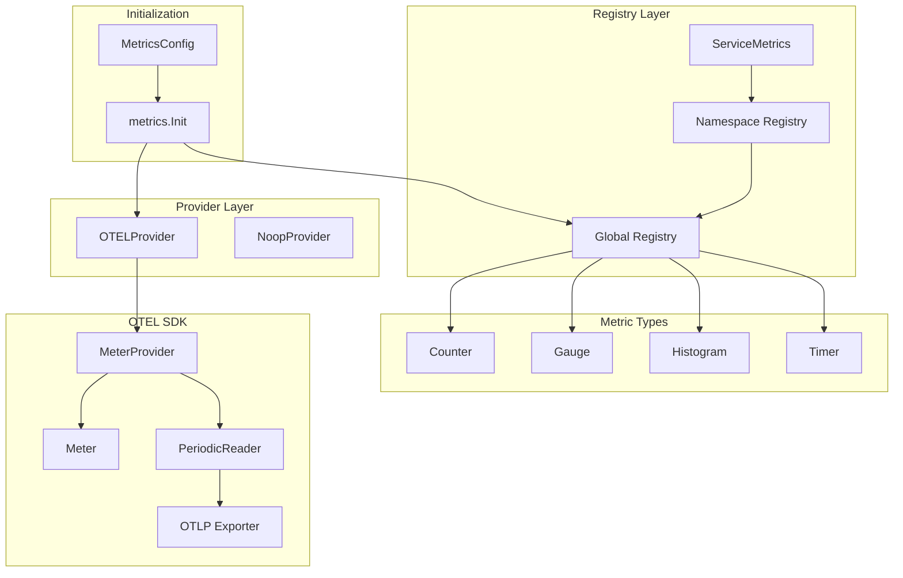
```mermaid
graph TB
    subgraph "Initialization"
        MINIT[metrics.Init]
        MCFG[MetricsConfig]
    end

    subgraph "Provider Layer"
        OTEL_PROV[OTELProvider]
        NOOP_PROV[NoopProvider]
    end

    subgraph "Registry Layer"
        GLOBAL_REG[Global Registry]
        NS_REG[Namespace Registry]
        SVC_MET[ServiceMetrics]
    end

    subgraph "Metric Types"
        COUNTER[Counter]
        GAUGE[Gauge]
        HISTOGRAM[Histogram]
        TIMER[Timer]
    end

    subgraph "OTEL SDK"
        METER[Meter]
        METER_PROV[MeterProvider]
        READER[PeriodicReader]
        EXPORTER[OTLP Exporter]
    end

    MCFG --> MINIT
    MINIT --> OTEL_PROV
    MINIT --> GLOBAL_REG

    OTEL_PROV --> METER_PROV
    METER_PROV --> METER
    METER_PROV --> READER
    READER --> EXPORTER

    GLOBAL_REG --> COUNTER
    GLOBAL_REG --> GAUGE
    GLOBAL_REG --> HISTOGRAM
    GLOBAL_REG --> TIMER

    NS_REG --> GLOBAL_REG
    SVC_MET --> NS_REG
```

#### Metrics Class Diagram

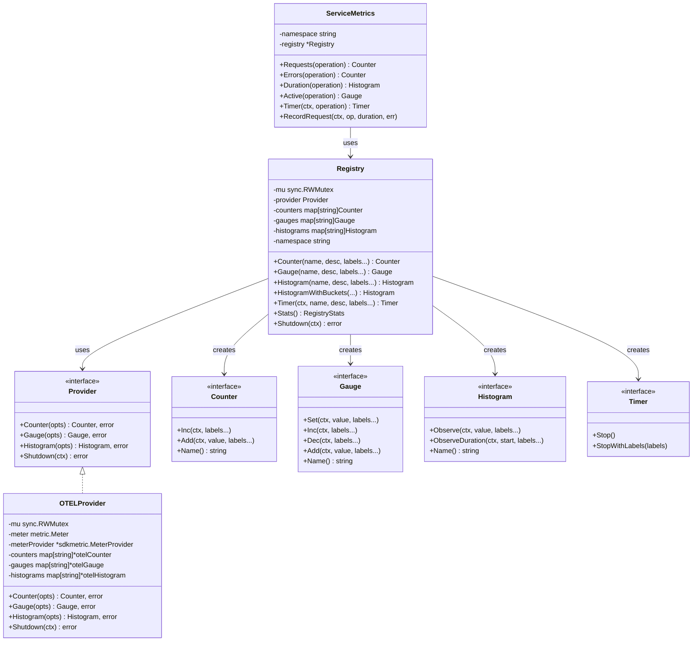
```mermaid
classDiagram
    class Provider {
        <<interface>>
        +Counter(opts) Counter, error
        +Gauge(opts) Gauge, error
        +Histogram(opts) Histogram, error
        +Shutdown(ctx) error
    }

    class OTELProvider {
        -mu sync.RWMutex
        -meter metric.Meter
        -meterProvider *sdkmetric.MeterProvider
        -counters map[string]*otelCounter
        -gauges map[string]*otelGauge
        -histograms map[string]*otelHistogram
        +Counter(opts) Counter, error
        +Gauge(opts) Gauge, error
        +Histogram(opts) Histogram, error
        +Shutdown(ctx) error
    }

    class Registry {
        -mu sync.RWMutex
        -provider Provider
        -counters map[string]Counter
        -gauges map[string]Gauge
        -histograms map[string]Histogram
        -namespace string
        +Counter(name, desc, labels...) Counter
        +Gauge(name, desc, labels...) Gauge
        +Histogram(name, desc, labels...) Histogram
        +HistogramWithBuckets(...) Histogram
        +Timer(ctx, name, desc, labels...) Timer
        +Stats() RegistryStats
        +Shutdown(ctx) error
    }

    class Counter {
        <<interface>>
        +Inc(ctx, labels...)
        +Add(ctx, value, labels...)
        +Name() string
    }

    class Gauge {
        <<interface>>
        +Set(ctx, value, labels...)
        +Inc(ctx, labels...)
        +Dec(ctx, labels...)
        +Add(ctx, value, labels...)
        +Name() string
    }

    class Histogram {
        <<interface>>
        +Observe(ctx, value, labels...)
        +ObserveDuration(ctx, start, labels...)
        +Name() string
    }

    class Timer {
        <<interface>>
        +Stop()
        +StopWithLabels(labels)
    }

    class ServiceMetrics {
        -namespace string
        -registry *Registry
        +Requests(operation) Counter
        +Errors(operation) Counter
        +Duration(operation) Histogram
        +Active(operation) Gauge
        +Timer(ctx, operation) Timer
        +RecordRequest(ctx, op, duration, err)
    }

    Provider <|.. OTELProvider
    Registry --> Provider : uses
    Registry --> Counter : creates
    Registry --> Gauge : creates
    Registry --> Histogram : creates
    Registry --> Timer : creates
    ServiceMetrics --> Registry : uses
```

#### Metric Recording Flow

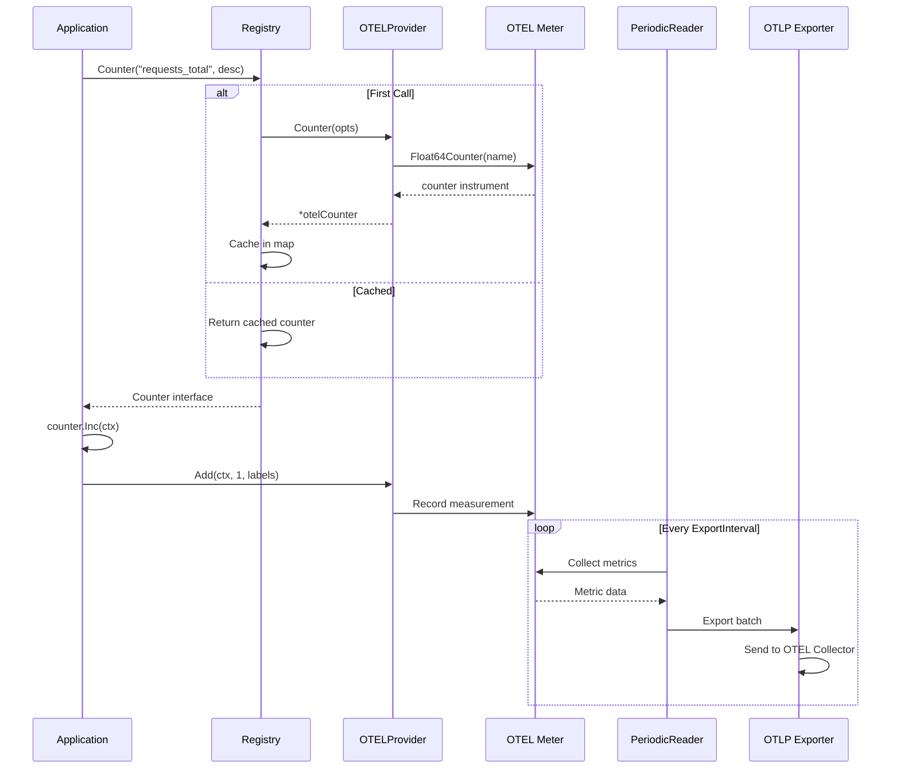
```mermaid
sequenceDiagram
    participant App as Application
    participant Reg as Registry
    participant Prov as OTELProvider
    participant Meter as OTEL Meter
    participant Reader as PeriodicReader
    participant Exp as OTLP Exporter

    App->>Reg: Counter("requests_total", desc)

    alt First Call
        Reg->>Prov: Counter(opts)
        Prov->>Meter: Float64Counter(name)
        Meter-->>Prov: counter instrument
        Prov-->>Reg: *otelCounter
        Reg->>Reg: Cache in map
    else Cached
        Reg->>Reg: Return cached counter
    end

    Reg-->>App: Counter interface

    App->>App: counter.Inc(ctx)
    App->>Prov: Add(ctx, 1, labels)
    Prov->>Meter: Record measurement

    loop Every ExportInterval
        Reader->>Meter: Collect metrics
        Meter-->>Reader: Metric data
        Reader->>Exp: Export batch
        Exp->>Exp: Send to OTEL Collector
    end
```

---

### Tracer

#### Tracer Architecture

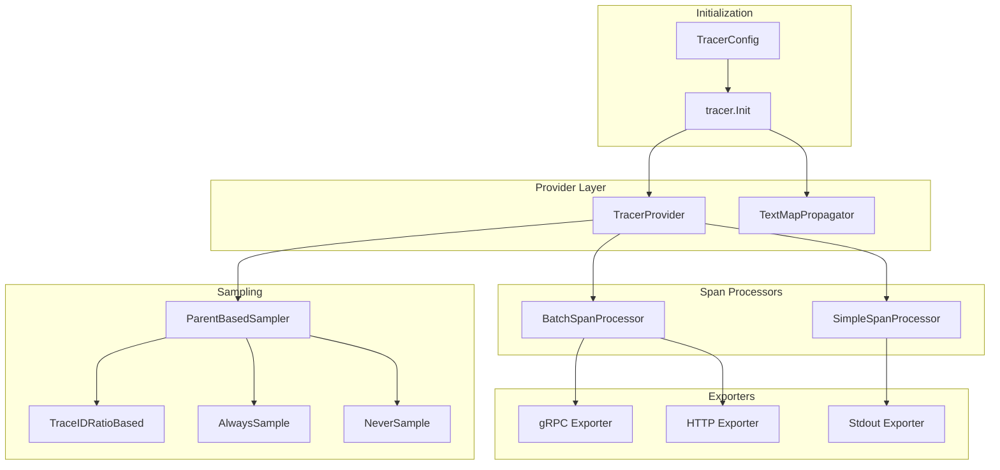
```mermaid
graph TB
    subgraph "Initialization"
        TINIT[tracer.Init]
        TCFG[TracerConfig]
    end

    subgraph "Provider Layer"
        TRACE_PROV[TracerProvider]
        PROPAGATOR[TextMapPropagator]
    end

    subgraph "Span Processors"
        BATCH[BatchSpanProcessor]
        SIMPLE[SimpleSpanProcessor]
    end

    subgraph "Exporters"
        GRPC_EXP[gRPC Exporter]
        HTTP_EXP[HTTP Exporter]
        STDOUT_EXP[Stdout Exporter]
    end

    subgraph "Sampling"
        SAMPLER[ParentBasedSampler]
        RATIO[TraceIDRatioBased]
        ALWAYS[AlwaysSample]
        NEVER[NeverSample]
    end

    TCFG --> TINIT
    TINIT --> TRACE_PROV
    TINIT --> PROPAGATOR

    TRACE_PROV --> BATCH
    TRACE_PROV --> SIMPLE
    TRACE_PROV --> SAMPLER

    BATCH --> GRPC_EXP
    BATCH --> HTTP_EXP
    SIMPLE --> STDOUT_EXP

    SAMPLER --> RATIO
    SAMPLER --> ALWAYS
    SAMPLER --> NEVER
```

#### Tracer Class Diagram

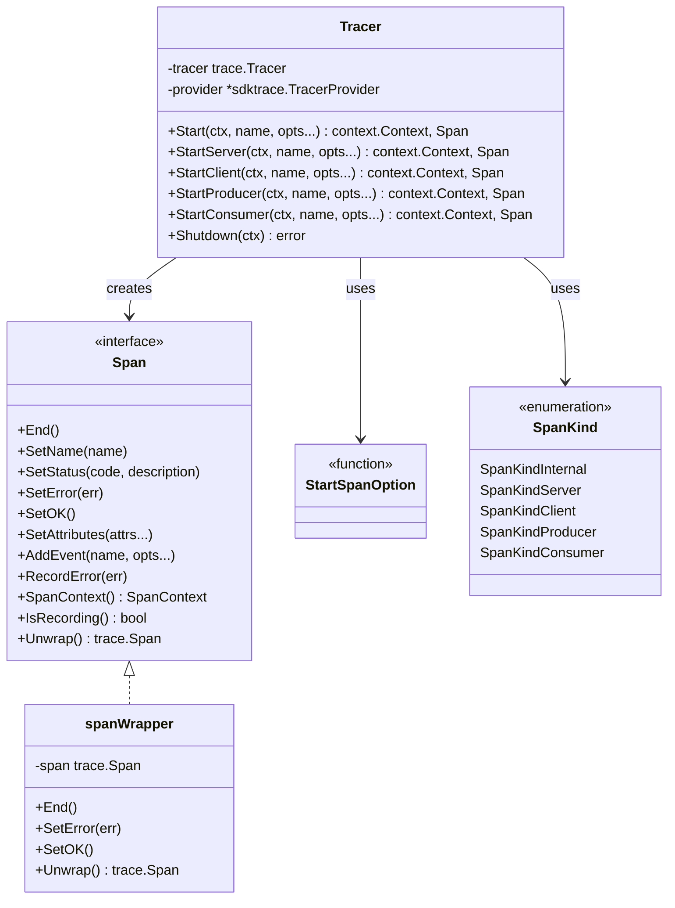
```mermaid
classDiagram
    class Tracer {
        -tracer trace.Tracer
        -provider *sdktrace.TracerProvider
        +Start(ctx, name, opts...) context.Context, Span
        +StartServer(ctx, name, opts...) context.Context, Span
        +StartClient(ctx, name, opts...) context.Context, Span
        +StartProducer(ctx, name, opts...) context.Context, Span
        +StartConsumer(ctx, name, opts...) context.Context, Span
        +Shutdown(ctx) error
    }

    class Span {
        <<interface>>
        +End()
        +SetName(name)
        +SetStatus(code, description)
        +SetError(err)
        +SetOK()
        +SetAttributes(attrs...)
        +AddEvent(name, opts...)
        +RecordError(err)
        +SpanContext() SpanContext
        +IsRecording() bool
        +Unwrap() trace.Span
    }

    class spanWrapper {
        -span trace.Span
        +End()
        +SetError(err)
        +SetOK()
        +Unwrap() trace.Span
    }

    class StartSpanOption {
        <<function>>
    }

    class SpanKind {
        <<enumeration>>
        SpanKindInternal
        SpanKindServer
        SpanKindClient
        SpanKindProducer
        SpanKindConsumer
    }

    Span <|.. spanWrapper
    Tracer --> Span : creates
    Tracer --> StartSpanOption : uses
    Tracer --> SpanKind : uses
```

#### Distributed Trace Flow

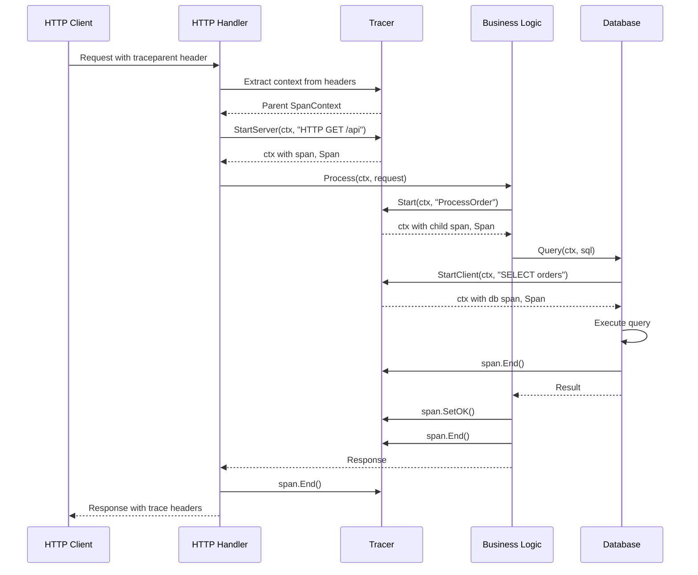
```mermaid
sequenceDiagram
    participant Client as HTTP Client
    participant Handler as HTTP Handler
    participant Tracer as Tracer
    participant Service as Business Logic
    participant DB as Database

    Client->>Handler: Request with traceparent header
    Handler->>Tracer: Extract context from headers
    Tracer-->>Handler: Parent SpanContext

    Handler->>Tracer: StartServer(ctx, "HTTP GET /api")
    Tracer-->>Handler: ctx with span, Span

    Handler->>Service: Process(ctx, request)
    Service->>Tracer: Start(ctx, "ProcessOrder")
    Tracer-->>Service: ctx with child span, Span

    Service->>DB: Query(ctx, sql)
    DB->>Tracer: StartClient(ctx, "SELECT orders")
    Tracer-->>DB: ctx with db span, Span

    DB->>DB: Execute query
    DB->>Tracer: span.End()
    DB-->>Service: Result

    Service->>Tracer: span.SetOK()
    Service->>Tracer: span.End()
    Service-->>Handler: Response

    Handler->>Tracer: span.End()
    Handler-->>Client: Response with trace headers
```

---

## Data Flow

### Complete Observability Data Flow

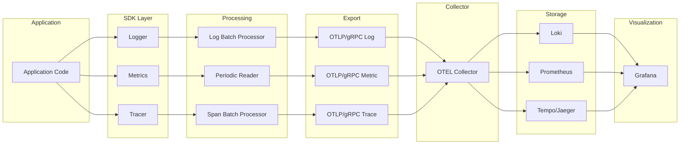
```mermaid
graph LR
    subgraph "Application"
        CODE[Application Code]
    end

    subgraph "SDK Layer"
        LOG[Logger]
        MET[Metrics]
        TRACE[Tracer]
    end

    subgraph "Processing"
        LOG_BATCH[Log Batch Processor]
        MET_READER[Periodic Reader]
        TRACE_BATCH[Span Batch Processor]
    end

    subgraph "Export"
        OTLP_LOG[OTLP/gRPC Log]
        OTLP_MET[OTLP/gRPC Metric]
        OTLP_TRACE[OTLP/gRPC Trace]
    end

    subgraph "Collector"
        OTEL_COL[OTEL Collector]
    end

    subgraph "Storage"
        LOKI[Loki]
        PROM[Prometheus]
        TEMPO[Tempo/Jaeger]
    end

    subgraph "Visualization"
        GRAFANA[Grafana]
    end

    CODE --> LOG
    CODE --> MET
    CODE --> TRACE

    LOG --> LOG_BATCH
    MET --> MET_READER
    TRACE --> TRACE_BATCH

    LOG_BATCH --> OTLP_LOG
    MET_READER --> OTLP_MET
    TRACE_BATCH --> OTLP_TRACE

    OTLP_LOG --> OTEL_COL
    OTLP_MET --> OTEL_COL
    OTLP_TRACE --> OTEL_COL

    OTEL_COL --> LOKI
    OTEL_COL --> PROM
    OTEL_COL --> TEMPO

    LOKI --> GRAFANA
    PROM --> GRAFANA
    TEMPO --> GRAFANA
```

---

## Configuration

### Configuration Hierarchy

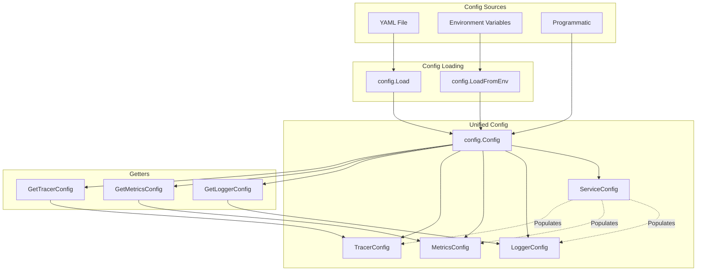
```mermaid
graph TB
    subgraph "Config Sources"
        YAML[YAML File]
        ENV[Environment Variables]
        CODE[Programmatic]
    end

    subgraph "Config Loading"
        LOAD[config.Load]
        LOADENV[config.LoadFromEnv]
    end

    subgraph "Unified Config"
        CFG[config.Config]
        SVC[ServiceConfig]
        LCFG[LoggerConfig]
        MCFG[MetricsConfig]
        TCFG[TracerConfig]
    end

    subgraph "Getters"
        GETLOG[GetLoggerConfig]
        GETMET[GetMetricsConfig]
        GETTRACE[GetTracerConfig]
    end

    YAML --> LOAD
    ENV --> LOADENV
    CODE --> CFG

    LOAD --> CFG
    LOADENV --> CFG

    CFG --> SVC
    CFG --> LCFG
    CFG --> MCFG
    CFG --> TCFG

    CFG --> GETLOG
    CFG --> GETMET
    CFG --> GETTRACE

    GETLOG --> LCFG
    GETMET --> MCFG
    GETTRACE --> TCFG

    SVC -.->|Populates| LCFG
    SVC -.->|Populates| MCFG
    SVC -.->|Populates| TCFG
```

### Environment Variables

| Component | Variable | Default | Description |
|-----------|----------|---------|-------------|
| **Service** | `SERVICE_NAME` | `app` | Service name |
| | `SERVICE_VERSION` | `0.0.0` | Service version |
| | `SERVICE_ENVIRONMENT` | `development` | Environment |
| **Logger** | `LOG_LEVEL` | `info` | Minimum log level |
| | `LOG_CONSOLE_ENABLED` | `true` | Enable console output |
| | `LOG_CONSOLE_FORMAT` | `json` | Console format |
| | `LOG_OTEL_ENABLED` | `false` | Enable OTEL export |
| | `LOG_OTEL_ENDPOINT` | `localhost:4317` | OTEL endpoint |
| | `LOG_OTEL_INSECURE` | `true` | Use insecure connection |
| | `LOG_OTEL_PROTOCOL` | `grpc` | Protocol (grpc/http) |
| | `LOG_OTEL_DEBUG` | `false` | Enable debug output |
| | `LOG_FILE_ENABLED` | `false` | Enable file output |
| | `LOG_FILE_PATH` | `logs/app.log` | Log file path |
| **Metrics** | `METRICS_ENABLED` | `true` | Enable metrics |
| | `METRICS_OTEL_ENABLED` | `false` | Enable OTEL export |
| | `METRICS_OTEL_ENDPOINT` | `localhost:4317` | OTEL endpoint |
| | `METRICS_EXPORT_INTERVAL` | `15s` | Export interval |
| **Tracer** | `TRACER_ENABLED` | `false` | Enable tracing |
| | `TRACER_OTEL_ENDPOINT` | `localhost:4317` | OTEL endpoint |
| | `TRACER_SAMPLING_RATIO` | `1.0` | Sampling ratio |
| | `TRACER_OTEL_PROTOCOL` | `grpc` | Protocol (grpc/http) |
| | `TRACER_OTEL_DEBUG` | `false` | Enable debug output |

---

## Initialization Lifecycle

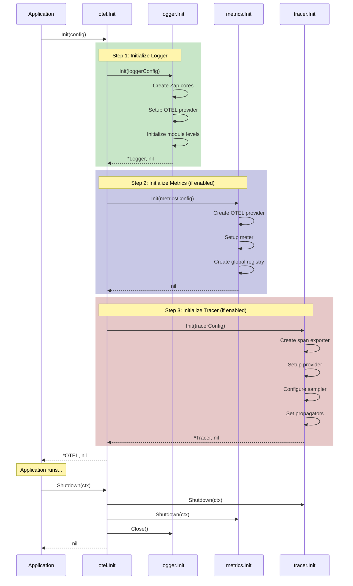
```mermaid
sequenceDiagram
    participant App as Application
    participant OTEL as otel.Init
    participant Log as logger.Init
    participant Met as metrics.Init
    participant Trace as tracer.Init

    App->>OTEL: Init(config)

    rect rgb(200, 230, 200)
        Note over OTEL,Log: Step 1: Initialize Logger
        OTEL->>Log: Init(loggerConfig)
        Log->>Log: Create Zap cores
        Log->>Log: Setup OTEL provider
        Log->>Log: Initialize module levels
        Log-->>OTEL: *Logger, nil
    end

    rect rgb(200, 200, 230)
        Note over OTEL,Met: Step 2: Initialize Metrics (if enabled)
        OTEL->>Met: Init(metricsConfig)
        Met->>Met: Create OTEL provider
        Met->>Met: Setup meter
        Met->>Met: Create global registry
        Met-->>OTEL: nil
    end

    rect rgb(230, 200, 200)
        Note over OTEL,Trace: Step 3: Initialize Tracer (if enabled)
        OTEL->>Trace: Init(tracerConfig)
        Trace->>Trace: Create span exporter
        Trace->>Trace: Setup provider
        Trace->>Trace: Configure sampler
        Trace->>Trace: Set propagators
        Trace-->>OTEL: *Tracer, nil
    end

    OTEL-->>App: *OTEL, nil

    Note over App: Application runs...

    App->>OTEL: Shutdown(ctx)
    OTEL->>Trace: Shutdown(ctx)
    OTEL->>Met: Shutdown(ctx)
    OTEL->>Log: Close()
    OTEL-->>App: nil
```

### Initialization Error Handling

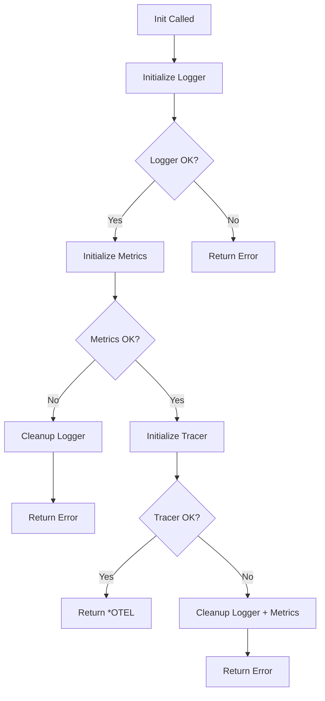
```mermaid
flowchart TB
    START[Init Called] --> INIT_LOG[Initialize Logger]

    INIT_LOG --> LOG_OK{Logger OK?}
    LOG_OK -->|Yes| INIT_MET[Initialize Metrics]
    LOG_OK -->|No| RETURN_ERR1[Return Error]

    INIT_MET --> MET_OK{Metrics OK?}
    MET_OK -->|Yes| INIT_TRACE[Initialize Tracer]
    MET_OK -->|No| CLEANUP1[Cleanup Logger]
    CLEANUP1 --> RETURN_ERR2[Return Error]

    INIT_TRACE --> TRACE_OK{Tracer OK?}
    TRACE_OK -->|Yes| SUCCESS[Return *OTEL]
    TRACE_OK -->|No| CLEANUP2[Cleanup Logger + Metrics]
    CLEANUP2 --> RETURN_ERR3[Return Error]
```

---

## Shutdown Lifecycle

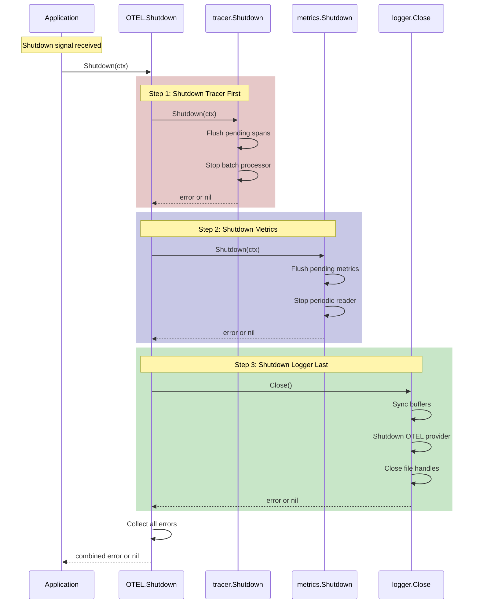
```mermaid
sequenceDiagram
    participant App as Application
    participant OTEL as OTEL.Shutdown
    participant Trace as tracer.Shutdown
    participant Met as metrics.Shutdown
    participant Log as logger.Close

    Note over App: Shutdown signal received

    App->>OTEL: Shutdown(ctx)

    rect rgb(230, 200, 200)
        Note over OTEL,Trace: Step 1: Shutdown Tracer First
        OTEL->>Trace: Shutdown(ctx)
        Trace->>Trace: Flush pending spans
        Trace->>Trace: Stop batch processor
        Trace-->>OTEL: error or nil
    end

    rect rgb(200, 200, 230)
        Note over OTEL,Met: Step 2: Shutdown Metrics
        OTEL->>Met: Shutdown(ctx)
        Met->>Met: Flush pending metrics
        Met->>Met: Stop periodic reader
        Met-->>OTEL: error or nil
    end

    rect rgb(200, 230, 200)
        Note over OTEL,Log: Step 3: Shutdown Logger Last
        OTEL->>Log: Close()
        Log->>Log: Sync buffers
        Log->>Log: Shutdown OTEL provider
        Log->>Log: Close file handles
        Log-->>OTEL: error or nil
    end

    OTEL->>OTEL: Collect all errors
    OTEL-->>App: combined error or nil
```

---

## Cross-Module Usage

### Global Accessor Pattern

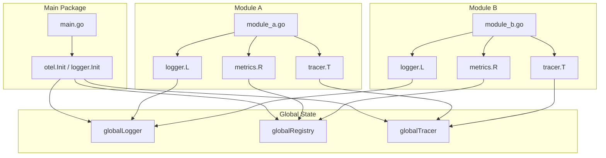
```mermaid
graph TB
    subgraph "Main Package"
        MAIN[main.go]
        INIT[otel.Init / logger.Init]
    end

    subgraph "Global State"
        GLOG[globalLogger]
        GMET[globalRegistry]
        GTRACE[globalTracer]
    end

    subgraph "Module A"
        MODA[module_a.go]
        LOGA[logger.L]
        META[metrics.R]
        TRACEA[tracer.T]
    end

    subgraph "Module B"
        MODB[module_b.go]
        LOGB[logger.L]
        METB[metrics.R]
        TRACEB[tracer.T]
    end

    MAIN --> INIT
    INIT --> GLOG
    INIT --> GMET
    INIT --> GTRACE

    MODA --> LOGA
    MODA --> META
    MODA --> TRACEA

    MODB --> LOGB
    MODB --> METB
    MODB --> TRACEB

    LOGA --> GLOG
    LOGB --> GLOG
    META --> GMET
    METB --> GMET
    TRACEA --> GTRACE
    TRACEB --> GTRACE
```

### Usage Pattern Code

```go
// main.go - Initialize once
func main() {
    cfg := config.LoadFromEnv()
    otelInstance, err := otel.Init(cfg)
    if err != nil {
        log.Fatal(err)
    }
    defer otelInstance.Shutdown(context.Background())

    // Run application...
}

// database/db.go - Use global logger
package database

import "dev.azure.com/Motadata/NextGen/motadata-go-sdk/otel/logger"

var dbLogger = logger.Module("database")

func Query(ctx context.Context, sql string) {
    dbLogger.Debug(ctx, "executing query", logger.String("sql", sql))
}

// api/handler.go - Use global metrics and tracer
package api

import (
    "dev.azure.com/Motadata/NextGen/motadata-go-sdk/otel/metrics"
    "dev.azure.com/Motadata/NextGen/motadata-go-sdk/otel/tracer"
)

var (
    apiMetrics = metrics.NewServiceMetrics("api")
)

func HandleRequest(ctx context.Context) {
    ctx, span := tracer.StartServer(ctx, "HandleRequest")
    defer span.End()

    timer := apiMetrics.Timer(ctx, "handle_request")
    defer timer.Stop()

    // Process request...
}
```

---

## Context Propagation

### Trace Context Flow

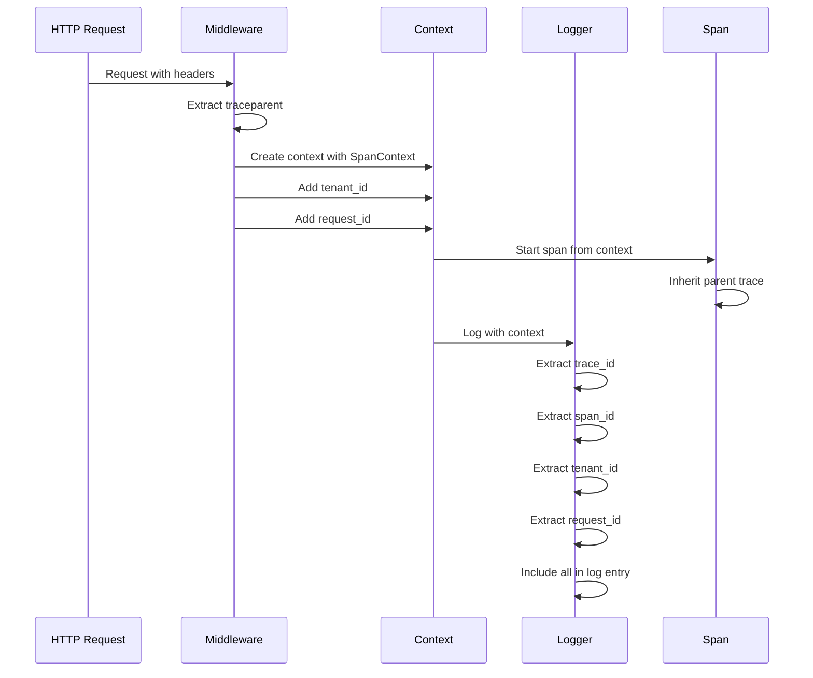
```mermaid
sequenceDiagram
    participant HTTP as HTTP Request
    participant MW as Middleware
    participant CTX as Context
    participant LOG as Logger
    participant SPAN as Span

    HTTP->>MW: Request with headers
    MW->>MW: Extract traceparent
    MW->>CTX: Create context with SpanContext
    MW->>CTX: Add tenant_id
    MW->>CTX: Add request_id

    CTX->>SPAN: Start span from context
    SPAN->>SPAN: Inherit parent trace

    CTX->>LOG: Log with context
    LOG->>LOG: Extract trace_id
    LOG->>LOG: Extract span_id
    LOG->>LOG: Extract tenant_id
    LOG->>LOG: Extract request_id
    LOG->>LOG: Include all in log entry
```

### Context Keys

| Key | Type | Source | Description |
|-----|------|--------|-------------|
| `trace_id` | string | OTEL SpanContext | Distributed trace identifier |
| `span_id` | string | OTEL SpanContext | Current span identifier |
| `tenant_id` | string | `logger.WithTenantID` | Multi-tenant identifier |
| `request_id` | string | `logger.WithRequestID` | Request correlation ID |
| `user_id` | string | `logger.WithUserID` | User identifier |
| `correlation_id` | string | `logger.WithCorrelationID` | Cross-service correlation |

---

## Error Handling

### Error Handling Strategy

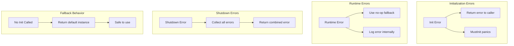
```mermaid
flowchart TB
    subgraph "Initialization Errors"
        INIT_ERR[Init Error]
        INIT_ERR --> RETURN[Return error to caller]
        INIT_ERR --> MUST[MustInit panics]
    end

    subgraph "Runtime Errors"
        RT_ERR[Runtime Error]
        RT_ERR --> NOOP[Use no-op fallback]
        RT_ERR --> LOG_ERR[Log error internally]
    end

    subgraph "Shutdown Errors"
        SHUT_ERR[Shutdown Error]
        SHUT_ERR --> COLLECT[Collect all errors]
        COLLECT --> COMBINED[Return combined error]
    end

    subgraph "Fallback Behavior"
        NO_INIT[No Init Called]
        NO_INIT --> DEFAULT[Return default instance]
        DEFAULT --> SAFE[Safe to use]
    end
```

### No-Op Fallbacks

All components provide safe no-op implementations when not initialized:

| Component | Fallback | Behavior |
|-----------|----------|----------|
| `logger.L()` | Default Logger | Logs to stdout with JSON format |
| `metrics.R()` | No-op Registry | Metrics are silently ignored |
| `tracer.T()` | No-op Tracer | Returns valid but non-recording spans |

---

## Performance Considerations

### Batching and Buffering

```mermaid
graph LR
    subgraph "Logger"
        LBUF[Zap Buffer]
        LBATCH[OTEL Batch Processor]
    end

    subgraph "Metrics"
        MBUF[In-Memory Aggregation]
        MREAD[Periodic Reader]
    end

    subgraph "Tracer"
        TBATCH[Batch Span Processor]
        TQUEUE[Queue: 2048 spans]
    end

    LBUF -->|Flush on sync| LBATCH
    LBATCH -->|512 logs / 1s| EXPORT1[Export]

    MBUF -->|Aggregate| MREAD
    MREAD -->|Every 15s| EXPORT2[Export]

    TBATCH -->|512 spans / 5s| EXPORT3[Export]
    TQUEUE --> TBATCH
```

### Default Batch Settings

| Component | Max Batch Size | Batch Timeout | Max Queue Size |
|-----------|---------------|---------------|----------------|
| Logger | 512 | 1s | 2048 |
| Metrics | N/A (aggregated) | 15s (export interval) | N/A |
| Tracer | 512 | 5s | 2048 |

---

## Best Practices

1. **Initialize Early**: Call `otel.Init()` at application startup before any logging/metrics/tracing
2. **Defer Shutdown**: Always defer `otelInstance.Shutdown(ctx)` to ensure graceful cleanup
3. **Use Context**: Pass `context.Context` through all function calls for trace propagation
4. **Module Loggers**: Create module-specific loggers for better log filtering
5. **Namespace Metrics**: Use `metrics.Namespace()` to organize related metrics
6. **Sample Appropriately**: In production, use sampling ratio < 1.0 for high-traffic services
7. **Handle Errors**: Check initialization errors; use `MustInit` only in main

---

## Dependencies

| Dependency | Version | Purpose |
|------------|---------|---------|
| `go.uber.org/zap` | v1.27+ | Structured logging |
| `gopkg.in/natefinch/lumberjack.v2` | v2.2+ | Log file rotation |
| `go.opentelemetry.io/otel` | v1.28+ | OTEL core APIs |
| `go.opentelemetry.io/otel/sdk` | v1.28+ | OTEL SDK implementation |
| `go.opentelemetry.io/contrib/bridges/otelzap` | v0.14+ | Zap to OTEL bridge |
| `google.golang.org/grpc` | v1.60+ | gRPC transport |
