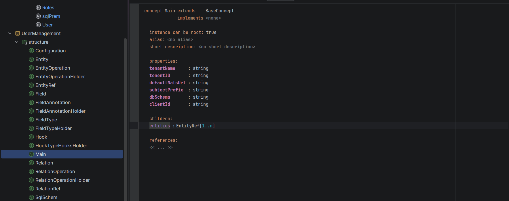

# Building a Production DSL with JetBrains MPS: What 21 Experiments Taught Me

Every entity handler looked identical. Same validation pattern. Same NATS reply structure. Same hook pipeline. Same error handling. 1,790 lines of Go spread across three files, but the cognitive structure was the same repeated three times.

That's when I knew: there had to be a better way.

This is the story of building a production domain-specific language (DSL) with JetBrains MPS — from the initial frustration to the breakthrough to a running service passing 21 end-to-end tests. Along the way I'll share what worked, what didn't, and the surprising lesson that MPS's constraints are design tools, not obstacles.

## The Hook: Too Much Repetition


I was building a NATS microservice bridging a User Management layer with a Data Access Layer. Each entity (User, Role, Permission) needed handlers for create, read, update, delete, and list. Each operation required:

1. A struct definition (the event type)
2. Validation logic (check required fields, password strength)
3. Hook execution (pre-create validation, post-create notification)
4. NATS subject routing (map to the DAL)
5. OTEL span creation (observability)

By the third entity, I'd realized I was copy-pasting handler structure. This isn't engineering — it's bureaucracy. And that's when you need a DSL.

## The Learning Journey: 21 MPS Experiments

I didn't start by building UserManagement. I started by learning MPS from first principles.

The `~/MPSProjects/` directory now contains 21 experimental projects, each teaching me something about language design in MPS:

- **Calculator DSLs** (from tutorials) — learned editor definitions and basic syntax
- **Shape DSLs** — practiced with MPS's expression language
- **gtog** (Go-to-Go transpiler) — deep dive into syntax checking, references, and scoping
- **pcrd** (CRUD DSL) — first working end-to-end example (Gin server + SQL schema + Docker)
- **config languages** (with typos like `congifLang`) — rapid iteration, learning by trying

The typos in project names tell the real story: `claculator`, `congifLang`, `testtttt`. Speed over polish. The goal wasn't to ship these — it was to understand MPS's mental model before betting on it.

By the time I reached UserManagement, I'd internalized:
- How concepts relate to each other
- How MPS's projectional editor works (and why copy-paste doesn't work)
- The power of constraints in language design
- The fundamental rule: one concept = one generated file

That last one would haunt me through the entire project.

## First Real Attempt: UMAN (The Prisma-Style Mistake)


UMAN felt natural. Define a single `Schema` file containing all entities — like Prisma's schema.prisma. One file to rule them all.

```
Models {
  User {
    id: int64 [primaryKey, auto]
    username: string
    email: email [unique]
    password: password [hidden]
    created_at: timestamp [auto]
  }
  Role {
    id: int64 [primaryKey, auto]
    name: string
    permissions: Permission[] [manyToMany]
  }
}
```

TextGen produced exactly what I asked for: a single generated file with all entity handlers. Problem: that violates the S in SOLID. One file shouldn't have three responsibilities.

I needed separate files: `user.go`, `roles.go`, `permissions.go`.

But MPS has a hard constraint: **one root concept = one generated file**. To get three files, I need three root concepts.

That's the architectural lesson from UMAN. The mistake wasn't the feature set — it was schema-centric thinking (thinking in tables) instead of entity-centric thinking (thinking in domain objects).

## The Shift: Entity-Centric Architecture

UserManagmentMps (note the typo in the original name — it stuck) flipped the architecture:

- **Top-level concept**: `Entity` (a domain object like User, Role, Permission)
- **Each Entity is a separate root** in the sandbox
- **Relations live as children of entities** (UserRole is a child of User, not a separate root)
- **Handlers are generated with their entity** (not in a separate file)

Now TextGen produced the right structure:

```
main.go          — NATS service setup
user.go          — User handlers + UserRoles relation handlers
roles.go         — Roles handlers + RolesPermissions relation handlers
permissions.go   — Permissions handlers
sqlPrem_init_sql.sql — DDL schema
```

The insight: don't fight MPS's 1:1 constraint. Work with it. Decompose your domain into separate entities, each as a root concept, each generating its own file.

This wasn't just a technical fix — it changed how I thought about the domain. Instead of "what does the database look like?" I started asking "what are the business objects and their operations?" That shift unlocked everything else: hooks, NATS subjects, prioritized validation.

## Production v3: The Four-Hook System


By March 2025, UserManagmentMps was production-ready with a hook system I'd evolved through three iterations:

```go
// Pre-sync: can abort the operation by returning an error
func (s *UserHandler) preCreateValidate(ctx context.Context, span tracer.Span, event *CreateUserEvent) error {
    if event.Password == "" {
        return errors.New("password required")
    }
    return nil
}

// Pre-async: fire-and-forget, runs via workerpool
func (s *UserHandler) preCreateNotifyStakeholders(ctx context.Context, span tracer.Span, event *CreateUserEvent) {
    // send notification without blocking create
}

// Post-sync: transforms response data after DAL reply
func (s *UserHandler) postGetFilterPII(ctx context.Context, span tracer.Span, event *GetUserEvent, data []byte) []byte {
    // strip sensitive fields before returning to client
    return sanitized
}

// Post-async: fire-and-forget after DAL reply
func (s *UserHandler) postCreateNotifyAdmin(ctx context.Context, span tracer.Span, event *CreateUserEvent, data []byte) {
    // audit log, metrics, alerts
}
```

Four signatures emerged naturally from two axes: **pre/post × sync/async**. Each serves a distinct purpose:

- **Pre-sync** validators run first (lowest priority number), can reject the operation
- **Pre-async** notifications run in parallel, can't block
- **Post-sync** transformers modify the response before it goes to the client
- **Post-async** sidecars (audit, metrics) run after the response is sent

The evolution from v1's boolean flags (`PreCreateD bool`) to this was driven by real requirements. You need both sync validation and async audit on the same operation — and those are fundamentally incompatible in a single function signature.

Generating 30+ hook stubs across four entity handlers seemed impossible — until we solved it with external Python.

## The Hardest Problems: TextGen's Walled Garden

### Problem 1: Char-by-Char Editing

The Entity TextGen template is ~300 lines of `append` statements. Every single line was typed character-by-character in MPS's projectional editor.

```
text gen component for concept Entity {
  file path: "/src/"
  extension: "go"
  file name: node.name.toLowerCase()
  body:
    append {package main\n} ;
    append {import (\n} ;
    append {"github.com/nats-io/nats.go"\n} ;
    // ... 290 more lines like this
}
```

This is genuinely painful:
- Can't copy-paste working Go code into the template
- Can't use AI to help write templates (can't export them)
- Can't diff changes in git (the `.mps` files are binary XML)
- Every `{`, `}`, `\n` requires an editor action

I tried everything: pasting from external editors (doesn't work — walled garden), exporting templates (MPS doesn't support import), using DSL Foundry (failed — couldn't understand groupings).

Then I asked the right question: what is MPS actually reading? Not what its editor displays — what format does it actually load from disk?

### Problem 2: Reverse-Engineering the Bridge

I built `parse_textgen.py` — a Python script that:

1. Accepts a human-readable `.md` file that looks like TextGen output
2. Reverse-engineers the MPS internal `.mps` XML format
3. Produces valid `.mps` files that MPS loads as if typed natively

This took one full day and a lot of AI tokens to decode the XML node structure permutations. But once working, the workflow became:

```bash
1. Write template.md in any text editor
2. run parse_textgen.py template.md
3. Load the generated .mps file into MPS
4. MPS treats it as if you typed it natively
```

Templates became version-controllable (markdown is text, not binary). AI could help write them. Iteration speed multiplied.

The breakthrough insight: **when MPS's editing UX is a blocker, don't find a better plugin — reverse-engineer the import format and build a bridge**.

### Problem 3: The Hook Stub Extraction

Generated code needed a `userDefinedHooks.go` file. But MPS's 1:1 constraint meant creating a root concept just for hook stubs would clutter the sandbox.

Solution: generate hooks *inside* entity files, then extract them with Python.

`merge_hooks.py` does three things:

1. **Strips hooks** — looks for `#HOOKS_START` / `#HOOKS_END` markers
2. **Preserves existing implementations** — new hooks appended, old hooks kept unless signature changed
3. **Detects signature changes** — if a hook changed from sync to async, replace the stub and warn

```python
def merge_hooks(entity_files, userDefinedHooks):
    for entity_file in entity_files:
        hooks = extract_between_markers(entity_file, "#HOOKS_START", "#HOOKS_END")
        for hook in hooks:
            key = f"{hook.receiver_type}.{hook.name}"
            if key not in userDefinedHooks:
                userDefinedHooks[key] = hook_stub
            elif signature_changed(hook, userDefinedHooks[key]):
                warn(f"Signature changed: {key}")
                userDefinedHooks[key] = hook_stub
            else:
                # Keep user's implementation
                pass
```

The identity key is `*ReceiverType.funcName` — not just the function name. That distinction matters: `*UserHandler.preAssign` and `*RolesHandler.preAssign` are different hooks that happen to share a name. Keying only by name caused a silent collision bug early on where the UserRoles assign implementation was overwritten by the RolesPermissions stub.

## What Actually Worked: "Don't Fight MPS, Extend It"

Three patterns emerged as the philosophy:

### 1. Separate Concepts for Separate Files

Each entity = separate root concept. Embrace the 1:1 constraint.

```
Sandbox:
  Main       → main.go
  User       → user.go
  Roles      → roles.go
  Permissions → permissions.go
  SqlSchema  → sqlPrem_init_sql.sql
```

### 2. External Scripts for Coordination

When MPS's 1:1 constraint blocks what you need (consolidating 30+ hook stubs into one file), generate combined output and use external scripts to transform it:

- `merge_hooks.py` — extracts hooks from generated files and consolidates them
- `sync.sh` — copies `.go` files from MPS, patches SDK imports, builds Docker

Pattern: **MPS generates → External script transforms → Final output**.

### 3. Build Bridges, Not Workarounds

Future projects should use:
- **DSL Foundry TextGen** — the M2 attempt failed due to missing guides, not plugin quality; with more MPS experience this is tractable
- **MPS extensions** (mbeddr) — reduces editor boilerplate

The meta-principle: **use MPS for structure and constraints, use external tools for text manipulation and build coordination**.

## The Alternatives I Explored (And Why They Didn't Win)

### Rust Declarative Macros

I built a working prototype in `/home/prem-modha/projects/rust/userManMacros`:

```rust
schema! {
    User {
        name: String,
        email: Email,
        password: Password,
        age: u32,
    }
    indexes { name: String, email: Email }
}

many_to_many!(UserRole, User, Role);
```

This generates structs, CRUD stores, query builders, cascade deletes — real functionality. But it has no hook system, no NATS integration, no OTEL. The macro system solves the *editing* problem (templates are normal Rust code) but not the *structure* problem (defining valid domains with constraints, generating NATS subject patterns). MPS excels at structure; macros excel at editing. Neither does both.

### JSON AST → Jinja Templates


The idea: MPS generates a JSON AST of the domain, then external Jinja templates produce the Go code. This solves the walled garden (Jinja templates in any text editor) but requires building a JSON serializer in MPS, then handling all the permutations of field types, hook signatures, and relation types in Jinja. The `parse_textgen.py` bridge was faster to implement for the current scope.

## The 21 Experiments in Perspective

Looking back, the 21 projects weren't failures. They were investment in understanding MPS's mental model before committing to a production use case.

Each taught something concrete:
- **Calculator/Shape DSLs** — MPS editor fundamentals
- **gtog** — language design (syntax, references, scoping)
- **pcrd** — proof that end-to-end generation works
- **UMAN** — what NOT to do (single-file schema-centric architecture)

By the time I built v3, I understood MPS's strengths (structure, constraints, concepts) and weaknesses (projectional editor UX, walled garden). That's why v3 worked: it leveraged the strengths and routed around the weaknesses with external tools.

If I'd skipped the experiments and tried to build UserManagement directly, I'd have made the UMAN mistake on the "real" project. The 21 experiments compressed that learning safely.

## The Stats (What Production Looks Like)



**Generated Code**:
- 1,790 lines of Go across 4 files
- 30+ hook stubs (pre/post × sync/async)
- 21 e2e integration tests
- Docker Compose deployment (NATS on 4229)

**Tooling**:
- `parse_textgen.py` — 1 day to reverse-engineer and implement
- `merge_hooks.py` — preserves user implementations across regeneration
- `sync.sh` — copies output from MPS, patches SDK paths, builds Docker
- `demo.sh` — 21 tests via `nats req` against mock DAL

**The TextGen Template**:
- ~300 lines of append statements
- ~400 lines of Go generated per entity
- Each line originally typed char-by-char (before the bridge existed)

## Five Things I Wish I Knew

### 1. The 1:1 Constraint Is a Feature, Not a Bug

I fought it first. Then I realized: decomposing your domain into separate root concepts forces clean architecture. Each entity is independent. No god file with three responsibilities.

**For next time**: Design your domain around the constraint from day one.

### 2. The Walled Garden Can Be Bypassed

MPS's projectional editor prevents copy-paste. But the constraint is UX, not technical. Once you understand what MPS actually reads from disk, solutions appear.

**For next time**: Build a text → MPS bridge early. The ROI is immediate.

### 3. Hooks Are Your Extensibility Contract

Pre/post × sync/async × priority = a powerful customer extension mechanism. Customers can validate, transform, and side-effect on every operation without touching generated code.

**For next time**: Design hooks early. They're not developer convenience — they're the extensibility API.

### 4. External Scripts Solve MPS's Structural Limits

When the 1:1 constraint prevents what you need, generate combined output and use external Python/Bash to transform it. This isn't a hack — it's the right tool for coordination work that MPS can't do.

**For next time**: Let MPS focus on generating correct Go. Let scripts handle file merging, path patching, dependency management.

### 5. Budget Time to Learn the Tool Before Betting on It

The 21 experiments weren't wasted time. They were necessary. By the time I reached UserManagement v3, MPS's mental model was intuitive — not alien. Concepts, relations, hooks, constraints all made sense.

**For next time**: The learning cost is real. Pay it up front in low-stakes experiments, not mid-project on production code.

## Closing: What This Project Proved


You can build a production DSL with MPS. The generated NATS microservice is running. Tests pass. Hooks execute. Customers can extend it.

But success requires accepting MPS's constraints and extending them with external tooling. The naive approach — fight the projectional editor, demand a normal text editor, refuse the 1:1 concept-to-file mapping — leads to frustration and abandoned projects (both UMAN and pcrd demonstrate this).

The winning approach: **use MPS for what it's good at (structure, constraints, concepts), and use external tools (Python, Bash, templates) for what it's bad at (text editing, file coordination, build pipelines)**.

That's the philosophy that took v3 from prototype to production.

The NATS microservice now handles User, Role, and Permission operations. More entities can be added by following the pattern. Hooks are the extensibility layer. The codebase is maintainable because each entity is separate, each responsibility is clear, and the tooling preserves user code across regeneration.

If you're considering MPS for your DSL: learn the fundamentals, understand the constraints, build bridges rather than fighting walls, and document what you learn as you go.

The payoff is worth it.

---

**Where to go from here**: Read the full knowledge graph at `docs/knowledge/` for deep dives into TextGen, hooks, the merge strategy, alternatives explored, and the forensics of every failure mode encountered.
