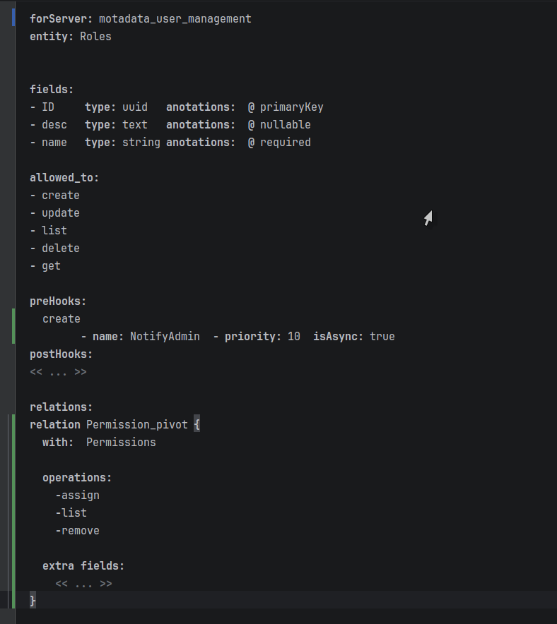

= The Developer Flow

image::images/permissions-entity-hooks.png[MPS Editor: Permissions entity with pre/post hooks]

This section traces the complete workflow for adding a new entity to the system.
The example is the Permissions entity — the third entity added after User and Roles were already working.

The six steps:

. Define the entity in MPS (fields, operations)
. Define hooks on operations
. Define relations (RolesPermissions)
. Run TextGen to generate Go files
. Run `sync.sh` to copy, merge, patch, and rebuild
. Run `demo.sh` to verify

== Step 1: Define the Entity in MPS

image::images/entity-user-definition-1.png[MPS Editor: User Entity definition with fields, types, and annotations]

Open MPS, navigate to the UserManagmentMps project, and create a new root node of type `Entity`.

The projectional editor presents a structured form — not a text file.
Fill in the entity name, then add fields one by one using completion menus.

[source]
----
Entity: Permissions
  fields:
    id          uuid     primaryKey, auto
    name        string   required
    description text     nullable
    created_at  time     auto
  operations: create, get, update, delete, list
----

The DSL editor validates as you type.
`uuid` + `primaryKey` tells the generator to produce `UUID PRIMARY KEY DEFAULT gen_random_uuid()` in SQL.
`text` + `nullable` tells it to omit `NOT NULL`.
`time` + `auto` produces `TIMESTAMPTZ NOT NULL DEFAULT NOW()`.

Compare this to the User entity:

[source]
----
Entity: User
  fields:
    id          uuid     primaryKey, auto
    username    string   required
    email       email    required
    password    password hidden
    created_at  time     auto
    updated_at  time     auto
  operations: create, get, update, delete, list
----

The structure is identical — same field type vocabulary, same operation list, same annotation system.
The generator sees the same pattern and applies the same template.
The output will be a `permissions.go` file with the same eight-step structure as `user.go` and `roles.go`, with `Permissions`-specific type names and subjects.

[WARNING]
====
*The faithful propagation rule:* Typos in DSL field names propagate without correction.
If the entity is named `Permissons` (missing an 'i'), the generated file will be `permissons.go`, the NATS subject will be `motadata.permissons.create`, and the SQL table will be `iam.permissons`.
The generator trusts the declaration.
MPS constraints can catch some errors (duplicate names, missing required fields) but cannot catch semantic mistakes like misspellings.
====

== Step 2: Define Hooks

With the entity defined, add hooks to specific operations.
In MPS, hooks are children of an operation within the entity definition.

[source]
----
Entity: Permissions
  ...
  hooks on create:
    preCreateValidate  (pre-sync,  priority 1)   ← blocks; can abort
    preCreateAudit     (pre-async, priority 2)   ← fire-and-forget logging
    postCreateNotify   (post-async, priority 1)  ← fire-and-forget alert
----

When a hook is added, the generator:

. Includes the hook stub in the generated `permissions.go` between `#HOOKS_START` and `#HOOKS_END` markers.
. Includes the hook call in the `HandleCreate` method at the correct phase (pre-hooks before DAL forward, post-hooks after).
. Sorts hooks by priority within each phase before generating the dispatch code.

[NOTE]
====
*Priority and async interaction:* `preCreateValidate` runs first (priority 1, sync).
It can return an error to abort the operation before the DAL is called.
`preCreateAudit` runs second (priority 2, async) — it has already been dispatched to the workerpool by the time the main goroutine continues.
If `preCreateValidate` fails on a later request, `preCreateAudit` will have already fired for that request.
*Place sync validators at lower priority numbers than async hooks* to ensure validation runs before async work begins.
====

The conditional import logic is worth noting here.
Because `preCreateAudit` and `postCreateNotify` are async, the TextGen template detects that the entity `needWorkerPool()` and includes the workerpool import in the generated file.
If all hooks were sync, the workerpool import would be omitted entirely.

== Step 3: Define Relations

A relation connecting Roles to Permissions is a separate concept in MPS, defined as a child of the Roles entity:

[source]
----
Entity: Roles
  ...
  Relation: RolesPermissions
    from: Roles
    to:   Permissions
    operations: assign, remove, list
    extraFields:
      granted_at  time  auto
----

Compare to UserRoles:

[source]
----
Entity: User
  ...
  Relation: UserRoles
    from: User
    to:   Roles
    operations: assign, remove, list
    extraFields:
      assigned_at  time  auto
----

The template is identical — only the entity names and field names differ.
`RolesPermissions` generates into `roles.go` (because it is a child of Roles).
`UserRoles` generates into `user.go` (because it is a child of User).

This gives three handler methods inside `roles.go`:

[source,go]
----
func (s *RolesHandler) HandleAssign(msg micro.Request)  { ... }
func (s *RolesHandler) HandleRemove(msg micro.Request)  { ... }
func (s *RolesHandler) HandleList(msg micro.Request)    { ... }
----

With NATS subjects:

* `motadata.roles.permissions.assign`
* `motadata.roles.permissions.remove`
* `motadata.roles.permissions.list`

== Step 4: Run TextGen

In MPS, right-click the root node → "Preview Generated Text" to see what will be produced.
This is the fastest feedback loop — it shows the output inline without file I/O, without running `sync.sh`, without rebuilding Docker.

Use "Preview Generated Text" to verify:

* The struct fields match the declaration (correct types, correct annotations)
* The operation methods are present (`HandleCreate`, `HandleGet`, etc.)
* The hook calls appear in the correct phase order
* The `#HOOKS_START` / `#HOOKS_END` markers are present with the correct stub signatures

When the preview looks correct, trigger full TextGen (right-click → "Generate Text") to write the files to `source_gen/`.

MPS generates:
* `source_gen/permissions.go` — Permissions entity handler (~307 lines)
* Updated `source_gen/roles.go` — now includes RolesPermissions relation handlers
* Updated `source_gen/sqlPrem_init_sql.sql` — now includes `iam.permissions` table (if `SqlSchem` references the new entity)

[NOTE]
====
*The SqlSchem reference gap:* The SQL schema only generates tables for entities that are referenced in the `SqlSchem` root concept's `entityrefs` list.
Adding `Permissions` as an entity does not automatically add it to the SQL schema.
A reference to Permissions in the `SqlSchem` root must also be added.
This was the cause of the missing Permissions table in the initial deployment — the entity existed, the handler worked, but the table was never created.
====

== Step 5: Run sync.sh

`sync.sh` is the transition from "files on disk" to "running service."
It is also the step with the most ways to go wrong.

[source,bash]
----
./sync.sh
----

What happens, in order:

. `permissions.go` is copied from `source_gen/` to `src/`. Previous `src/permissions.go` (if any) is overwritten.
. `merge_hooks.py` runs. It finds `#HOOKS_START` in `src/permissions.go` and extracts three new stubs: `preCreateValidate`, `preCreateAudit`, `postCreateNotify`. These are appended to `userDefinedHooks.go`.
. `roles.go` is also copied and merged — the `RolesPermissions` hooks appear as new stubs.
. SDK is rsynced and patched.
. Docker container is rebuilt and restarted.

After `sync.sh`, open `userDefinedHooks.go`:

[source,go]
----
// New stubs appended by merge_hooks.py:

func (s *PermissionsHandler) preCreateValidate(
    ctx context.Context, span tracer.Span, event *PermissionsCreatedEvent) error {
    return nil
}

func (s *PermissionsHandler) preCreateAudit(
    ctx context.Context, span tracer.Span, event *PermissionsCreatedEvent) {
}

func (s *PermissionsHandler) postCreateNotify(
    ctx context.Context, span tracer.Span, event *PermissionsCreatedEvent, data []byte) {
}
----

The stubs are empty.
Implement the business logic here.
On the next `sync.sh` run, `merge_hooks.py` will skip these stubs (they already exist with matching signatures) and preserve the implementations.

=== War Story: The Trailing Dot Bug

During early development of the Permissions entity, a generated handler contained:

[source,go]
----
if event.Permissions. == "" {
    // validation
}
----

A trailing dot — `event.Permissions.` — with nothing after it.
The Go compiler caught this immediately, but the root cause was not obvious.

Tracing backward: the TextGen template iterates `node.fields` and for each non-auto, non-hidden, non-nullable field, appends:

[source]
----
append {|| event.} ;
append ${field.name.capitalize()} ;
append { == ""} ;
----

`field.name.capitalize()` returned an empty string.
The field in MPS had been created in the editor but not named.
The MPS editor allows a field to exist with an empty name — there is no constraint preventing it.

TextGen generated `event.` + `""` + ` == ""` = `event. == ""`.

The fix: give the field a name, or delete it.

*Principle:* Silent generation failures produce syntactically invalid code.
The symptom appears in the compiler, not in MPS.
When a Go compile error looks like a template expansion artifact (trailing dots, empty identifiers, doubled strings), trace backward to the TextGen node that produced that line — not to the Go code itself.

== Step 6: Run demo.sh

[source,bash]
----
./demo.sh
----

`demo.sh` connects to `nats://localhost:4229` and runs 21 tests.
For the Permissions entity, it spawns a mock DAL responder:

[source,bash]
----
nats reply "motadata.permissions.db.>" '{"status":"ok"}' &
----

Then sends test messages:

[source,bash]
----
# Test: valid permission create
nats req motadata.permissions.create \
    '{"name":"read:users","description":"Can read user list"}'

# Test: missing required field (name)
nats req motadata.permissions.create \
    '{"description":"No name provided"}'

# Expected: validation error response
----

A passing test suite confirms:

* The NATS subjects are correctly registered (service discovery works)
* Validation fires on missing required fields
* Pre-hooks run in priority order
* DAL forwarding works (mock responder replies, main handler returns the reply)
* Post-hooks fire

== What Can Go Wrong at Each Step

[cols="1,2,2", options="header"]
|===
| Step | Symptom | Root Cause

| Define entity
| Wrong field type in generated struct
| Field declared with wrong DSL type; generator trusts the declaration

| Define entity
| Missing SQL table
| Entity not referenced in `SqlSchem` root's `entityrefs` list

| Define hooks
| Async hook fires even when sync validator aborts
| Async hook has lower priority number than sync validator — runs first

| Run TextGen
| Trailing dot in generated code
| Field in MPS editor has empty name string

| Run TextGen
| `user_roless` double suffix in SQL
| Hardcoded `"s"` suffix appended to entity name that already ends in 's'

| Run sync.sh
| Old hook implementation broken after sync
| Hook changed from sync to async (signature mismatch); check `merge_hooks.py` stdout for warning

| Run sync.sh
| Build fails: cannot find module
| SDK rsync didn't complete or module path patch failed; check `motadata-go-sdk/go.mod`

| Run demo.sh
| Test times out instead of failing
| No mock DAL responder for the new entity's `*.db.*` subjects; add `nats reply` for the entity
|===

[WARNING]
====
*Watch for:*

* Running `demo.sh` before `sync.sh` completes. Docker Compose takes time to become healthy — `demo.sh` connects immediately and may see the old container.
* Implementing hook logic that depends on DAL response format before verifying the mock DAL response matches production DAL format. Mock responders return `{"status":"ok"}` for everything — production DAL returns entity-specific JSON.
* Forgetting that hook implementations in `userDefinedHooks.go` are not regenerated. If a hook is renamed in MPS, the old implementation remains in `userDefinedHooks.go` under the old name, unused. The new stub is appended with an empty body. The old implementation must be manually migrated and deleted.
====
