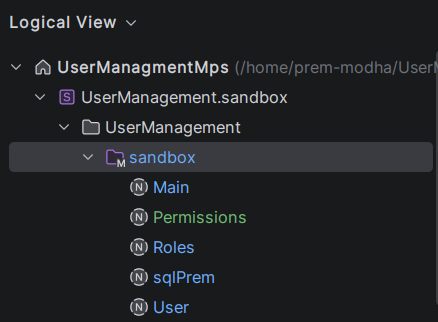

# DSL Code Generation: What We Built and Why It Works

---

## Slide 1: Title Slide

**UserManagmentMps — Production Code Generation DSL**

*1,790 Lines of Go Generated from Entity Definitions*

**Project**: UserManagmentMps — NATS Microservice Code Generator
**Timeline**: Feb 2 – Mar 19, 2025 (6 weeks)
**Status**: Production (21 e2e tests passing)

**Speaker notes**: This talk covers the architecture of a Domain-Specific Language (DSL) built on JetBrains MPS. It generates a complete NATS microservice — handlers, SQL schema, hook stubs — from compact entity definitions. The system is deployed and all tests pass.

---

## Slide 2: Agenda

**What We'll Cover**

- **The Problem**: 1,790 lines of hand-written boilerplate
- **The Architecture**: Three pivots that shaped the final design
- **Key Technical Decisions**: The constraints we respected and how
- **What Ships**: Artifacts, stats, and validation results
- **Operational Patterns**: Top 5 design principles
- **Future Directions**: DSL Foundry, Rust macros, JSON AST
- **Q&A**

**Speaker notes**: This is a technical deep-dive. If you work with code generation, DSL design, or NATS microservices, there is relevant material here for you. The focus is on concrete decisions and their consequences.

---

## Slide 3: The Problem

**One Entity. Repeated Three Times.**

A NATS microservice for User Management requires, per entity:
- Request-reply handlers (create, get, update, delete, list)
- Hook system (pre/post, sync/async, with priority ordering)
- OTEL tracing on every operation
- SDK integration (Motadata Go SDK)
- SQL schema generation
- Docker deployment

**The Problem**: Each entity is structurally identical. Every new entity is another 400+ lines of hand-written boilerplate following the same eight-step handler pattern.

**Speaker notes**: The structure is: unmarshal → pre-hooks → validate → DAL forward → post-hooks → reply. That pattern repeated 15 times across three files. It is mechanical work, and mechanical work belongs in a template — not a human's hands.

---

## Slide 4: The Boilerplate Reality


**What One Entity Requires**

| Artifact | Lines | Content |
|----------|-------|---------|
| Handler code | ~595 | CRUD operations, hook stubs, validation |
| SQL schema | 8 | Table definition with constraints |
| Hook stubs | 30+ | 4 signatures × multiple operations |
| Integration tests | 21 | End-to-end validation |

**Total per entity**: ~600 lines
**Three entities (User, Roles, Permissions)**: **1,790 lines**

The business logic — validation rules, hook implementations — is under 100 lines. The rest is structural plumbing that does not change between entities.

**Speaker notes**: The case for automation: when 94% of the code is structure and 6% is business logic, the structure should be generated.

---

## Slide 5: The Solution

**Define Once. Generate Everything.**

```
Entity Definition (in DSL)
     ↓
MPS TextGen Templates
     ↓
Generated automatically:
  - NATS handler code (1,790 lines)
  - SQL schema (31 lines)
  - Hook stubs (preserved across regeneration)
```

A developer defines `User has username, email, password` — the system generates the complete handler file, correctly, every time.

When the handler pattern changes, one template change regenerates all three entity files simultaneously.

**Speaker notes**: This is the core value proposition. The entity definition is ~15 lines of DSL. The output is 400+ lines of correct Go. The template guarantees consistency — you cannot accidentally skip the OTEL span in roles.go but include it in user.go.

---

## Slide 6: Architecture — v1 UMAN (Feb 2-3, 2025)

**The Prisma-Style Attempt**

**Idea**: Define all entities in one model file (like Prisma's schema.prisma).

```
Models (root concept)
  ├─ User
  ├─ Role
  └─ Permission
```

**Result**: MPS's core constraint — one root concept = one generated file — produced a single `models.go` with all handlers combined. A Single Responsibility violation.

**Lesson**: Schema-centric design does not translate to MPS. The tool's architecture demands entity-centric thinking.

**Status**: Generation worked. Architecture was wrong. Abandoned.

**Speaker notes**: This is a common first mistake. Prisma puts all entities in one schema and generates many separate files. MPS TextGen does the opposite: one root produces one file. Respecting that constraint means designing the DSL model differently.

---

## Slide 7: Architecture — v2/v3 UserManagement (Feb 9 – Mar 19, 2025)

**The Entity-Centric Architecture**



**The pivot**: Each entity is a separate root concept in the sandbox.

```
Sandbox
  ├─ Main (root)        → main.go
  ├─ User (root)        → user.go + UserRoles handlers
  ├─ Roles (root)       → roles.go + RolesPermissions handlers
  ├─ Permissions (root) → permissions.go
  └─ SqlSchema (root)   → sqlPrem_init_sql.sql
```

**Result**: Clean separation. Each file has exactly one responsibility.

**Speaker notes**: Working with MPS's 1:1 constraint rather than against it produced a cleaner architecture than the Prisma-style attempt. The constraint is a design discipline.

---

## Slide 8: Timeline

**6-Week Path to Production**

```
Week 1 (Feb 2-8)
  └─ v1 UMAN: discovers single-file constraint

Weeks 2-4 (Feb 9 – Mar 8)
  ├─ v2 pivots to entity-centric architecture
  ├─ Hook system: boolean → named → prioritized + async
  └─ TextGen templates iterated 4+ versions

Weeks 5-6 (Mar 12-19)
  ├─ Python TextGen bridge (parse_textgen.py) built
  ├─ SDK + OTEL integration complete
  ├─ 21 e2e tests passing
  └─ Production deployment
```

**Speaker notes**: The earlier versions were not waste — they established the correct architecture. The final sprint moved fast because the design was already right.

---

## Slide 9: Key Decision #1 — The 1:1 Constraint

**MPS Core Rule: One Concept = One Generated File**

Every root concept instance in the MPS sandbox produces exactly one TextGen output file. This is not configurable.

**Applied Design Decisions**:
- Each entity is its own root → separate, independently generated files
- Relations are children of entities → generate inside entity files
- Post-processing (hook extraction) is handled by external scripts

**Result**: The architecture self-enforces separation of concerns. Each entity file is independent.

**The principle**: Understand the tool's model. Design within it, not against it.

**Speaker notes**: This constraint initially felt limiting. Once we embraced it as a design rule, it enforced clean architecture for free. No entity handler can accidentally grow to include another entity's code.

---

## Slide 10: Key Decision #2 — The TextGen Bridge

**The Problem**: MPS's projectional editor is a walled garden.

- Cannot paste code snippets into TextGen buffers
- Cannot copy templates to external editors
- Cannot use AI assistance for template authoring
- Changes not diffable in git (binary `.mps` format)

Writing a 300-`append`-statement template required typing every character through MPS completion menus.

**The Solution: `parse_textgen.py`**

A Python script that:
1. Accepts human-readable markdown files structured like TextGen templates
2. Reverse-engineers MPS's internal TextGen `.mps` XML format
3. Produces valid `.mps` files that MPS loads natively

**Impact**: Template authoring in any text editor. AI-assisted. Version-controllable as plain text.

**Speaker notes**: One day of engineering work eliminated the walled garden problem entirely for all future template authoring. This is the highest-leverage tool built during the project.

---

## Slide 11: Key Decision #3 — The Hook System


**Four Signatures from Two Axes**

The 2×2 matrix of pre/post × sync/async:

| Signature | Use Case |
|-----------|----------|
| Pre-sync | Validation, authorization — can abort the operation |
| Pre-async | Audit logging, notifications — fire-and-forget |
| Post-sync | Data transformation, PII filtering — transforms response |
| Post-async | Cache invalidation, admin alerts — runs after reply |

```go
PreSync:   func(ctx, span, event) error          // Can abort
PreAsync:  func(ctx, span, event)                // Fire-and-forget
PostSync:  func(ctx, span, event, data []byte) []byte  // Transform
PostAsync: func(ctx, span, event, data []byte)   // Side effects
```

**Design Rule**: Sync validators run at higher priority (lower number) so they reject before async hooks dispatch.

**Speaker notes**: The four signatures emerged from real customer extensibility requirements — you need both sync validation and async audit on the same operation, and those are incompatible in a single signature. The 2×2 matrix is the minimal correct design.

---

## Slide 12: What Ships

**Generated Output: 1,790 LOC**

```
src/
├─ main.go              155 lines   NATS service setup, endpoint wiring
├─ user.go              595 lines   User entity + UserRoles relation
├─ roles.go             481 lines   Roles entity + RolesPermissions
├─ permissions.go       307 lines   Permissions entity
├─ userDefinedHooks.go  221 lines   Hook implementations (preserved across regen)
└─ sqlPrem_init_sql.sql  31 lines   IAM schema (3 tables + 2 junction tables)
```

**Stats**:
- 1,790 lines of generated Go
- 30+ hook stubs across 4 entity handlers
- 4 hook signatures (pre-sync, pre-async, post-sync, post-async)
- 21 e2e tests, all passing
- Docker Compose deployment (NATS + app)

**Speaker notes**: This is production code with OTEL tracing on every operation, full SDK integration, and proper error handling. Adding a fourth entity requires writing ~15 lines of DSL, not 400+ lines of Go.

---

## Slide 13: Generated Code — The Pattern

**DSL Declaration (15 lines)**

```
Entity User {
  id: uuid (primaryKey, auto)
  username: string
  email: email
  password: password (hidden)
  created_at: time (auto)
}

Relation UserRoles {
  from: User
  to: Roles
  operations: [assign, remove, list]
}
```

**Generated Handler Pattern (excerpt)**

```go
func (h *UserHandler) HandleCreate(msg micro.Request) {
    ctx, span := h.tracer.Start(ctx, "user.create")
    defer span.End()

    // Pre-sync hooks (validate, can abort)
    if err := h.preCreateD(ctx, span, &event); err != nil {
        msg.Error("422", err.Error(), nil)
        return
    }

    // Pre-async hooks (fire-and-forget)
    workerpool.AsyncWithCtx(ctx, h.wp, func() {
        h.preCreateM(ctx, span, &event)
    })

    // Forward to DAL
    resp, _ := h.publisher.Request(ctx, "motadata.user.db.create", ...)

    // Post-async hooks
    workerpool.AsyncWithCtx(ctx, h.wp, func() {
        h.postCreateNotifyAdmin(ctx, span, &event, resp.Data())
    })

    msg.Respond(resp.Data())
}
```

---

## Slide 14: Validation — 21 E2E Tests

**demo.sh — Integration Test Coverage**

Architecture: Docker Compose with mock DAL

```
┌─ NATS (port 4229)
├─ UserManagement Service (generated)
├─ Mock DAL (5 responders on motadata.*.db.*)
└─ demo.sh test runner
```

| Category | Tests |
|----------|-------|
| User CRUD | 4 |
| User operations | 3 |
| Roles CRUD | 5 |
| UserRoles relation | 3 |
| Permissions CRUD | 4 |
| Permissions relations | 2 |
| Service discovery | 1 |

**Status**: All 21 passing

**Speaker notes**: The mock DAL pattern lets us test the full handler pipeline — subjects, routing, validation, hooks — without a production database. It is sufficient to validate that the generated code is structurally correct.

---

## Slide 15: Design Principles — What Works

**#1: Respect the Tool's Model**

MPS's 1:1 concept-to-file mapping is a design discipline, not a limitation. Separate entities = separate roots = clean architecture.

**#2: Build Bridges, Not Workarounds**

When a tool's editing UX blocks productivity, reverse-engineer its import format and build a converter (`parse_textgen.py`). One day of work, permanent payoff.

**#3: Generate + Transform, Not Generate Everything**

The 1:1 constraint prevents `userDefinedHooks.go` from being generated directly. Generate hooks inside entity files; extract with `merge_hooks.py`. Pattern: generate → external script transforms → final output.

**#4: Hook Signatures Follow Use Cases**

Start minimal. Add signatures when requirements demand them. The 4-signature hook system emerged from extensibility requirements, not from upfront planning.

**#5: Documentation as a First-Class Artifact**

The 41-node knowledge graph captured decisions during development. This presentation is compiled from it. Future onboarding and technical guides draw from the same source.

---

## Slide 16: What the Data Shows


**DSL Language Stats**:
- 19 concepts defined in the UserManagement language
- 12 categories of knowledge captured
- 41 knowledge graph nodes, 80+ links

**Generation Stats**:
- 1,790 lines of Go from ~15 lines of DSL per entity
- 31 lines of SQL from entity field declarations
- 30+ hook stubs generated and managed automatically

**Operational Stats**:
- 21 e2e tests passing
- Zero hand-written lines in generated files
- Hook implementations survive regeneration via `merge_hooks.py`

---

## Slide 17: Future Directions

**Three Paths Forward**

**#1: DSL Foundry TextGen**

The M2 attempt failed due to insufficient documentation. With current MPS knowledge, the groupings model is tractable. This eliminates the `parse_textgen.py` bridge requirement entirely.

**#2: MPS → JSON AST → Jinja**

```
MPS Entity Definition
  ↓
JSON AST (machine-readable)
  ↓
External Jinja2 Templates (version-controlled, AI-editable)
  ↓
Final Code
```

Benefits: MPS's constraint system with external template flexibility.

**#3: Rust Proc Macros (Prototype Exists)**

```rust
schema! {
  User { name: String, email: Email, password: Password }
}
many_to_many!(UserRole, User, Role);
```

Generates handlers, CRUD stores, query builders.
- Full IDE support (rust-analyzer)
- Distributable as a cargo dependency
- No visual DSL editor

**Speaker notes**: Phase 2 is not decided. The MPS DSL is production-ready. These alternatives matter if the project scales to new teams or new languages.

---

## Slide 18: The Meta-Pattern

**Use Each Tool for What It Does Best**

```
MPS strengths:
  Structure (entities, fields, concepts)
  Constraints (type checking, validation rules)
  Visual editor (autocomplete, refactoring)

MPS weaknesses:
  Text editing (projectional editor is limiting)
  File coordination (1:1 constraint)
  External integration (walled garden)

Pipeline:
  MPS → structure and constraints
  parse_textgen.py → template authoring
  merge_hooks.py → file coordination
  sync.sh → build pipeline
```

A well-designed code generation system is a pipeline. Each tool handles what it does best.

---

## Slide 19: Q&A

**Common Topics**

- **DSL choice**: When does MPS beat Rust macros or YAML-based generators?
- **Code generation maintenance**: How do you avoid generated code becoming a black box?
- **Testing**: What is the right test surface for a DSL?
- **Scaling**: What breaks at 10 entities? At 50?
- **Distribution**: How do you ship a DSL to a new team?

**Open Discussion**: The knowledge graph at `docs/knowledge/` is structured and indexed. Any node is available for deeper discussion.

---

## Slide 20: References

**Artifacts**

- **DSL Repository**: `~/UserManagmentMps` (production)
- **Knowledge Graph**: `docs/knowledge/` (41 nodes)
- **Generated Code**: `src/` (1,790 LOC)
- **Test Suite**: `demo.sh` (21 e2e tests)
- **TextGen Bridge**: `parse_textgen.py`

**Key Knowledge Nodes**

1. **Architecture**: `mps-gotchas/one-concept-one-file-constraint.md`
2. **TextGen**: `textgen/entity-textgen-template-full.md`
3. **Hooks**: `hooks/four-hook-signatures.md`
4. **Pipeline**: `tooling/sync-pipeline.md` + `tooling/merge-hooks-story.md`

**Next Steps**

- [ ] Evaluate DSL Foundry vs. Rust macro approach for Phase 2
- [ ] Expand to additional microservices (billing, auth)
- [ ] Formalize the onboarding process for new DSL contributors

---

## Appendix: Key Metrics

**Development**
- Duration: 6 weeks (Feb 2 – Mar 19, 2025)
- Architecture versions: 3 (UMAN → UserManagement → UserManagmentMps)
- Commits: 30+ across all projects

**Output**
- Generated Go: 1,790 lines
- Generated SQL: 31 lines
- Hook stubs managed: 30+
- E2E tests: 21 (all passing)

**DSL**
- Concepts defined: 19
- Knowledge nodes: 41
- Knowledge categories: 12

**Time investment highlights**
- `parse_textgen.py` bridge: 1 day
- Architecture pivot (v1→v2): 1 week
- Testing harness: 1 day
