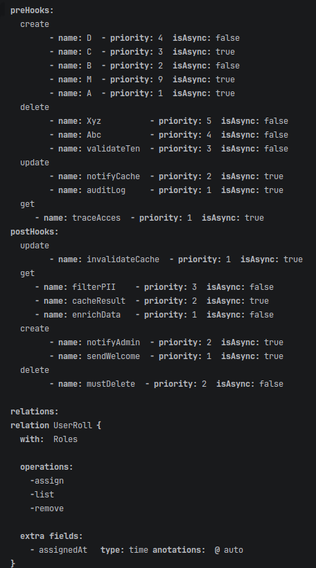
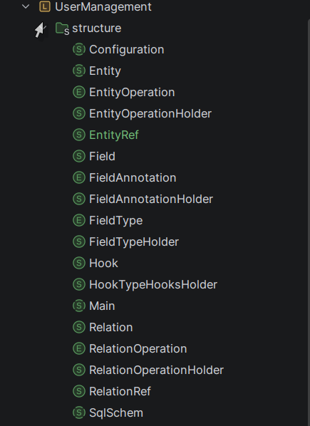
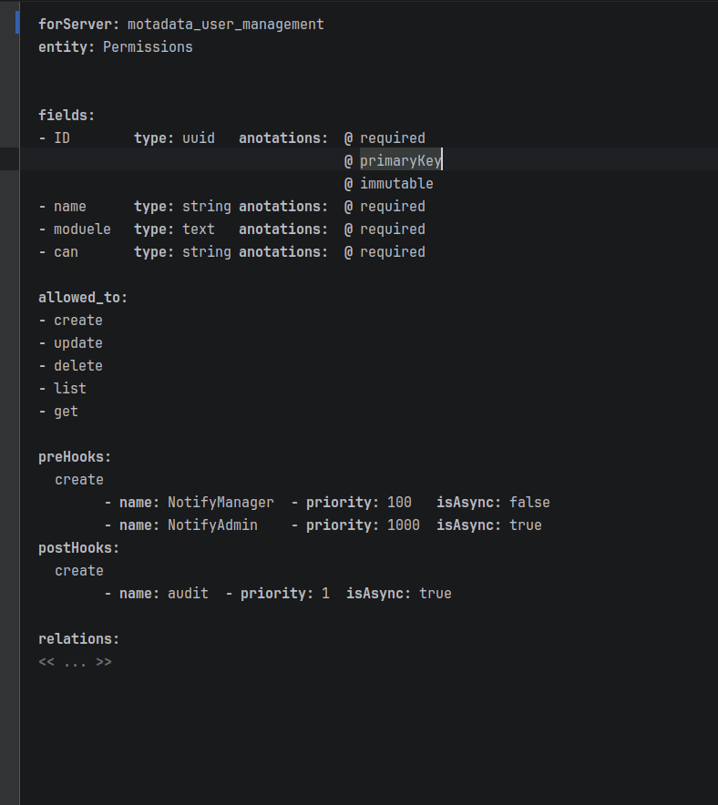

# MotaDSLUM Onboarding Guide

Before you touch anything, read this. It will save you hours.

---

## Prerequisites

You need these installed and working before anything else:

| Tool | Version | Why |
|------|---------|-----|
| JetBrains MPS | 3.2+ | The DSL editor |
| Go toolchain | 1.18+ | Compiling generated code |
| Docker + Docker Compose | any recent | Running the NATS + app stack |
| Python | 3.9+ | `parse_textgen.py` and `merge_hooks.py` |
| NATS CLI | recommended | Testing via `nats req`/`nats reply` |

---

## Directory Map

| Path | What it is |
|------|-----------|
| `~/UserManagmentMps` | The DSL source — open this in MPS |
| `~/projects/dsl/src/code/user-management-templ/` | This repo — generated code lives here |
| `~/projects/nextgen/gosdk/` | Vendored Motadata Go SDK |
| `src/` | Generated `.go` files — **DO NOT hand-edit these** |
| `src/userDefinedHooks.go` | The **only** file safe to edit — your hook implementations |
| `sync.sh` | Run this after every MPS change |
| `merge_hooks.py` | Extracts and merges hook stubs automatically |
| `demo.sh` | 21 e2e tests — run this to verify |

---

## The Five-Minute Overview


### What the DSL does

You write entity definitions in MPS. The system generates a complete NATS microservice. That's it.



What gets generated:
- Entity handlers (User, Roles, Permissions) — full CRUD on NATS subjects
- Relation handlers (UserRoles, RolesPermissions) — assign/remove/list
- SQL schema (PostgreSQL)
- Hook stubs for extensibility
- OpenTelemetry tracing on every operation

### The generation pipeline

```
MPS DSL (~/UserManagmentMps/)
    ↓  TextGen runs inside MPS
source_gen/*.go
    ↓  sync.sh:
       1. Copy files to src/
       2. merge_hooks.py (preserve your implementations)
       3. Patch SDK module paths
       4. docker compose build + up
    ↓
Running NATS microservice on localhost:4229
```

**Rule #1**: Never hand-edit generated `.go` files except `userDefinedHooks.go`. All other `src/*.go` files are overwritten on every `sync.sh` run.

---

## Critical Rules You Must Know


### Rule 1: One Concept = One Generated File

MPS TextGen maps one root concept to one output file. This is not configurable.

The sandbox structure that produces the correct output:

```
Main         → main.go
User         → user.go (includes UserRoles handlers)
Roles        → roles.go (includes RolesPermissions handlers)
Permissions  → permissions.go
SqlSchem     → sqlPrem_init_sql.sql
```

**Why this matters**: If you put all entities in one root concept (tempting, since it feels like Prisma), TextGen produces one massive file. That's the wrong structure. Each entity must be a separate root.


### Rule 2: DO NOT Edit Generated Files

All files in `src/` except `userDefinedHooks.go` will be overwritten the next time you run `sync.sh`. If you hand-edit `user.go` and then run `sync.sh`, your changes disappear.

**The correct workflow**:
- Change the DSL in MPS → regenerate → run `sync.sh`
- Implement business logic in `src/userDefinedHooks.go` only

### Rule 3: TextGen Cannot Be Copy-Pasted Into

MPS's projectional editor does not accept pasted text from external editors. If you need to modify a TextGen template, you have two options:

1. Type it character-by-character through MPS's completion menus
2. Use `parse_textgen.py`: write the template as a markdown file, parse it to `.mps` format, load into MPS

Option 2 is significantly faster for any template change beyond a few characters.

### Rule 4: Hook Priority Ordering Is Critical

Hooks execute sorted by priority number — **lower number runs first**.

**Always place sync validators at lower priority numbers than async hooks.**

```go
preCreateValidate (sync, priority 1)  ← Runs first, can abort
preCreateAudit   (async, priority 2)  ← Runs after validation passes
```

If you flip this — async at priority 1, sync at priority 2 — the async hook fires and starts irreversible work (sending an email, writing an audit record) before the sync validator gets a chance to abort the operation. The async hook cannot be cancelled once dispatched.

### Rule 5: TextGen Has No Debugger

When generated code is wrong, there are no line numbers, no breakpoints, no stack traces pointing to the template.

Debugging workflow:
1. Use **Preview Generated Text** (right-click the root node in MPS) — fastest feedback, no file I/O
2. Add `System.out.println(field.name)` inside `${ }` blocks — output appears in MPS Messages console
3. Binary search the template — comment out sections to isolate bad output
4. If you see a Go syntax error that looks like a template artifact (trailing dot, empty identifier, doubled string) — the bug is in the DSL model, not the generated file

---

## How to Add a New Entity

1. **Open MPS** — open `~/UserManagmentMps`

2. **Create a new Entity root** in the sandbox:
   - Right-click sandbox → New Child → Entity
   - Set `name` to the Go type name (e.g., `Tenant`)

3. **Add fields**:
   - `fieldName`, `fieldType` (UUID, String, Time, Text, Email, etc.)
   - Modifiers: `primaryKey`, `auto`, `hidden`, `nullable`, `unique`

4. **Add hooks** (if needed):
   - Add Hook children under HookTypeHooksHolder
   - Set `hookName`, `priority`, `isAsync`
   - Naming: `pre/post` + OperationName + Description

5. **Add relations** (if needed):
   - Add Relation children to the Entity
   - Link via `toEntity` reference
   - Set operations: assign, remove, list

6. **Register in Main**:
   - Add an `EntityRef` in the Main root pointing to your new entity
   - Without this, the entity handler is not wired into the microservice

7. **Register in SqlSchem**:
   - Add an `entityref` in the SqlSchem root pointing to your new entity
   - Without this, no SQL table is generated — the handler works but the table doesn't exist

8. **Regenerate and sync**:
   ```bash
   cd ~/projects/dsl/src/code/user-management-templ/
   ./sync.sh
   ```

9. **Verify**:
   ```bash
   ./demo.sh
   ```

---

## How to Work with Hooks

### The four hook signatures



| Signature | Runs when | Can abort | Use case |
|-----------|-----------|-----------|----------|
| Pre-sync | Before operation, blocking | Yes (return error) | Validation, authorization |
| Pre-async | Before operation, non-blocking | No | Fire-and-forget logging |
| Post-sync | After DAL reply, blocking | No (transforms response) | PII filtering, enrichment |
| Post-async | After DAL reply, non-blocking | No | Cache invalidation, notifications |

### Implementing a hook

Only edit `src/userDefinedHooks.go`. Never the generated files.

```go
func (s *UserHandler) preCreateValidate(ctx context.Context, span tracer.Span, event *UserCreateEvent) error {
    if event.Password == "" {
        return errors.New("password required")
    }
    return nil
}
```

When you run `sync.sh`, `merge_hooks.py` preserves this implementation. It is keyed by `*ReceiverType.funcName` — so `*UserHandler.preCreateValidate` and `*RolesHandler.preCreateValidate` are tracked separately even if they share a name.

### Changing a hook from sync to async (or vice versa)

1. Edit the Hook concept in MPS — change `isAsync`
2. Run `sync.sh`
3. `merge_hooks.py` detects the signature change, prints your old implementation as a warning, and replaces the stub
4. Port your logic to the new signature in `userDefinedHooks.go`

Check `merge_hooks.py` stdout after every sync that modifies hook definitions.

### Adding a new hook

1. Add a Hook concept in the Entity (set `hookName`, `priority`, `isAsync`)
2. Run `sync.sh`
3. `merge_hooks.py` appends the new empty stub to `userDefinedHooks.go`
4. Implement the hook body

---

## Running and Testing

### Start the service

```bash
cd ~/projects/dsl/src/code/user-management-templ/
./sync.sh
```

This generates, builds, and starts Docker Compose. NATS is on `localhost:4229` (external).

### Run all tests

```bash
./demo.sh
```

This runs 21 e2e tests using a mock DAL:
- 5 mock responders on `motadata.{entity}.db.>` return `{"status":"ok"}`
- Tests send requests to `motadata.{entity}.{operation}` and verify responses
- Covers: validation, hooks, CRUD routing, relations, service discovery

### Manual testing

```bash
# Create a user
nats req motadata.user.create '{"username":"alice","email":"alice@example.com","password":"secret123"}'

# List roles
nats req motadata.roles.list '{}'

# Assign a role to a user
nats req motadata.user.roles.assign '{"user_id":"abc","role_id":"xyz"}'
```

---

## Common Mistakes and Fixes

### Double-S bug (`user_roless` instead of `user_roles`)

**Symptom**: Junction table name has a doubled suffix.

**Root cause**: TextGen hardcoded the `"s"` pluralization suffix as a string literal, not using DSL variables. Entity names already ending in `s` get a doubled suffix.

**Fix**: Open the Relation TextGen template in MPS, find the hardcoded `"s"` concatenation, replace with a proper variable expression. Use `parse_textgen.py` to edit as markdown, then parse back to `.mps`.

### Entity missing from SQL schema

**Symptom**: CRUD works, but no SQL table exists.

**Root cause**: Forgot to add an `entityref` to the `SqlSchem` root.

**Fix**: Open `SqlSchem` in the sandbox, add an `entityref` pointing to the missing entity, run `sync.sh`.

### SDK import errors after `sync.sh`

**Symptom**: Compile errors like `unknown import "motadatagosdk/events/core"`.

**Root cause**: `sync.sh` patches the SDK module path, but the patch may have failed.

**Fix**: Check `sync.sh` log for `sed` errors. Verify `motadata-go-sdk/go.mod` has `dev.azure.com/Motadata/NextGen/motadata-go-sdk` as the module name. Run `sync.sh` again.

### Hook signature mismatch after changes

**Symptom**: Compile error in `userDefinedHooks.go` — wrong return type or parameter count.

**Root cause**: Changed hook from sync to async (or reverse) in MPS but didn't port the implementation.

**Fix**: Check `merge_hooks.py` output for "signature mismatch" warnings. The old implementation is printed there — copy it and adapt to the new signature.

### Async hook fires even when validation failed

**Symptom**: Notification sent or audit written even though the operation was rejected.

**Root cause**: Async hook had a lower priority number than the sync validator — it ran first.

**Fix**: Lower the priority number of sync validators relative to async hooks. Sync validators must run first (lower priority number = runs first).

---

## Where to Find Things

### DSL source

**Location**: `~/UserManagmentMps/languages/UserManagement/`

- Entity/relation structure: `models/UserManagement.structure.mps`
- TextGen templates: `models/*.textGen.mps` files

### Generated code



**Location**: `src/`

- `main.go` (155 lines) — NATS micro.Service setup, endpoint wiring
- `user.go`, `roles.go`, `permissions.go` — entity handlers (read-only)
- `userDefinedHooks.go` — **your code goes here**
- `sqlPrem_init_sql.sql` — generated PostgreSQL schema

### Pipeline scripts

- `sync.sh` — full pipeline: generate → merge → patch → docker compose
- `merge_hooks.py` — extracts and merges hook stubs
- `demo.sh` — 21 e2e tests
- `docker-compose.yml` — NATS + app
- `Dockerfile` — app container

### Vendored SDK

**Location**: `~/projects/nextgen/gosdk/motadata-go-sdk/`

- `events/core/` — Publisher, Subscriber, Message interfaces
- `events/transport/nats/` — NATS implementation
- `otel/tracer/` — OpenTelemetry integration
- `workerpool/` — async hook execution

---

## Deep Reading

Go here when you need to understand *why* something works the way it does:

| Topic | File |
|-------|------|
| One concept = one file (MPS constraint) | `docs/knowledge/mps-gotchas/one-concept-one-file-constraint.md` |
| TextGen walled garden | `docs/knowledge/textgen/textgen-walled-garden.md` |
| Python bridge (`parse_textgen.py`) | `docs/knowledge/textgen/python-bridge-solution.md` |
| Full Entity TextGen template | `docs/knowledge/textgen/entity-textgen-template-full.md` |
| TextGen debugging | `docs/knowledge/textgen/textgen-debugging-pain.md` |
| Four hook signatures | `docs/knowledge/hooks/four-hook-signatures.md` |
| Hook extensibility model | `docs/knowledge/hooks/hooks-as-customer-extensibility.md` |
| sync.sh pipeline | `docs/knowledge/tooling/sync-pipeline.md` |
| merge_hooks.py story | `docs/knowledge/tooling/merge-hooks-story.md` |
| Docker + NATS setup | `docs/knowledge/deployment/docker-nats-setup.md` |
| E2E test coverage | `docs/knowledge/testing/demo-sh-e2e.md` |
| Production architecture | `docs/knowledge/projects/v3-user-managment-mps.md` |

---

## Your First Change — Checklist

- [ ] Open `~/UserManagmentMps` in MPS
- [ ] Locate the Entity in the sandbox
- [ ] Make your change (field, hook, relation)
- [ ] Preview Generated Text (right-click root node) — verify output before committing
- [ ] Trigger full TextGen (right-click → Generate Text)
- [ ] Run `sync.sh`
- [ ] Check `merge_hooks.py` output for warnings
- [ ] If you added/changed a hook, implement it in `src/userDefinedHooks.go`
- [ ] Run `./demo.sh`
- [ ] Verify all 21 tests still pass
