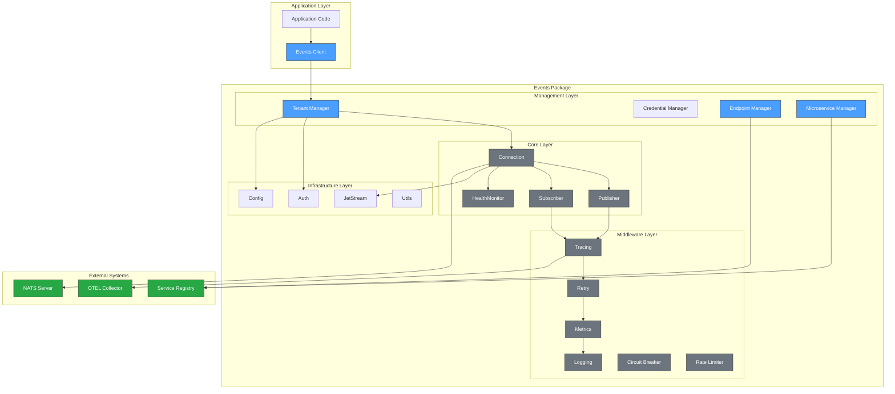
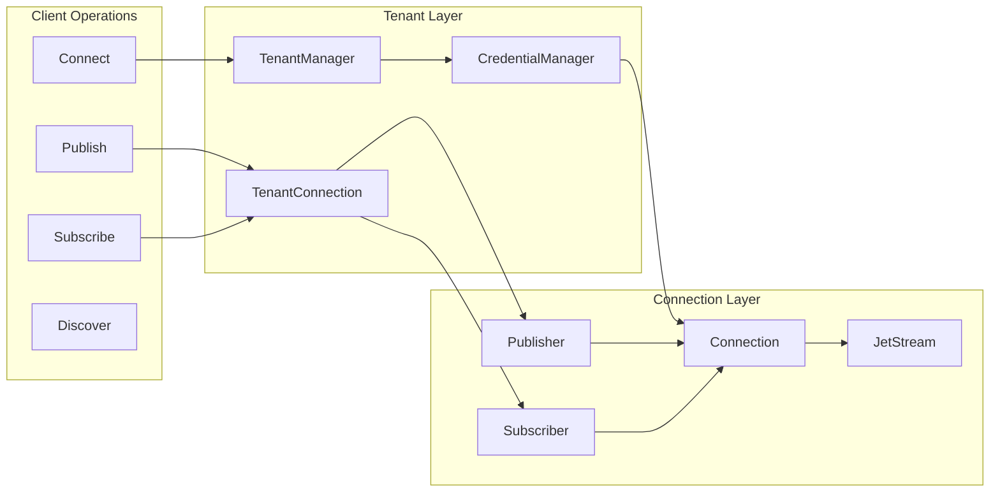
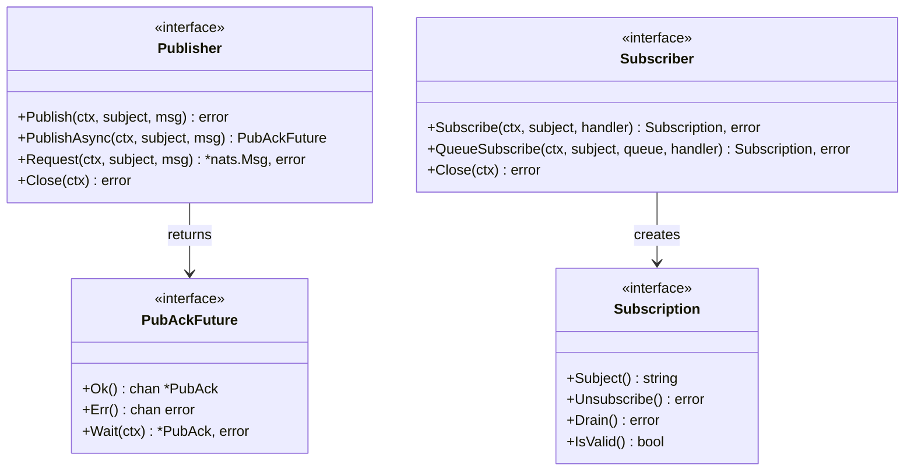
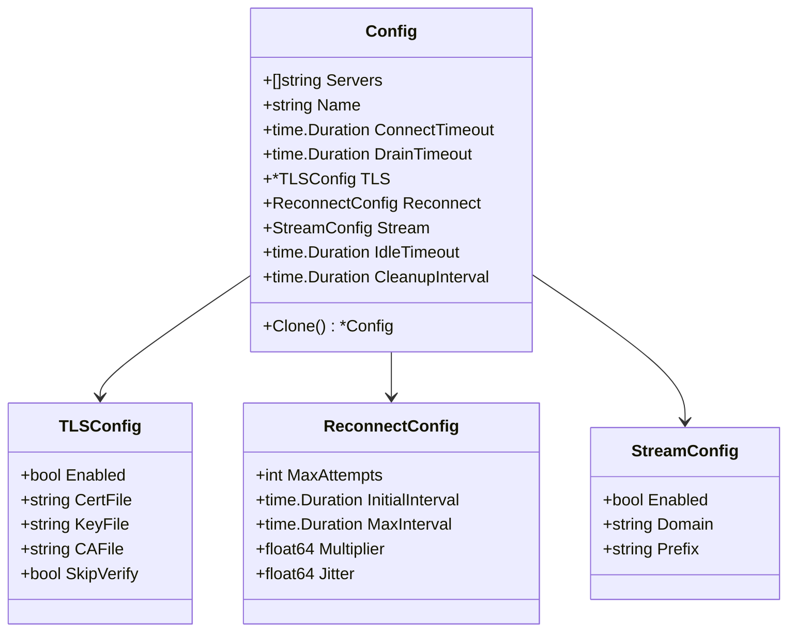
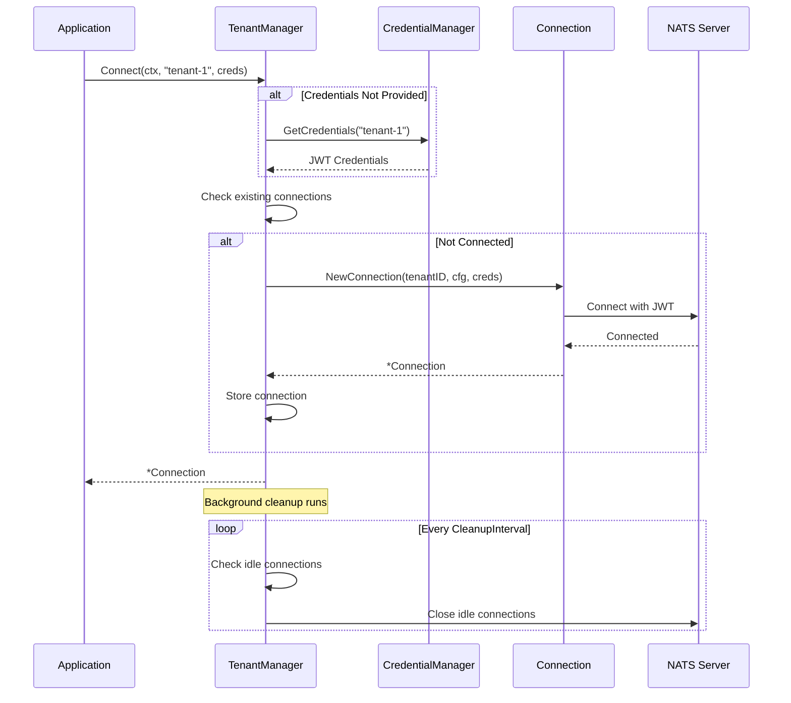
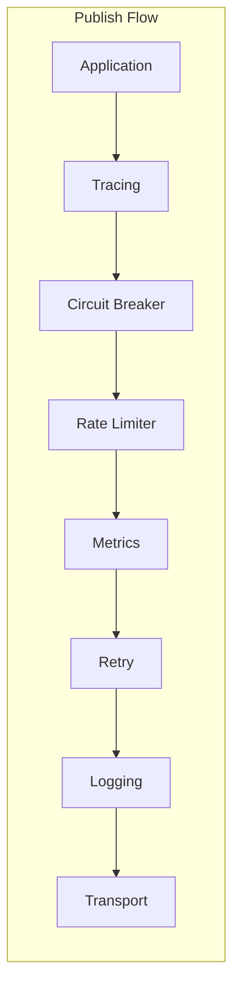
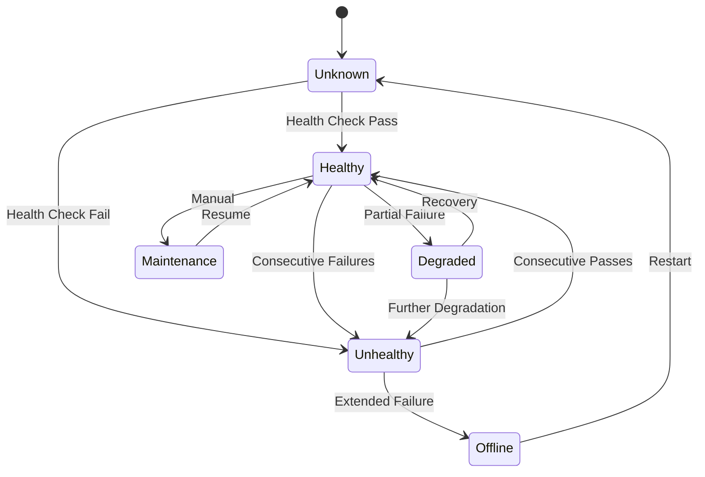
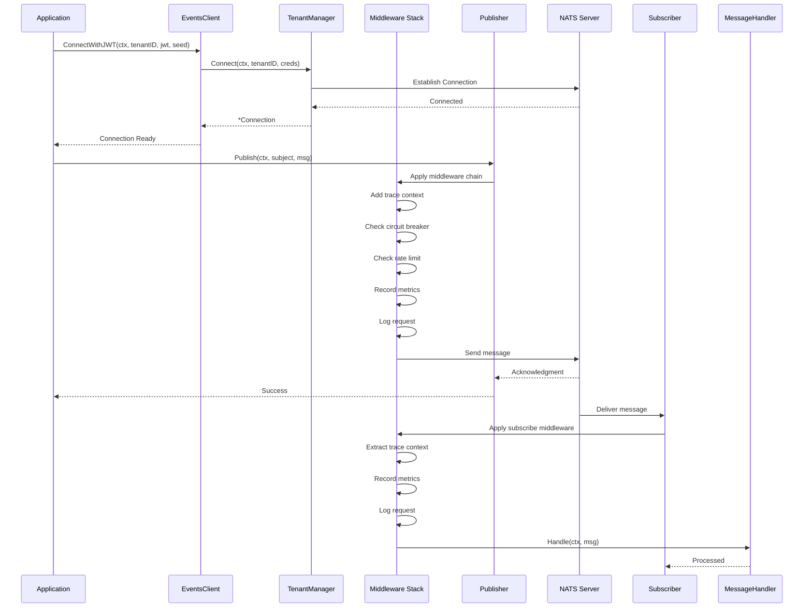
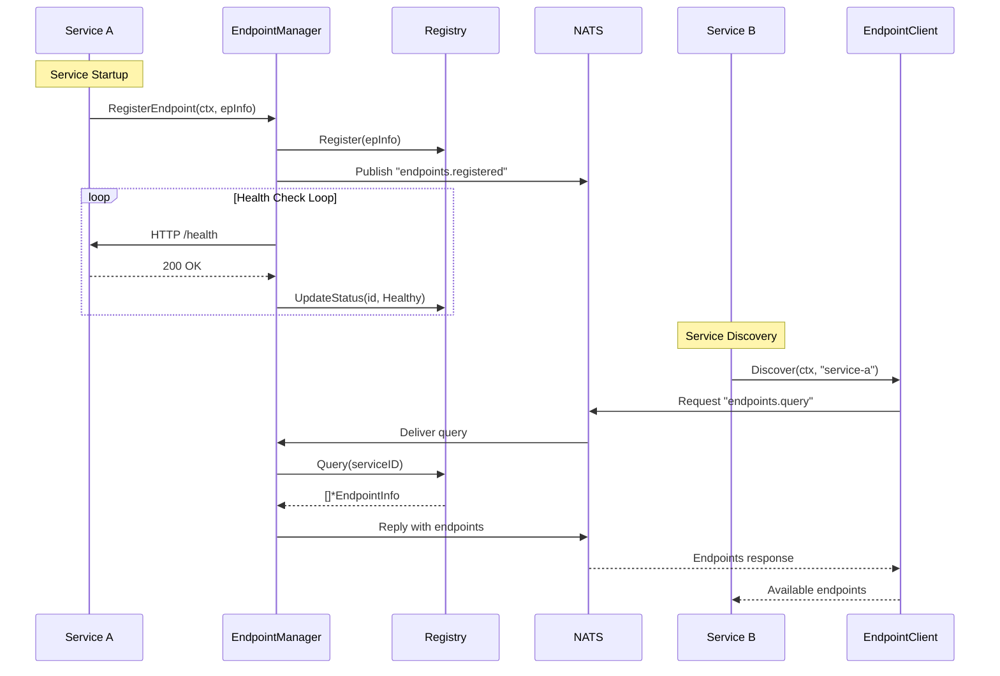

# Events Package - Technical Architecture Documentation

## Table of Contents

- [Overview](#overview)
- [Architecture](#architecture)
- [Package Structure](#package-structure)
- [Component Details](#component-details)
  - [Core Types](#core-types)
  - [Configuration](#configuration)
  - [Authentication](#authentication)
  - [Tenant Management](#tenant-management)
  - [Publisher & Subscriber](#publisher--subscriber)
  - [Middleware](#middleware)
  - [JetStream](#jetstream)
  - [Endpoint Management](#endpoint-management)
  - [Microservice Management](#microservice-management)
  - [Utilities](#utilities)
- [Data Flow](#data-flow)
- [Usage Examples](#usage-examples)
- [Configuration Reference](#configuration-reference)
- [Error Handling](#error-handling)
- [Best Practices](#best-practices)

---

## Overview

The `events` package provides a NATS-based event-driven messaging SDK for Go applications, offering:

- **NATS Integration**: Core NATS pub/sub, JetStream persistent streaming, KV store, and object store
- **Multi-Tenant Architecture**: Isolated connections per tenant with JWT credential management
- **Middleware Pipeline**: Extensible middleware for tracing, retry, metrics, logging, circuit breaker, and rate limiting
- **Service Discovery**: Endpoint and microservice registration with health checking
- **Batch Publishing**: High-throughput batch publishing with auto-flush

The package follows a flat, modular architecture enabling clean separation of concerns and easy extensibility.

---

## Architecture

### High-Level Architecture



### Component Interaction



---

## Package Structure

```
events/
├── events.go            # Main entry point with re-exports and Client
├── connection.go        # NATS connection wrapper with tenant awareness
├── publisher.go         # Publisher and BatchPublisher with middleware
├── subscriber.go        # Subscriber with middleware and queue groups
├── health.go            # HealthMonitor and ConnectionStats
├── README.md            # This documentation
├── USAGE.md             # Step-by-step usage guide
│
├── core/                # Core interfaces and types
│   ├── messaging.go     # Publisher, Subscriber, Subscription interfaces
│   ├── context.go       # Context helpers for tracing and tenant propagation
│   ├── request.go       # Request-reply pattern and NATS micro service
│   └── doc.go           # Package documentation
│
├── auth/                # Authentication and credentials
│   ├── auth.go          # Credentials and auth types
│   ├── credentials.go   # CredentialManager implementation
│   ├── jwt.go           # JWT credential handling
│   └── provider.go      # Auth provider interface
│
├── tenant/              # Multi-tenant connection management
│   ├── manager.go       # Tenant manager with idle cleanup
│   └── registry.go      # Tenant registry
│
├── middleware/           # Middleware pipeline
│   ├── middleware.go     # Core interfaces and Stack
│   ├── tracing.go       # Distributed tracing (OpenTelemetry, W3C, B3)
│   ├── retry.go         # Retry with exponential backoff
│   ├── metrics.go       # Metrics collection (OTEL, per-subject)
│   ├── logging.go       # Structured logging
│   ├── circuitbreaker.go # Circuit breaker pattern
│   └── ratelimit.go     # Token bucket and sliding window rate limiting
│
├── jetstream/           # JetStream helpers
│   ├── stream.go        # StreamManager for streams and consumers
│   ├── consumer.go      # Consumer and OrderedConsumer wrappers
│   ├── kv.go            # Key-Value store utilities
│   └── objectstore.go   # Object store utilities
│
├── endpoint/            # Endpoint management
│   ├── types.go         # Info, Status, Protocol, Method types
│   ├── registry.go      # Endpoint registry with TTL
│   ├── manager.go       # Endpoint lifecycle manager
│   ├── handlers.go      # NATS message handlers
│   └── errors.go        # Endpoint-specific errors
│
├── microservice/        # Microservice management
│   ├── types.go         # Info, Instance, Status, ServiceType
│   ├── registry.go      # Service registry
│   ├── manager.go       # Service lifecycle manager
│   ├── handlers.go      # NATS message handlers
│   └── errors.go        # Microservice-specific errors
│
├── utils/               # Utility types and error handling
│   ├── errors.go        # Error definitions and utilities
│   ├── types.go         # Generic type constraints, Optional, SafeMap
│   ├── const.go         # Package constants
│   └── utils.go         # Helper functions
│
└── examples/            # Usage examples
    ├── service_registry/main.go        # Complete service registry example
    └── distributed_registry/main.go    # Distributed registry with NATS
```

---

## Component Details

### Core Types

#### Messaging Interfaces



**Standard Headers:**

| Header | Constant | Description |
|--------|----------|-------------|
| `Content-Type` | `HeaderContentType` | Message content type |
| `Nats-Msg-Id` | `HeaderMessageID` | Message ID for deduplication |
| `Correlation-ID` | `HeaderCorrelationID` | Request correlation ID |
| `X-Tenant-ID` | `HeaderTenantID` | Multi-tenant identifier |
| `X-Trace-ID` | `HeaderTraceID` | Distributed trace ID |
| `X-Span-ID` | `HeaderSpanID` | Span identifier |
| `traceparent` | `HeaderTraceParent` | W3C trace context |
| `tracestate` | `HeaderTraceState` | W3C trace state |
| `X-B3-TraceId` | `HeaderB3TraceID` | B3 trace format |

#### Connection States

| State | Description |
|-------|-------------|
| `StateDisconnected` | Not connected to server |
| `StateConnecting` | Connection in progress |
| `StateConnected` | Successfully connected |
| `StateReconnecting` | Attempting to reconnect |
| `StateDraining` | Draining pending messages |
| `StateClosed` | Connection closed |

---

### Configuration

#### Config Structure



**Default Values:**

| Setting | Default | Description |
|---------|---------|-------------|
| Servers | `nats://localhost:4222` | Server URLs |
| ConnectTimeout | `10s` | Connection timeout |
| DrainTimeout | `30s` | Graceful shutdown timeout |
| IdleTimeout | `30m` | Idle connection cleanup |
| CleanupInterval | `1m` | Cleanup check frequency |
| MaxAttempts (Reconnect) | `-1` (infinite) | Reconnection attempts |
| InitialInterval | `100ms` | Initial backoff |
| MaxInterval | `30s` | Maximum backoff |

---

### Authentication

#### Auth Types

| Type | Constant | Usage |
|------|----------|-------|
| None | `TypeNone` | No authentication |
| UserPass | `TypeUserPass` | Username/password |
| Token | `TypeToken` | Static token |
| NKey | `TypeNKey` | NATS NKey (Ed25519) |
| Credentials File | `TypeCredentialsFile` | From file |
| JWT | `TypeJWT` | JWT + Seed (recommended for production) |

See [`auth/README.md`](auth/README.md) for detailed authentication documentation.

---

### Tenant Management

#### Multi-Tenant Architecture



See [`tenant/README.md`](tenant/README.md) for detailed tenant management documentation.

---

### Publisher & Subscriber

#### Publisher

The `Publisher` sends messages to NATS subjects with middleware support:

- **Synchronous publish**: `Publish(ctx, subject, msg)`
- **Asynchronous publish**: `PublishAsync(ctx, subject, msg)` (JetStream)
- **Request-reply**: `Request(ctx, subject, msg)` / `RequestWithTimeout(...)`

#### BatchPublisher

High-throughput batch publishing with auto-flush:

```go
batch := events.NewBatchPublisher(publisher,
    events.WithMaxBatchSize(100),
    events.WithFlushInterval(time.Second),
    events.WithConcurrentFlush(true),
    events.WithMaxFlushWorkers(4),
)
defer batch.Close(ctx)

batch.Add("orders.created", orderMsg)
batch.Flush(ctx) // Or auto-flushed
```

#### Subscriber

The `Subscriber` receives messages from NATS subjects:

- **Regular subscription**: `Subscribe(ctx, subject, handler)`
- **Queue subscription**: `QueueSubscribe(ctx, subject, queue, handler)` (load balancing)
- **Middleware support**: `UseMiddleware(mw)`

---

### Middleware

#### Middleware Pipeline



**Available Middleware:**

| Middleware | Purpose | Features |
|------------|---------|----------|
| **Tracing** | Distributed tracing | OpenTelemetry, W3C trace context, B3 format |
| **Retry** | Automatic retry | Exponential backoff, jitter, max attempts, selective errors |
| **Metrics** | Performance metrics | OTEL integration, per-subject metrics, slow query detection |
| **Logging** | Request logging | Structured logging, configurable levels, OTEL logger |
| **Circuit Breaker** | Fault isolation | Per-subject breakers, configurable thresholds, state management |
| **Rate Limiter** | Traffic control | Token bucket, sliding window, per-subject limits |

See [`middleware/README.md`](middleware/README.md) for detailed middleware documentation.

---

### JetStream

JetStream provides persistent streaming, key-value stores, and object stores:

- **StreamManager**: Create, update, delete streams and consumers
- **Consumer/OrderedConsumer**: Pull-based consumption with batch fetch
- **KVStore**: Configuration and state storage with history and watch
- **ObjectStore**: Large object storage with listing and watch

See [`jetstream/README.md`](jetstream/README.md) for detailed JetStream documentation.

---

### Endpoint Management

#### Endpoint Lifecycle



See [`endpoint/README.md`](endpoint/README.md) for detailed endpoint documentation.

---

### Microservice Management

#### Service Types

| Type | Constant | Description |
|------|----------|-------------|
| API | `ServiceTypeAPI` | REST/gRPC API services |
| Worker | `ServiceTypeWorker` | Background workers |
| Gateway | `ServiceTypeGateway` | API gateways |
| Broker | `ServiceTypeBroker` | Message brokers |
| Database | `ServiceTypeDatabase` | Database services |
| Cache | `ServiceTypeCache` | Cache services |
| Queue | `ServiceTypeQueue` | Queue services |
| Scheduler | `ServiceTypeScheduler` | Job schedulers |
| Monitor | `ServiceTypeMonitor` | Monitoring services |
| Custom | `ServiceTypeCustom` | Custom service types |

See [`microservice/README.md`](microservice/README.md) for detailed microservice documentation.

---

### Utilities

Error types, type constraints, and thread-safe collections:

- **Sentinel Errors**: Connection, Publish, Subscribe, Auth, Tenant, Config, JetStream
- **Error Utilities**: Wrapping, chaining, classification, collection
- **Type Constraints**: Signed, Unsigned, Integer, Float, Numeric, Ordered
- **Collections**: SafeMap[K,V], SafeSlice[T], Optional[T], Result[T]

See [`utils/README.md`](utils/README.md) for detailed utilities documentation.

---

## Data Flow

### Complete Message Flow



### Service Discovery Flow



---

## Usage Examples

### Basic Setup

```go
import "dev.azure.com/Motadata/NextGen/motadata-go-sdk/events"

func main() {
    ctx := context.Background()

    // Create client with options
    client, err := events.NewClient(
        events.WithServers("nats://localhost:4222"),
        events.WithName("my-service"),
        events.WithConnectTimeout(10 * time.Second),
    )
    if err != nil {
        log.Fatal(err)
    }
    defer client.Shutdown(ctx)

    // Connect tenant with JWT
    conn, err := client.ConnectWithJWT(ctx, "tenant-1", jwtToken, seed)
    if err != nil {
        log.Fatal(err)
    }

    // Create publisher and subscriber
    pub := events.NewPublisher(conn)
    sub := events.NewSubscriber(conn)

    // Publish message
    msg := &nats.Msg{
        Subject: "my.subject",
        Data:    []byte(`{"hello": "world"}`),
    }
    err = pub.Publish(ctx, "my.subject", msg)

    // Subscribe to messages
    subscription, err := sub.Subscribe(ctx, "my.subject",
        func(ctx context.Context, msg *nats.Msg) error {
            fmt.Printf("Received: %s\n", string(msg.Data))
            return nil
        },
    )
    defer subscription.Unsubscribe()
}
```

### Multi-Tenant Setup

```go
// Create credential manager
credManager := events.NewCredentialManager(auth.DefaultCredentialManagerConfig())

// Register tenant credentials
credManager.Register("tenant-1", jwt1, seed1)
credManager.Register("tenant-2", jwt2, seed2)

// Create client
client, _ := events.NewClient(
    events.WithServers("nats://localhost:4222"),
)

// Connect tenants - each gets an isolated connection
conn1, _ := client.Connect(ctx, "tenant-1", nil)
conn2, _ := client.Connect(ctx, "tenant-2", nil)
```

### Middleware Usage

```go
// Create middleware stack
stack := events.NewMiddlewareStack()

// Add middleware in order
stack.UseInterceptor(events.TracingMiddleware())
stack.UsePublish(events.RetryMiddleware(middleware.RetryConfig{
    MaxAttempts:     3,
    InitialInterval: 100 * time.Millisecond,
}))
stack.UseInterceptor(events.MetricsMiddleware("my-service"))
stack.UseInterceptor(events.LoggingMiddleware())

// Use circuit breaker
cb := events.NewCircuitBreaker(events.DefaultCircuitBreakerConfig())
stack.UsePublish(events.CircuitBreakerMiddleware(cb))

// Use rate limiter
rl := events.NewRateLimiter(events.DefaultRateLimiterConfig())
stack.UsePublish(events.RateLimitMiddleware(rl))
```

### Request-Reply Pattern

```go
// Requester side
pub := events.NewPublisher(conn)
response, err := pub.Request(ctx, "users.get", requestMsg)

// With explicit timeout
response, err = pub.RequestWithTimeout(ctx, "users.get", requestMsg, 5*time.Second)

// Responder side
sub := events.NewSubscriber(conn)
sub.Subscribe(ctx, "users.get", func(ctx context.Context, msg *nats.Msg) error {
    reply := &nats.Msg{Data: userData}
    return pub.Publish(ctx, msg.Reply, reply)
})
```

### Batch Publishing

```go
batch := events.NewBatchPublisher(pub,
    events.WithMaxBatchSize(100),
    events.WithFlushInterval(time.Second),
    events.WithConcurrentFlush(true),
)
defer batch.Close(ctx)

// Add messages
for _, order := range orders {
    batch.Add("orders.created", orderMsg)
}

// Explicit flush
batch.Flush(ctx)
```

For complete step-by-step usage examples, see [`USAGE.md`](USAGE.md).

---

## Configuration Reference

### Environment Variables

| Variable | Default | Description |
|----------|---------|-------------|
| `EVENTS_SERVERS` | `nats://localhost:4222` | Comma-separated server URLs |
| `EVENTS_NAME` | `app` | Client name |
| `EVENTS_CONNECT_TIMEOUT` | `10s` | Connection timeout |
| `EVENTS_DRAIN_TIMEOUT` | `30s` | Drain timeout |
| `EVENTS_IDLE_TIMEOUT` | `30m` | Idle connection timeout |
| `EVENTS_TLS_ENABLED` | `false` | Enable TLS |
| `EVENTS_TLS_CERT` | | TLS certificate file |
| `EVENTS_TLS_KEY` | | TLS key file |
| `EVENTS_TLS_CA` | | TLS CA file |
| `EVENTS_STREAM_ENABLED` | `true` | Enable JetStream |
| `EVENTS_STREAM_DOMAIN` | | JetStream domain |

### Functional Options

```go
// Server configuration
events.WithServers("nats://server1:4222", "nats://server2:4222")
events.WithName("my-service")
events.WithConnectTimeout(10 * time.Second)
events.WithDrainTimeout(30 * time.Second)

// TLS configuration
events.WithTLS(&config.TLSConfig{
    Enabled:  true,
    CertFile: "/path/to/cert.pem",
    KeyFile:  "/path/to/key.pem",
    CAFile:   "/path/to/ca.pem",
})

// Reconnection settings
events.WithReconnect(config.ReconnectConfig{
    MaxAttempts:     -1,
    InitialInterval: 100 * time.Millisecond,
    MaxInterval:     30 * time.Second,
    Multiplier:      2.0,
    Jitter:          0.1,
})

// JetStream settings
events.WithStream(config.StreamConfig{
    Enabled: true,
    Domain:  "hub",
})

// Idle connection cleanup
events.WithIdleTimeout(30 * time.Minute)
events.WithCleanupInterval(time.Minute)
```

---

## Error Handling

### Common Errors

| Error | Constant | Description |
|-------|----------|-------------|
| Not Connected | `ErrNotConnected` | Operation on disconnected client |
| Already Connected | `ErrAlreadyConnected` | Duplicate connection attempt |
| Connection Closed | `ErrConnectionClosed` | Connection was closed |
| Connection Timeout | `ErrConnectionTimeout` | Connection timed out |
| Publish Failed | `ErrPublishFailed` | Message publish failed |
| Publish Timeout | `ErrPublishTimeout` | Publish acknowledgment timeout |
| Invalid Subject | `ErrInvalidSubject` | Invalid subject format |
| Invalid Message | `ErrInvalidMessage` | Invalid message format |
| Tenant Not Found | `ErrTenantNotFound` | Tenant not registered |
| Shutdown In Progress | `ErrShutdownInProgress` | System shutting down |
| Circuit Open | `ErrCircuitOpen` | Circuit breaker is open |
| Rate Limit | `ErrRateLimitExceeded` | Rate limit exceeded |
| JetStream Disabled | `ErrJetStreamNotEnabled` | JetStream not enabled |

### Error Handling Pattern

```go
conn, err := client.Connect(ctx, tenantID, creds)
if err != nil {
    switch {
    case errors.Is(err, events.ErrConnectionTimeout):
        // Handle timeout - maybe retry
    case errors.Is(err, events.ErrInvalidCredential):
        // Handle auth failure
    case errors.Is(err, events.ErrCircuitOpen):
        // Circuit breaker tripped - wait
    default:
        // Handle other errors
    }
}
```

See [`utils/README.md`](utils/README.md) for comprehensive error type documentation.

---

## Best Practices

### 1. Connection Management

```go
// Initialize once at startup
client, _ := events.NewClient(opts...)
defer client.Shutdown(context.Background())

// Reuse connections
conn, _ := client.Connect(ctx, tenantID, creds)
// Use conn throughout request lifecycle

// Let idle cleanup handle unused connections
// Don't manually disconnect active tenants
```

### 2. Context Propagation

```go
// Always pass context for tracing
ctx = events.WithTenantID(ctx, tenantID)
ctx = events.WithCorrelationID(ctx, correlationID)

// Context propagates trace IDs through middleware
err := publisher.Publish(ctx, "orders.created", msg)
```

### 3. Graceful Shutdown

```go
sigChan := make(chan os.Signal, 1)
signal.Notify(sigChan, syscall.SIGINT, syscall.SIGTERM)

go func() {
    <-sigChan
    ctx, cancel := context.WithTimeout(context.Background(), 30*time.Second)
    defer cancel()

    epManager.Shutdown(ctx)
    svcManager.Shutdown(ctx)
    client.Shutdown(ctx)
}()
```

### 4. Health Monitoring

```go
go func() {
    ticker := time.NewTicker(30 * time.Second)
    for range ticker.C {
        health := client.Manager().Health()
        for tenantID, status := range health {
            if !status.IsHealthy() {
                log.Printf("Tenant %s unhealthy: %s", tenantID, status.Message)
            }
        }
    }
}()
```

### 5. Use Middleware for Cross-Cutting Concerns

```go
// Recommended middleware order
stack := events.NewMiddlewareStack()
stack.UseInterceptor(events.TracingMiddleware())       // 1. Tracing (outermost)
stack.UsePublish(events.CircuitBreakerMiddleware(cb))  // 2. Circuit breaker
stack.UsePublish(events.RateLimitMiddleware(rl))       // 3. Rate limiting
stack.UseInterceptor(events.MetricsMiddleware("svc"))  // 4. Metrics
stack.UsePublish(events.RetryMiddleware(retryCfg))     // 5. Retry
stack.UseInterceptor(events.LoggingMiddleware())       // 6. Logging (innermost)
```

---

## Thread Safety

All components in the events package are safe for concurrent use:

| Component | Thread Safety |
|-----------|---------------|
| Client | Safe - internal mutex |
| TenantManager | Safe - sync.RWMutex |
| Connection | Safe - atomic operations |
| Publisher | Safe - connection-level sync |
| Subscriber | Safe - per-subscription sync |
| BatchPublisher | Safe - internal mutex |
| EndpointRegistry | Safe - sync.RWMutex |
| EndpointManager | Safe - internal mutex |
| MicroserviceRegistry | Safe - sync.RWMutex |
| MicroserviceManager | Safe - internal mutex |
| MiddlewareStack | Safe after initialization |
| CircuitBreaker | Safe - atomic operations |
| RateLimiter | Safe - sync.Mutex |
| HealthMonitor | Safe - sync.Mutex |

---

## Dependencies

| Dependency | Version | Purpose |
|------------|---------|---------|
| `github.com/nats-io/nats.go` | v1.30+ | NATS client |
| `github.com/nats-io/nats.go/jetstream` | v1.30+ | JetStream API |
| `go.opentelemetry.io/otel` | v1.28+ | Distributed tracing |
| `dev.azure.com/.../otel` | internal | OTEL integration |
