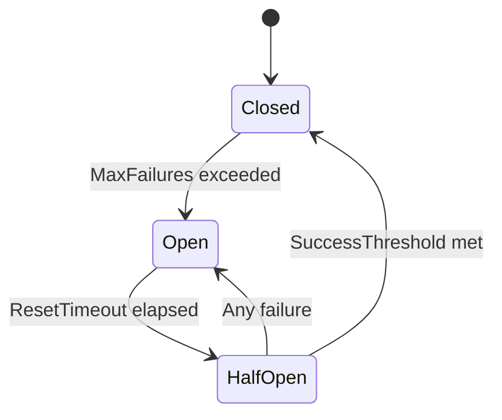

# Middleware Package

The `middleware` package provides a middleware pipeline for the events messaging system, enabling cross-cutting concerns like tracing, retry, metrics, logging, circuit breaker, and rate limiting.

## Overview

This package contains:

- **Middleware Stack**: Composable middleware chain
- **Tracing Middleware**: Distributed tracing with OpenTelemetry, W3C, and B3 support
- **Retry Middleware**: Automatic retry with exponential backoff and jitter
- **Metrics Middleware**: Request metrics collection with OTEL and per-subject support
- **Logging Middleware**: Structured request logging with OTEL integration
- **Circuit Breaker**: Fault isolation with per-subject circuit breakers
- **Rate Limiter**: Token bucket, sliding window, and per-subject rate limiting

## Package Structure

```
middleware/
├── middleware.go          # Core interfaces, Stack, Chain functions
├── tracing.go             # Distributed tracing (W3C, B3, OTEL)
├── retry.go               # Retry with exponential backoff
├── metrics.go             # Metrics collection (OTEL, per-subject)
├── logging.go             # Structured logging (OTEL logger)
├── circuitbreaker.go      # Circuit breaker pattern
├── ratelimit.go           # Token bucket and sliding window rate limiting
├── middleware_test.go     # Stack tests
├── tracing_test.go        # Tracing tests
├── metrics_test.go        # Metrics tests
├── retry_test.go          # Retry tests
├── circuitbreaker_test.go # Circuit breaker tests
├── ratelimit_test.go      # Rate limiting tests
└── README.md              # This file
```

## Middleware Types

### PublishMiddleware

Intercepts publish operations:

```go
type PublishMiddleware func(PublishHandler) PublishHandler
type PublishHandler func(ctx context.Context, subject string, msg *nats.Msg) error
```

### SubscribeMiddleware

Intercepts subscribe operations:

```go
type SubscribeMiddleware func(SubscribeHandler) SubscribeHandler
type SubscribeHandler func(ctx context.Context, msg *nats.Msg) error
```

### Interceptor

Combined publish and subscribe interception:

```go
type Interceptor interface {
    InterceptPublish() PublishMiddleware
    InterceptSubscribe() SubscribeMiddleware
}
```

## Middleware Stack

### Creating a Stack

```go
import "dev.azure.com/Motadata/NextGen/motadata-go-sdk/events/middleware"

stack := middleware.NewStack()

// Add publish middleware
stack.UsePublish(tracingMiddleware.InterceptPublish())
stack.UsePublish(metricsMiddleware.InterceptPublish())
stack.UsePublish(retryMiddleware)

// Add subscribe middleware
stack.UseSubscribe(tracingMiddleware.InterceptSubscribe())
stack.UseSubscribe(metricsMiddleware.InterceptSubscribe())
```

### Using Interceptors

```go
// Add both publish and subscribe middleware at once
stack.UseInterceptor(middleware.NewTracingMiddleware())
stack.UseInterceptor(middleware.NewMetricsCollector())
stack.UseInterceptor(middleware.NewLoggingMiddleware())
```

### Wrapping Handlers

```go
// Wrap a publish handler
wrappedPublish := stack.WrapPublish(func(ctx context.Context, subject string, msg *nats.Msg) error {
    return publisher.Publish(ctx, subject, msg)
})
err := wrappedPublish(ctx, "orders.created", msg)

// Wrap a subscribe handler
wrappedSubscribe := stack.WrapSubscribe(func(ctx context.Context, msg *nats.Msg) error {
    return processMessage(msg)
})
```

### Chaining Middleware

```go
// Chain multiple publish middleware manually
combined := middleware.Chain(
    tracingMiddleware,
    metricsMiddleware,
    loggingMiddleware,
)
handler := combined(baseHandler)

// Chain subscribe middleware
combinedSubscribe := middleware.ChainSubscribe(
    tracing.InterceptSubscribe(),
    metrics.InterceptSubscribe(),
)
```

## Tracing Middleware

Distributed tracing with OpenTelemetry integration:

```go
// Create tracing middleware (default configuration)
tracing := middleware.NewTracingMiddleware()

// Or with OTEL explicitly enabled
tracing = middleware.NewTracingMiddlewareWithOTEL()

// Configure custom samplers/generators
tracing.UseOTEL = true
tracing.Sampler = func() bool { return true }

// Use as interceptor
stack.UseInterceptor(tracing)

// Or use convenience function
stack.UseInterceptor(middleware.Tracing())
```

### Features

- **OpenTelemetry Integration**: Automatic span creation and propagation
- **W3C Trace Context**: Standard `traceparent` and `tracestate` header support
- **B3 Propagation**: `X-B3-TraceId`, `X-B3-SpanId`, `X-B3-Sampled`
- **Context Propagation**: Trace context injected into message headers
- **Span Attributes**: Messaging system, destination, operation

### W3C Trace Context Parsing

```go
// Extract trace context from W3C traceparent header
tc := middleware.ExtractW3CTraceParent("00-abc123...-def456...-01")

// Format trace context as W3C traceparent
traceparent := middleware.FormatW3CTraceParent(tc)
```

### Trace Context Headers

| Header | Description |
|--------|-------------|
| `traceparent` | W3C trace context parent |
| `tracestate` | W3C trace state |
| `X-Trace-ID` | Trace identifier |
| `X-Span-ID` | Span identifier |
| `X-B3-TraceId` | B3 trace ID |
| `X-B3-SpanId` | B3 span ID |
| `X-B3-Sampled` | B3 sampling flag |

## Retry Middleware

Automatic retry with exponential backoff:

```go
// Create with default configuration
retry := middleware.NewRetryMiddleware(middleware.DefaultRetryConfig())

// Or with custom configuration
retry = middleware.NewRetryMiddleware(middleware.RetryConfig{
    MaxAttempts:     3,
    InitialInterval: 100 * time.Millisecond,
    MaxInterval:     5 * time.Second,
    Multiplier:      2.0,
    Jitter:          0.1,
})

// Add custom retry condition
retry.WithShouldRetry(func(err error) bool {
    return errors.Is(err, utils.ErrPublishTimeout)
})

// Use as publish middleware
stack.UsePublish(retry.InterceptPublish())

// Or use convenience functions
stack.UsePublish(middleware.Retry(retryConfig))
stack.UsePublish(middleware.RetryWithConfig(retryConfig))
```

### RetryConfig

```go
type RetryConfig struct {
    MaxAttempts     int           // Maximum retry attempts (default: 3)
    InitialInterval time.Duration // Initial backoff (default: 100ms)
    MaxInterval     time.Duration // Maximum backoff (default: 5s)
    Multiplier      float64       // Backoff multiplier (default: 2.0)
    Jitter          float64       // Random jitter 0.0-1.0 (default: 0.1)
}
```

### Backoff Calculation

```
interval = min(InitialInterval * (Multiplier ^ attempt), MaxInterval)
interval = interval * (1 + random(-Jitter, +Jitter))
```

**Example with defaults:**
- Attempt 1: ~100ms
- Attempt 2: ~200ms
- Attempt 3: ~400ms
- (Total: ~700ms before final failure)

## Circuit Breaker

Fault isolation pattern to prevent cascading failures:

```go
import "dev.azure.com/Motadata/NextGen/motadata-go-sdk/events/middleware"

// Create circuit breaker with default config
cb := middleware.NewCircuitBreaker(middleware.DefaultCircuitBreakerConfig())

// Or with custom config
cb = middleware.NewCircuitBreaker(middleware.CircuitBreakerConfig{
    MaxFailures:      5,            // Failures to trip
    ResetTimeout:     30 * time.Second, // Time before half-open
    HalfOpenRequests: 3,            // Test requests in half-open
    SuccessThreshold: 2,            // Successes to close
})
```

### Circuit States



| State | Constant | Description |
|-------|----------|-------------|
| Closed | `CircuitClosed` | Normal operation, requests flow through |
| Open | `CircuitOpen` | Requests are rejected immediately |
| Half-Open | `CircuitHalfOpen` | Limited test requests allowed |

### Using Circuit Breaker

```go
// Check if request is allowed
if cb.Allow() {
    err := doOperation()
    if err != nil {
        cb.RecordFailure()
    } else {
        cb.RecordSuccess()
    }
} else {
    // Circuit is open - fail fast
}

// Query state
state := cb.State()     // CircuitClosed, CircuitOpen, CircuitHalfOpen
failures := cb.Failures()
cb.Reset()              // Force reset to closed
```

### Circuit Breaker Middleware

```go
// Use as publish middleware
stack.UsePublish(middleware.CircuitBreakerMiddleware(cb))

// Use as subscribe middleware
stack.UseSubscribe(middleware.CircuitBreakerSubscribeMiddleware(cb))
```

### Per-Subject Circuit Breakers (MultiCircuitBreaker)

```go
// Create per-subject circuit breakers
mcb := middleware.NewMultiCircuitBreaker(middleware.DefaultCircuitBreakerConfig())

// Each subject gets its own circuit breaker
stack.UsePublish(middleware.MultiCircuitBreakerMiddleware(mcb))

// Subject "orders.create" can be open while "users.get" is closed
```

## Rate Limiter

Traffic control with multiple algorithms:

### Token Bucket Rate Limiter

```go
import "dev.azure.com/Motadata/NextGen/motadata-go-sdk/events/middleware"

// Create rate limiter with default config
rl := middleware.NewRateLimiter(middleware.DefaultRateLimiterConfig())

// Or with custom config
rl = middleware.NewRateLimiter(middleware.RateLimiterConfig{
    Rate:      100,  // Tokens per second
    Burst:     200,  // Maximum burst size
})
```

### Rate Limiter Methods

```go
// Check if request is allowed (non-blocking)
if rl.Allow() {
    // Process request
}

// Check if N tokens available
if rl.AllowN(5) {
    // Process batch of 5
}

// Wait until token is available (blocking)
err := rl.Wait(ctx)

// Wait for N tokens
err = rl.WaitN(ctx, 5)

// Query current tokens
tokens := rl.Tokens()
```

### Rate Limiter Middleware

```go
// Reject immediately when rate exceeded
stack.UsePublish(middleware.RateLimitMiddleware(rl))

// Wait for token (blocking, respects context deadline)
stack.UsePublish(middleware.RateLimitWaitMiddleware(rl))

// Subscribe-side rate limiting
stack.UseSubscribe(middleware.RateLimitSubscribeMiddleware(rl))
```

### Per-Subject Rate Limiter

```go
// Create per-subject rate limiter (each subject has its own bucket)
psrl := middleware.NewPerSubjectRateLimiter(middleware.RateLimiterConfig{
    Rate:  50,
    Burst: 100,
})

stack.UsePublish(middleware.PerSubjectRateLimitMiddleware(psrl))

// "orders.create" and "users.get" have independent rate limits
```

### Sliding Window Rate Limiter

```go
// Fixed-window rate limiting (e.g., max 1000 requests per minute)
swl := middleware.NewSlidingWindowLimiter(1000, time.Minute)

if swl.Allow() {
    // Process request
}

count := swl.Count() // Current request count in window

stack.UsePublish(middleware.SlidingWindowMiddleware(swl))
```

## Metrics Middleware

Request metrics collection:

```go
// Create metrics collector
mc := middleware.NewMetricsCollector()
stack.UseInterceptor(mc)

// Or use convenience function
stack.UseInterceptor(middleware.MetricsMiddleware("my-service"))
```

### Collected Metrics

| Metric | Type | Description |
|--------|------|-------------|
| `events_publish_total` | Counter | Total publish operations |
| `events_publish_errors_total` | Counter | Failed publish operations |
| `events_publish_duration_seconds` | Histogram | Publish latency |
| `events_receive_total` | Counter | Total received messages |
| `events_receive_errors_total` | Counter | Failed message processing |
| `events_receive_duration_seconds` | Histogram | Processing latency |

### OTEL Metrics Integration

```go
// Use OTEL-based metrics
otelMetrics := middleware.NewOTELMetricsMiddleware("my-service")
stack.UseInterceptor(otelMetrics)
```

### Per-Subject Metrics

```go
// Collect metrics per subject
psm := middleware.NewPerSubjectMetrics()
stack.UseInterceptor(psm)
// Each subject gets individual counters and histograms
```

### Manual Metrics Collection

```go
mc := middleware.NewMetricsCollector()
mc.OnPublish(func(subject string, duration time.Duration, err error) {
    // Custom publish metric handling
})
mc.OnReceive(func(subject string, duration time.Duration, err error) {
    // Custom receive metric handling
})

// Get current metrics
metrics := mc.Collect()

// Reset metrics
mc.Reset()
```

## Logging Middleware

Structured request logging:

```go
// Create logging middleware
logging := middleware.NewLoggingMiddleware()
stack.UseInterceptor(logging)

// Or use convenience function
stack.UseInterceptor(middleware.Logging())

// With custom log level
logging.WithLevel(middleware.LogLevelDebug)

// With payload logging enabled
logging.WithPayload(true)
```

### OTEL Logger

```go
// Use OpenTelemetry-based logger
otelLogger := middleware.NewOTELLogger("my-service")

// Or use OTEL logging middleware
stack.UseInterceptor(middleware.OTELLoggingMiddleware("my-service"))
```

### Log Levels

| Event | Level |
|-------|-------|
| Publish start | Debug |
| Publish success | Debug |
| Publish error | Error |
| Receive start | Debug |
| Receive success | Debug |
| Receive error | Error |
| Slow operation | Warn |

### Logged Fields

**Publish:**
- `subject`: Target subject
- `message_id`: Message ID
- `size_bytes`: Message size
- `duration`: Operation duration
- `error`: Error if failed

**Subscribe:**
- `subject`: Source subject
- `message_id`: Message ID
- `size_bytes`: Message size
- `duration`: Processing duration
- `error`: Error if failed

## Middleware Execution Order

```
Request Flow (Publish):
┌─────────┐  ┌──────┐  ┌──────┐  ┌─────────┐  ┌───────┐  ┌─────────┐  ┌──────────┐
│ Tracing │->│  CB  │->│  RL  │->│ Metrics │->│ Retry │->│ Logging │->│ Publish  │
└─────────┘  └──────┘  └──────┘  └─────────┘  └───────┘  └─────────┘  └──────────┘
     │           │          │          │           │           │             │
     │<──────────│<─────────│<─────────│<──────────│<──────────│<────────────│
Response Flow

Request Flow (Subscribe):
┌──────────┐  ┌─────────┐  ┌──────┐  ┌──────┐  ┌─────────┐  ┌─────────┐  ┌─────────┐
│ Message  │->│ Tracing │->│  CB  │->│  RL  │->│ Metrics │->│ Logging │->│ Handler │
└──────────┘  └─────────┘  └──────┘  └──────┘  └─────────┘  └─────────┘  └─────────┘
```

## Step-by-Step Usage Guide

### Step 1: Create Middleware Stack

```go
import "dev.azure.com/Motadata/NextGen/motadata-go-sdk/events/middleware"

stack := middleware.NewStack()
```

### Step 2: Add Tracing (Always First)

```go
tracing := middleware.NewTracingMiddlewareWithOTEL()
stack.UseInterceptor(tracing)
```

### Step 3: Add Circuit Breaker (Fail Fast)

```go
cb := middleware.NewCircuitBreaker(middleware.CircuitBreakerConfig{
    MaxFailures:  5,
    ResetTimeout: 30 * time.Second,
})
stack.UsePublish(middleware.CircuitBreakerMiddleware(cb))
```

### Step 4: Add Rate Limiter (Traffic Control)

```go
rl := middleware.NewRateLimiter(middleware.RateLimiterConfig{
    Rate:  100,
    Burst: 200,
})
stack.UsePublish(middleware.RateLimitMiddleware(rl))
```

### Step 5: Add Metrics

```go
stack.UseInterceptor(middleware.NewOTELMetricsMiddleware("my-service"))
```

### Step 6: Add Retry (Publish Only)

```go
retry := middleware.NewRetryMiddleware(middleware.RetryConfig{
    MaxAttempts:     3,
    InitialInterval: 100 * time.Millisecond,
    MaxInterval:     5 * time.Second,
})
stack.UsePublish(retry.InterceptPublish())
```

### Step 7: Add Logging (Innermost)

```go
stack.UseInterceptor(middleware.NewLoggingMiddleware())
```

### Step 8: Wrap and Use

```go
// Wrap publisher handler
publish := stack.WrapPublish(func(ctx context.Context, subject string, msg *nats.Msg) error {
    return natsPublisher.Publish(ctx, subject, msg)
})

// Use wrapped handler
err := publish(ctx, "orders.created", orderMsg)
```

## Custom Middleware

### Simple Publish Middleware

```go
func TimingMiddleware() middleware.PublishMiddleware {
    return func(next middleware.PublishHandler) middleware.PublishHandler {
        return func(ctx context.Context, subject string, msg *nats.Msg) error {
            start := time.Now()
            err := next(ctx, subject, msg)
            log.Printf("Publish to %s took %v", subject, time.Since(start))
            return err
        }
    }
}
```

### Full Interceptor Implementation

```go
type AuthMiddleware struct {
    validator func(ctx context.Context) bool
}

func (m *AuthMiddleware) InterceptPublish() middleware.PublishMiddleware {
    return func(next middleware.PublishHandler) middleware.PublishHandler {
        return func(ctx context.Context, subject string, msg *nats.Msg) error {
            if !m.validator(ctx) {
                return errors.New("unauthorized")
            }
            return next(ctx, subject, msg)
        }
    }
}

func (m *AuthMiddleware) InterceptSubscribe() middleware.SubscribeMiddleware {
    return func(next middleware.SubscribeHandler) middleware.SubscribeHandler {
        return func(ctx context.Context, msg *nats.Msg) error {
            token := msg.Header.Get("Authorization")
            if token == "" {
                return errors.New("missing authorization")
            }
            return next(ctx, msg)
        }
    }
}

// Usage
stack.UseInterceptor(&AuthMiddleware{validator: validateToken})
```

## Error Constants

| Error | Description |
|-------|-------------|
| `ErrCircuitOpen` | Circuit breaker is open, request rejected |
| `ErrRateLimitExceeded` | Rate limit exceeded, request rejected |

## Best Practices

### 1. Order Matters

```go
// Recommended order:
stack.UseInterceptor(middleware.Tracing())                   // 1. Tracing (outermost)
stack.UsePublish(middleware.CircuitBreakerMiddleware(cb))     // 2. Circuit breaker
stack.UsePublish(middleware.RateLimitMiddleware(rl))          // 3. Rate limiting
stack.UseInterceptor(middleware.MetricsMiddleware("svc"))     // 4. Metrics
stack.UsePublish(middleware.Retry(retryCfg))                 // 5. Retry (publish only)
stack.UseInterceptor(middleware.Logging())                   // 6. Logging (innermost)
```

### 2. Don't Panic in Middleware

```go
func SafeMiddleware() middleware.PublishMiddleware {
    return func(next middleware.PublishHandler) middleware.PublishHandler {
        return func(ctx context.Context, subject string, msg *nats.Msg) error {
            defer func() {
                if r := recover(); r != nil {
                    log.Printf("Panic in middleware: %v", r)
                }
            }()
            return next(ctx, subject, msg)
        }
    }
}
```

### 3. Respect Context Cancellation

```go
func TimeoutMiddleware(timeout time.Duration) middleware.PublishMiddleware {
    return func(next middleware.PublishHandler) middleware.PublishHandler {
        return func(ctx context.Context, subject string, msg *nats.Msg) error {
            ctx, cancel := context.WithTimeout(ctx, timeout)
            defer cancel()
            return next(ctx, subject, msg)
        }
    }
}
```

### 4. Use Per-Subject Middleware for Granular Control

```go
// Per-subject circuit breakers prevent one failing subject from
// blocking all subjects
mcb := middleware.NewMultiCircuitBreaker(middleware.DefaultCircuitBreakerConfig())
stack.UsePublish(middleware.MultiCircuitBreakerMiddleware(mcb))

// Per-subject rate limiters allow different throughput per subject
psrl := middleware.NewPerSubjectRateLimiter(rlConfig)
stack.UsePublish(middleware.PerSubjectRateLimitMiddleware(psrl))
```

## Testing

```bash
# Run tests
go test ./events/middleware/...

# Run with coverage
go test -cover ./events/middleware/...

# Run benchmarks
go test -bench=. ./events/middleware/...
```

## Usage in Other Packages

This package is used by:
- `events` (main) - Re-exports middleware constructors
- `events/publisher.go` - Publisher middleware support
- `events/subscriber.go` - Subscriber middleware support
- Application code - Custom middleware pipelines
